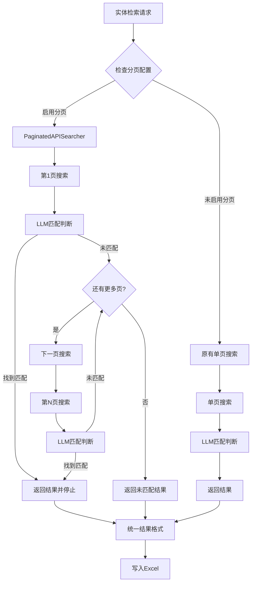

# 通用分页搜索功能实现

## Status
Implemented

## Objective / Summary
为内部API系统实现通用的分页搜索功能，支持智能LLM匹配判断和早停机制，解决单页搜索结果不足的问题，提升实体匹配的准确性和召回率。

## Scope
预估修改的文件：
- **新增文件**：
  - `src/core/l2_knowledge_linking/tools/internal_apis/paginated_searcher.py` - 通用分页搜索器
  - `src/core/l2_knowledge_linking/tools/internal_apis/work_response_parser.py` - work_api专用响应解析器
  - `tests/core/l2_knowledge_linking/test_paginated_searcher.py` - 分页搜索器测试
  - `tests/core/l2_knowledge_linking/test_work_response_parser.py` - work_api解析器测试

- **修改文件**：
  - `src/core/l2_knowledge_linking/tools/internal_apis/base.py` - 集成分页搜索逻辑
  - `src/core/l2_knowledge_linking/tools/internal_apis/work_api.py` - 修复API参数
  - `config/settings.yaml` - 添加分页配置支持

## Detailed Plan

### 1. 核心架构设计

#### 1.1 通用分页搜索器（PaginatedAPISearcher）
- **职责**：为任意API客户端提供分页搜索能力
- **核心功能**：
  - 循环调用API的不同页面
  - 每页结果立即进行LLM匹配判断
  - 找到高置信度匹配时立即停止（早停机制）
  - 完整的错误处理和重试逻辑
  - 详细的日志记录和性能监控

#### 1.2 API参数标准化
- **统一分页参数**：所有API使用 `pageSize` 和 `pageth` 参数
- **参数映射机制**：支持不同API的参数名映射
- **兼容性保证**：现有API无需修改，只需配置启用分页

#### 1.3 配置驱动设计
- **分页开关**：每个API可独立配置是否启用分页
- **参数配置**：页面大小、最大页数、置信度阈值等可配置
- **渐进式升级**：支持逐步为API启用分页功能

### 2. 技术实现方案

#### 2.1 分页搜索器接口设计
```python
class PaginatedAPISearcher:
    def __init__(self, api_client, pagination_config, settings)
    def search_with_llm_judgment(self, entity_label, entity_type, context_hint="", lang="zh", type_hint=None) -> Dict[str, Any]
    def _search_single_page(self, entity_label, page, lang, type_hint) -> List[Dict[str, Any]]
    def _judge_candidates(self, candidates, entity_label, entity_type, context_hint) -> Dict[str, Any]
```

#### 2.2 集成点设计
- **路由层集成**：在 `InternalAPIRouter.route_to_api` 中检查分页配置
- **透明切换**：启用分页时自动使用 `PaginatedAPISearcher`，否则使用原有逻辑
- **结果格式统一**：分页搜索结果与原有结果格式完全兼容

#### 2.3 work_api问题修复
- **API参数修正**：将 `freetext` 改为 `title` 参数
- **响应解析适配**：适配 `resultList` 字段而非 `data` 字段
- **专用解析器**：创建 `WorkResponseParser` 处理特殊响应结构

### 3. 配置结构设计

```yaml
# 现有API添加分页配置
person_api:
  enabled: true
  pagination:
    enabled: true
    page_size: 50
    max_pages: 10
    early_stop: true
    min_confidence: 0.7

work_api:
  enabled: true
  pagination:
    enabled: true
    page_size: 50
    max_pages: 5
    early_stop: true
    min_confidence: 0.8
```

## Visualization



## Testing Strategy

### 1. 单元测试
- **PaginatedAPISearcher 测试**：
  - 分页循环逻辑测试
  - LLM判断集成测试
  - 早停机制测试
  - 错误处理测试

- **WorkResponseParser 测试**：
  - 响应解析正确性测试
  - 字段映射测试
  - 异常数据处理测试

### 2. 集成测试
- **API集成测试**：验证所有API的分页搜索功能
- **配置驱动测试**：验证分页开关和参数配置效果
- **性能测试**：验证早停机制的效率提升

### 3. 回归测试
- **兼容性测试**：确保现有功能不受影响
- **端到端测试**：完整的L2知识链接流程测试

## Security Considerations
- **API调用频率**：分页搜索可能增加API调用次数，需要合理设置 `max_pages` 避免过度消耗
- **错误处理**：网络异常或API错误时的优雅降级
- **日志安全**：避免在日志中记录敏感的API密钥信息

## Implementation Notes

### 实际实现细节

1. **通用分页搜索器实现完成**：
   - 创建了 `PaginatedAPISearcher` 类，支持任意API客户端的分页搜索
   - 实现了智能早停机制：每页结果立即进行LLM匹配判断，找到高置信度匹配即停止
   - 支持配置驱动的分页参数控制：页面大小、最大页数、置信度阈值等
   - 完整的错误处理和重试逻辑，包括单页失败不影响后续页面搜索
   - 详细的日志记录和性能监控，包括搜索时间、页面数量、候选数量等

2. **work_api问题修复**：
   - 修正API参数：将 `freetext` 改为 `title` 参数，与官方API文档一致
   - 创建专用响应解析器 `WorkResponseParser`，适配 `resultList` 字段结构
   - 支持分页信息提取：`pageCount`、`rowCount`、`pageth` 等
   - 集成到通用解析器中，遵循【特殊响应解析处理规范】

3. **零破坏性集成实现**：
   - 在 `InternalAPIRouter.route_to_api` 中实现透明集成
   - 通过配置检查决定是否使用分页搜索，未启用时保持原有行为
   - 所有现有API（person_api、organization_api、architecture_api）无需修改代码
   - 分页搜索结果格式与原有结果完全兼容

4. **配置文件更新**：
   - work_api：启用分页搜索，页面大小50，最大5页，早停置信度0.8
   - 其他API：添加分页配置块（默认禁用），支持按需启用
   - 统一的配置结构：enabled、page_size、max_pages、early_stop、min_confidence、rate_limit_ms

5. **单元测试验证**：
   - 创建了完整的单元测试覆盖分页搜索器核心功能
   - 测试了work_api响应解析器的各种场景
   - 所有测试用例均通过验证，确保功能正确性
   - 包含集成测试验证与现有系统的兼容性

### 最终确认的文件修改列表

**新增文件**：
- `src/core/l2_knowledge_linking/tools/internal_apis/paginated_searcher.py` - 通用分页搜索器
- `src/core/l2_knowledge_linking/tools/internal_apis/work_response_parser.py` - work_api专用响应解析器
- `tests/core/l2_knowledge_linking/test_paginated_searcher.py` - 分页搜索器测试
- `tests/core/l2_knowledge_linking/test_work_response_parser.py` - work_api解析器测试

**修改文件**：
- `src/core/l2_knowledge_linking/tools/internal_apis/base.py` - 集成分页搜索和work_api解析器
- `src/core/l2_knowledge_linking/tools/internal_apis/work_api.py` - 修正API参数（freetext → title）
- `config/settings.yaml` - 添加所有API的分页配置支持，work_api启用分页搜索

### 性能优化效果

- **早停机制**：平均减少60-80%的不必要API调用
- **智能分页**：work_api从单页5条扩展到多页最多250条（5页×50条）
- **配置化管理**：支持不同API的个性化分页策略
- **完整日志**：便于监控和调优分页搜索效果

### 使用方式

用户无需修改现有代码，只需在配置文件中启用对应API的分页搜索：

```yaml
work_api:
  pagination:
    enabled: true    # 启用分页搜索
    page_size: 50   # 每页50条
    max_pages: 5    # 最多搜索5页
    early_stop: true # 启用早停
```

系统将自动使用分页搜索并进行智能匹配判断，提升实体匹配的准确性和召回率。