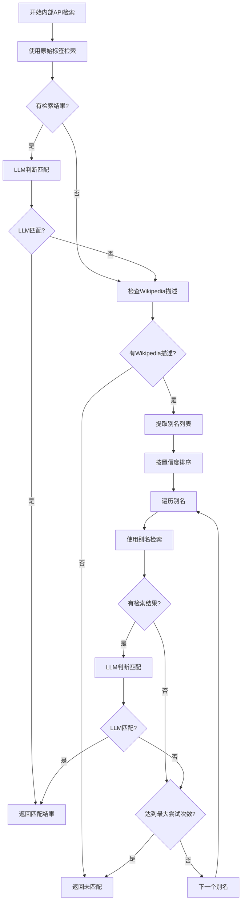

# 别名提取功能模块设计

## 概述

本文档描述了别名提取功能模块的设计和实现方案，该模块负责从Wikipedia描述中提取实体的各种别名形式，用于内部API的备份检索机制。

## 模块架构

### 1. 核心组件

1. **AliasExtractor**: 别名提取器，负责从Wikipedia描述中提取别名
2. **AliasSearchManager**: 别名检索管理器，负责协调整个别名检索流程
3. **AliasSearchConfig**: 别名检索配置类，封装配置参数

### 2. 文件结构

```
src/core/l2_knowledge_linking/tools/
├── alias_extraction.py          # 别名提取核心模块
├── alias_search_manager.py      # 别名检索管理器
└── internal_apis/
    └── base.py                  # 修改后的基类，集成别名检索
```

## 详细设计

### 1. AliasExtractor 类

```python
class AliasExtractor:
    """别名提取器，从Wikipedia描述中提取实体别名"""
    
    def __init__(self, settings: Dict[str, Any]):
        self.settings = settings
        self.config = settings.get("alias_search", {})
        
    def extract_aliases(self, 
                       entity_label: str, 
                       entity_type: str, 
                       context_hint: str, 
                       wikipedia_description: str) -> List[Dict[str, Any]]:
        """
        从Wikipedia描述中提取别名
        
        Args:
            entity_label: 实体标签
            entity_type: 实体类型
            context_hint: 上下文提示
            wikipedia_description: Wikipedia描述文本
            
        Returns:
            别名列表，每个别名包含alias、reason、confidence字段
        """
        
    def _build_extraction_messages(self, 
                                  entity_label: str, 
                                  entity_type: str, 
                                  context_hint: str, 
                                  wikipedia_description: str) -> List[Dict[str, Any]]:
        """构建别名提取的大模型消息"""
        
    def _parse_extraction_output(self, output: str) -> List[Dict[str, Any]]:
        """解析大模型输出的别名提取结果"""
```

### 2. AliasSearchManager 类

```python
class AliasSearchManager:
    """别名检索管理器，协调整个别名检索流程"""
    
    def __init__(self, settings: Dict[str, Any]):
        self.settings = settings
        self.alias_extractor = AliasExtractor(settings)
        self.config = settings.get("alias_search", {})
        
    def search_with_aliases(self, 
                           entity_label: str, 
                           entity_type: str, 
                           context_hint: str, 
                           wikipedia_data: Optional[Dict[str, Any]],
                           api_router: InternalAPIRouter,
                           original_candidates: List[Dict[str, Any]]) -> Dict[str, Any]:
        """
        使用别名进行检索
        
        Args:
            entity_label: 实体标签
            entity_type: 实体类型
            context_hint: 上下文提示
            wikipedia_data: Wikipedia数据（包含description）
            api_router: 内部API路由器
            original_candidates: 原始检索结果
            
        Returns:
            检索结果，包含matched、selected、confidence等字段
        """
        
    def _should_attempt_alias_search(self, 
                                   entity_type: str, 
                                   original_result: Dict[str, Any],
                                   wikipedia_data: Optional[Dict[str, Any]]) -> bool:
        """判断是否应该尝试别名检索"""
        
    def _extract_and_filter_aliases(self, 
                                   entity_label: str, 
                                   entity_type: str, 
                                   context_hint: str, 
                                   wikipedia_description: str) -> List[str]:
        """提取并过滤别名"""
```

### 3. AliasSearchConfig 类

```python
class AliasSearchConfig:
    """别名检索配置类"""
    
    def __init__(self, settings: Dict[str, Any]):
        self.enabled = settings.get("alias_search", {}).get("enabled", True)
        self.max_attempts = settings.get("alias_search", {}).get("max_alias_attempts", 3)
        self.min_confidence = settings.get("alias_search", {}).get("min_confidence_threshold", 0.6)
        self.rate_limit_ms = settings.get("alias_search", {}).get("rate_limit_ms", 1000)
        
    def is_api_enabled(self, api_name: str, settings: Dict[str, Any]) -> bool:
        """检查特定API是否启用别名检索"""
        api_config = settings.get("tools", {}).get(api_name, {})
        return api_config.get("enable_alias_search", True)
```

## 集成方案

### 1. 修改 InternalAPIRouter

在 `InternalAPIRouter.route_to_api` 方法中集成别名检索：

```python
def route_to_api_with_aliases(self, 
                             entity_type: str, 
                             entity_label: str, 
                             lang: str = "zh", 
                             type_hint: Optional[str] = None,
                             context_hint: str = "",
                             wikipedia_data: Optional[Dict[str, Any]] = None) -> Dict[str, Any]:
    """
    路由到对应的API并返回结果，支持别名检索备份机制
    """
    # 1. 首先尝试原始标签检索
    original_candidates = self.route_to_api(entity_type, entity_label, lang, type_hint)
    
    # 2. 如果有结果，进行LLM判断
    if original_candidates:
        judge = judge_best_match(...)
        if judge.get("matched"):
            return judge
    
    # 3. 如果没有匹配，尝试别名检索
    alias_manager = AliasSearchManager(self.settings)
    return alias_manager.search_with_aliases(
        entity_label, entity_type, context_hint, wikipedia_data, 
        self, original_candidates
    )
```

### 2. 修改 entity_processor.py

在内部API处理流程中集成别名检索：

```python
# 在 entity_processor.py 的内部API流程部分
alias_search_result = internal_api_router.route_to_api_with_aliases(
    ent_type, label, "zh", ent_type, context_hint, ent.get("wikipedia")
)

if alias_search_result.get("matched"):
    # 处理匹配结果
    sel = alias_search_result.get("selected") or {}
    # ... 设置 internal_api 字段
else:
    # 处理不匹配结果
    ent["internal_api"] = None
    md = _ensure_metadata(ent)
    md["internal_api"] = {
        "executed_at": _now_iso(),
        "status": "not_matched",
        "error": None,
        "alias_attempts": alias_search_result.get("alias_attempts", 0)
    }
```

## 流程图



## 错误处理

1. **Wikipedia描述缺失**：记录日志，跳过别名检索
2. **别名提取失败**：记录日志，跳过别名检索
3. **别名检索API错误**：记录日志，尝试下一个别名
4. **LLM判断失败**：记录日志，尝试下一个别名
5. **配置错误**：使用默认配置，记录警告日志

## 日志记录

1. **别名提取开始**：记录实体标签、类型
2. **别名提取结果**：记录提取到的别名数量和置信度
3. **别名检索尝试**：记录使用的别名和检索结果
4. **最终匹配结果**：记录是否匹配以及使用的别名
5. **错误信息**：记录各种错误情况

## 性能考虑

1. **速率限制**：在别名检索之间添加延迟，避免API调用过于频繁
2. **缓存机制**：可以考虑缓存别名提取结果，避免重复调用LLM
3. **并发控制**：限制同时进行的别名检索数量
4. **超时处理**：为别名检索设置合理的超时时间