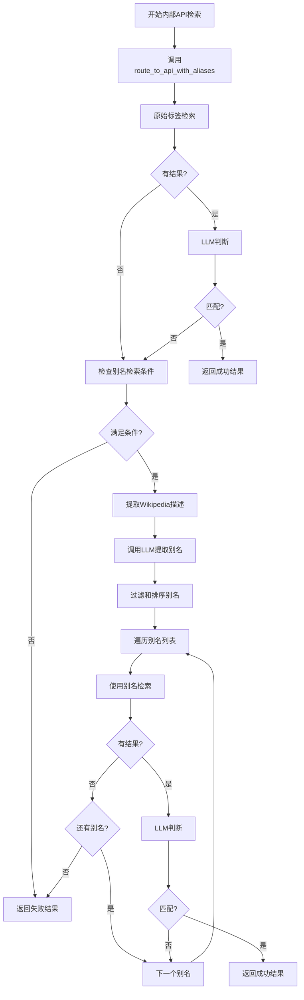

# 别名检索集成方案

## 概述

本文档描述了如何将别名检索备份机制集成到现有的内部API检索流程中，确保当原始标签检索失败时能够自动使用别名进行检索。

## 集成点分析

### 1. 现有流程回顾

当前的内部API检索流程在 [`entity_processor.py`](src/core/l2_knowledge_linking/entity_processor.py:422-506) 中：

1. 调用 `internal_api_router.route_to_api()` 进行检索
2. 如果有结果，调用 `judge_best_match()` 进行LLM判断
3. 根据判断结果设置 `internal_api` 字段

### 2. 集成策略

在现有流程中插入别名检索逻辑：

1. **原始检索失败时**：当 `route_to_api()` 返回空结果
2. **LLM判断不匹配时**：当 `judge_best_match()` 返回 `matched: false`
3. **有Wikipedia数据时**：当实体有Wikipedia节点且description有值

## 详细集成方案

### 1. 修改 InternalAPIRouter 类

在 `src/core/l2_knowledge_linking/tools/internal_apis/base.py` 中添加新方法：

```python
def route_to_api_with_aliases(self, 
                             entity_type: str, 
                             entity_label: str, 
                             lang: str = "zh", 
                             type_hint: Optional[str] = None,
                             context_hint: str = "",
                             wikipedia_data: Optional[Dict[str, Any]] = None) -> Dict[str, Any]:
    """
    路由到对应的API并返回结果，支持别名检索备份机制
    
    Args:
        entity_type: 实体类型
        entity_label: 实体标签
        lang: 语言
        type_hint: 类型提示
        context_hint: 上下文提示
        wikipedia_data: Wikipedia数据，包含description字段
        
    Returns:
        包含matched、selected、confidence等字段的结果字典
    """
    # 1. 原始检索
    original_candidates = self.route_to_api(entity_type, entity_label, lang, type_hint)
    
    # 2. 如果有结果，进行LLM判断
    if original_candidates:
        from ...entity_matcher import judge_best_match
        judge = judge_best_match(
            label=entity_label,
            ent_type=entity_type,
            context_hint=context_hint,
            source="internal_api",
            candidates=original_candidates,
            settings=self.settings
        )
        
        if judge.get("matched"):
            return {
                "matched": True,
                "selected": judge.get("selected"),
                "confidence": judge.get("confidence"),
                "reason": judge.get("reason"),
                "alias_used": None,
                "alias_attempts": 0
            }
    
    # 3. 别名检索
    alias_manager = AliasSearchManager(self.settings)
    return alias_manager.search_with_aliases(
        entity_label, entity_type, context_hint, wikipedia_data, 
        self, original_candidates
    )
```

### 2. 修改 entity_processor.py

在内部API处理流程中使用新的方法：

```python
# 在 entity_processor.py 的内部API流程部分（约422行）
if internal_apis_enabled and ent_type and not _should_skip("internal_api", ent):
    try:
        # 使用支持别名检索的新方法
        alias_search_result = internal_api_router.route_to_api_with_aliases(
            ent_type, label, "zh", ent_type, context_hint, ent.get("wikipedia")
        )
        
        if alias_search_result.get("matched"):
            # 处理匹配结果
            sel = alias_search_result.get("selected") or {}
            uri = sel.get("uri")
            description = sel.get("description")
            
            ent["internal_api"] = {
                "uri": uri,
                "description": description,
                "label": sel.get("label") or label,
                "api_type": ent_type,
                "alias_used": alias_search_result.get("alias_used"),
                "meta": {
                    "executed_at": _now_iso(),
                    "status": "success",
                    "llm": {
                        "matched": True,
                        "confidence": float(alias_search_result.get("confidence") or 0.0),
                        "reason": alias_search_result.get("reason") or "",
                        "selected_label": sel.get("label"),
                        "selected_uri": sel.get("uri"),
                        "model": alias_search_result.get("model"),
                    },
                },
            }
            updated = True
            
            # 记录别名检索成功日志
            alias_used = alias_search_result.get("alias_used")
            if alias_used:
                logger.info(f"internal_api_alias_match_success label={label} alias={alias_used} uri={uri}")
            else:
                logger.info(f"internal_api_match_success label={label} uri={uri}")
        else:
            # 处理不匹配结果
            ent["internal_api"] = None
            md = _ensure_metadata(ent)
            md["internal_api"] = {
                "executed_at": _now_iso(),
                "status": "not_matched",
                "error": None,
                "alias_attempts": alias_search_result.get("alias_attempts", 0)
            }
            updated = True
            
            logger.info(f"internal_api_not_matched label={label} attempts={alias_search_result.get('alias_attempts', 0)}")
            
    except Exception as e:
        ent["internal_api"] = None
        md = _ensure_metadata(ent)
        md["internal_api"] = {
            "executed_at": _now_iso(),
            "status": "error",
            "error": str(e),
        }
        updated = True
        logger.error(f"internal_api_error label={label} err={e}")
    
    # 添加延迟（如果配置了）
    delay = int(rate_limit.get("internal_api_ms", 1000))
    if delay > 0:
        try:
            time.sleep(delay / 1000.0)
        except Exception:
            pass
```

### 3. 创建 AliasSearchManager 类

在 `src/core/l2_knowledge_linking/tools/alias_search_manager.py` 中：

```python
from typing import Any, Dict, List, Optional
import time
import json
import os

from ...utils.logger import get_logger
from ...utils.llm_api import invoke_model
from .alias_extraction import AliasExtractor
from .internal_apis.base import InternalAPIRouter

logger = get_logger(__name__)

class AliasSearchManager:
    """别名检索管理器，协调整个别名检索流程"""
    
    def __init__(self, settings: Dict[str, Any]):
        self.settings = settings
        self.alias_extractor = AliasExtractor(settings)
        self.config = settings.get("alias_search", {})
        
    def search_with_aliases(self, 
                           entity_label: str, 
                           entity_type: str, 
                           context_hint: str, 
                           wikipedia_data: Optional[Dict[str, Any]],
                           api_router: InternalAPIRouter,
                           original_candidates: List[Dict[str, Any]]) -> Dict[str, Any]:
        """
        使用别名进行检索
        
        Args:
            entity_label: 实体标签
            entity_type: 实体类型
            context_hint: 上下文提示
            wikipedia_data: Wikipedia数据
            api_router: 内部API路由器
            original_candidates: 原始检索结果
            
        Returns:
            检索结果字典
        """
        # 1. 检查是否应该尝试别名检索
        if not self._should_attempt_alias_search(entity_type, original_candidates, wikipedia_data):
            return {
                "matched": False,
                "selected": None,
                "confidence": 0.0,
                "reason": "不满足别名检索条件",
                "alias_used": None,
                "alias_attempts": 0
            }
        
        # 2. 提取Wikipedia描述
        wikipedia_description = ""
        if wikipedia_data and isinstance(wikipedia_data, dict):
            wikipedia_description = wikipedia_data.get("description") or ""
        
        if not wikipedia_description:
            logger.info(f"alias_search_skipped label={entity_label} reason=no_wikipedia_description")
            return {
                "matched": False,
                "selected": None,
                "confidence": 0.0,
                "reason": "无Wikipedia描述",
                "alias_used": None,
                "alias_attempts": 0
            }
        
        # 3. 提取别名
        aliases = self._extract_and_filter_aliases(entity_label, entity_type, context_hint, wikipedia_description)
        
        if not aliases:
            logger.info(f"alias_search_skipped label={entity_label} reason=no_aliases_extracted")
            return {
                "matched": False,
                "selected": None,
                "confidence": 0.0,
                "reason": "未提取到有效别名",
                "alias_used": None,
                "alias_attempts": 0
            }
        
        # 4. 依次尝试别名检索
        max_attempts = min(len(aliases), self.config.get("max_alias_attempts", 3))
        rate_limit_ms = self.config.get("rate_limit_ms", 1000)
        
        for i, alias_data in enumerate(aliases[:max_attempts]):
            alias = alias_data.get("alias")
            confidence = alias_data.get("confidence", 0.0)
            
            if not alias or confidence < self.config.get("min_confidence_threshold", 0.6):
                continue
            
            logger.info(f"alias_search_attempt label={entity_label} alias={alias} confidence={confidence} attempt={i+1}/{max_attempts}")
            
            try:
                # 使用别名检索
                alias_candidates = api_router.route_to_api(entity_type, alias, "zh", entity_type)
                
                if not alias_candidates:
                    continue
                
                # LLM判断
                from ...entity_matcher import judge_best_match
                judge = judge_best_match(
                    label=entity_label,
                    ent_type=entity_type,
                    context_hint=context_hint,
                    source="internal_api",
                    candidates=alias_candidates,
                    settings=self.settings
                )
                
                if judge.get("matched"):
                    sel = judge.get("selected") or {}
                    logger.info(f"alias_search_success label={entity_label} alias={alias} uri={sel.get('uri')}")
                    
                    return {
                        "matched": True,
                        "selected": sel,
                        "confidence": judge.get("confidence"),
                        "reason": f"使用别名'{alias}'匹配成功: {judge.get('reason')}",
                        "alias_used": alias,
                        "alias_attempts": i + 1,
                        "model": judge.get("model")
                    }
                
            except Exception as e:
                logger.warning(f"alias_search_error label={entity_label} alias={alias} err={e}")
                continue
            
            # 添加延迟
            if rate_limit_ms > 0 and i < max_attempts - 1:
                try:
                    time.sleep(rate_limit_ms / 1000.0)
                except Exception:
                    pass
        
        # 所有别名都尝试失败
        logger.info(f"alias_search_failed label={entity_label} attempts={max_attempts}")
        return {
            "matched": False,
            "selected": None,
            "confidence": 0.0,
            "reason": f"尝试了{max_attempts}个别名，均未匹配",
            "alias_used": None,
            "alias_attempts": max_attempts
        }
    
    def _should_attempt_alias_search(self, 
                                   entity_type: str, 
                                   original_result: List[Dict[str, Any]],
                                   wikipedia_data: Optional[Dict[str, Any]]) -> bool:
        """判断是否应该尝试别名检索"""
        # 检查全局开关
        if not self.config.get("enabled", True):
            return False
        
        # 检查特定API开关
        api_name = f"{entity_type}_api"
        if not self.config.get(f"{api_name}_enabled", True):
            return False
        
        # 检查是否有Wikipedia数据
        if not wikipedia_data or not isinstance(wikipedia_data, dict):
            return False
        
        # 检查是否有description
        if not wikipedia_data.get("description"):
            return False
        
        return True
    
    def _extract_and_filter_aliases(self, 
                                   entity_label: str, 
                                   entity_type: str, 
                                   context_hint: str, 
                                   wikipedia_description: str) -> List[str]:
        """提取并过滤别名"""
        try:
            aliases_data = self.alias_extractor.extract_aliases(
                entity_label, entity_type, context_hint, wikipedia_description
            )
            
            # 过滤并排序别名
            min_confidence = self.config.get("min_confidence_threshold", 0.6)
            filtered_aliases = [
                alias_data for alias_data in aliases_data 
                if alias_data.get("confidence", 0.0) >= min_confidence
            ]
            
            # 按置信度降序排序
            filtered_aliases.sort(key=lambda x: x.get("confidence", 0.0), reverse=True)
            
            logger.info(f"aliases_extracted label={entity_label} total={len(aliases_data)} filtered={len(filtered_aliases)}")
            
            return filtered_aliases
            
        except Exception as e:
            logger.warning(f"alias_extraction_failed label={entity_label} err={e}")
            return []
```

## 流程图



## 数据结构变化

### 1. internal_api 字段扩展

```json
{
  "internal_api": {
    "uri": "实体URI",
    "description": "实体描述",
    "label": "实体标签",
    "api_type": "实体类型",
    "alias_used": "使用的别名（如果有）",
    "meta": {
      "executed_at": "执行时间",
      "status": "状态",
      "llm": {
        "matched": true,
        "confidence": 0.95,
        "reason": "匹配原因",
        "selected_label": "选中标签",
        "selected_uri": "选中URI",
        "model": "模型名称"
      }
    }
  }
}
```

### 2. metadata.internal_api 字段扩展

```json
{
  "metadata": {
    "internal_api": {
      "executed_at": "执行时间",
      "status": "not_matched",
      "error": null,
      "alias_attempts": 3  // 尝试的别名数量
    }
  }
}
```

## 错误处理和日志

### 1. 关键日志点

1. **别名提取开始**：`alias_extraction_started label={label}`
2. **别名提取结果**：`aliases_extracted label={label} total={total} filtered={filtered}`
3. **别名检索尝试**：`alias_search_attempt label={label} alias={alias} attempt={i}/{max}`
4. **别名检索成功**：`alias_search_success label={label} alias={alias} uri={uri}`
5. **别名检索失败**：`alias_search_failed label={label} attempts={attempts}`

### 2. 错误处理

1. **别名提取失败**：记录警告，返回空别名列表
2. **别名检索API错误**：记录警告，尝试下一个别名
3. **LLM判断失败**：记录警告，尝试下一个别名
4. **配置错误**：使用默认值，记录警告

## 性能优化

1. **速率限制**：在别名检索之间添加延迟
2. **早期退出**：一旦找到匹配立即返回
3. **置信度过滤**：只使用高置信度的别名
4. **最大尝试次数**：限制别名检索次数