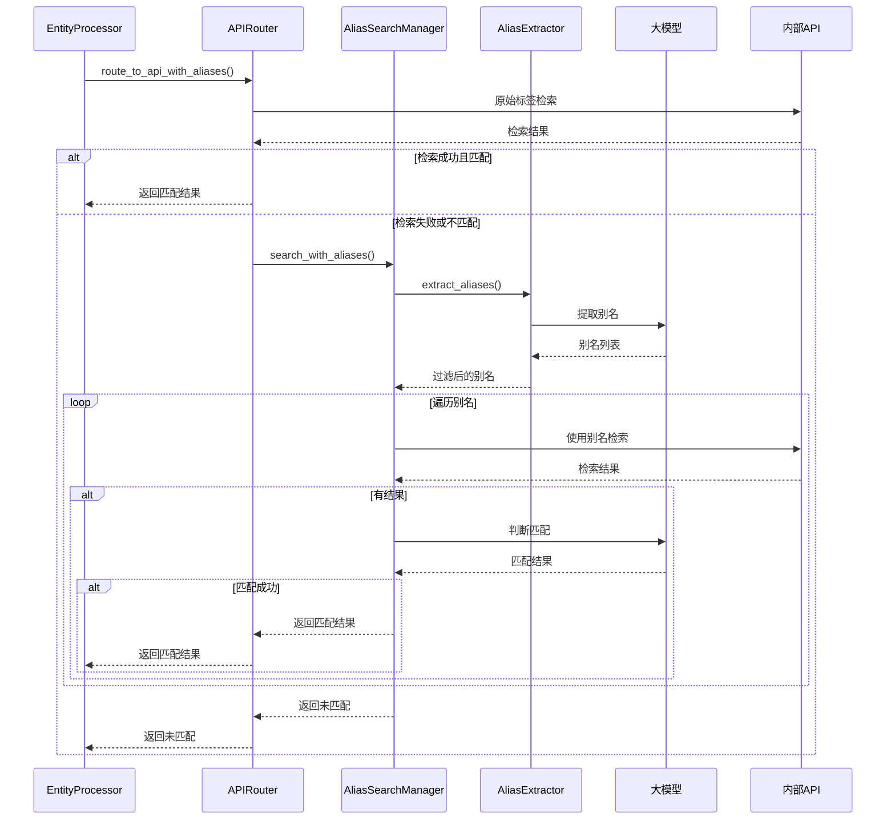

# 别名检索备份机制实施总结

## 概述

本文档总结了内部API中别名检索备份机制的完整设计方案，该机制能够在原始实体标签检索失败时，自动从Wikipedia描述中提取别名进行备份检索，显著提高检索成功率。

## 设计目标

1. **提高检索成功率**：当原始标签检索失败时，使用别名进行备份检索
2. **智能别名提取**：从Wikipedia描述中智能提取各种形式的别名
3. **支持所有实体类型**：人物、地点、机构、事件、作品、影剧院等
4. **可配置性**：提供灵活的配置选项，支持细粒度控制
5. **性能优化**：避免无限循环，控制检索次数和频率

## 核心功能

### 1. 触发条件

- 原始标签检索无结果
- 原始标签检索有结果但大模型判断不匹配
- 实体有Wikipedia节点且description字段有值

### 2. 别名提取

- 使用大模型从Wikipedia描述中提取别名
- 支持各种别名形式：本名、笔名、字号、英文名、简称、译名等
- 按置信度对别名进行排序和过滤

### 3. 别名检索循环

- 按置信度从高到低依次尝试别名
- 每个别名检索后进行大模型判断
- 找到匹配后立即终止
- 支持配置最大尝试次数

## 技术架构

### 1. 核心组件

| 组件 | 职责 | 文件位置 |
|------|------|----------|
| AliasExtractor | 从Wikipedia描述中提取别名 | `src/core/l2_knowledge_linking/tools/alias_extraction.py` |
| AliasSearchManager | 协调整个别名检索流程 | `src/core/l2_knowledge_linking/tools/alias_search_manager.py` |
| InternalAPIRouter | 增强的API路由器，支持别名检索 | `src/core/l2_knowledge_linking/tools/internal_apis/base.py` |

### 2. 数据流程



## 配置设计

### 1. 全局配置

```yaml
alias_search:
  enabled: true                    # 是否启用别名检索
  max_alias_attempts: 3           # 最大别名尝试次数
  min_confidence_threshold: 0.6   # 最小置信度阈值
  rate_limit_ms: 1000            # 速率限制（毫秒）
```

### 2. 大模型配置

```yaml
tasks:
  l2_alias_extraction:
    provider_type: "text"
    model: "DeepSeek-V3.2-Exp"
    temperature: 0.2
    system_prompt_file: "l2_alias_extraction.md"
```

### 3. API级别配置

```yaml
tools:
  person_api:
    enable_alias_search: true
  place_api:
    enable_alias_search: true
  # ... 其他API配置
```

## 实施步骤

### 1. 创建提示词文件

- 文件：`src/prompts/l2_alias_extraction.md`
- 内容：支持所有实体类型的别名提取提示词
- 特点：通用性强，支持多种别名形式

### 2. 实现核心模块

- **AliasExtractor**：负责别名提取逻辑
- **AliasSearchManager**：负责别名检索流程协调
- **增强InternalAPIRouter**：添加别名检索支持

### 3. 集成到现有流程

- 修改`entity_processor.py`中的内部API处理流程
- 使用新的`route_to_api_with_aliases`方法
- 扩展结果数据结构，记录别名使用情况

### 4. 配置更新

- 在`settings.yaml`中添加别名检索相关配置
- 支持全局和API级别的开关控制

### 5. 测试和验证

- 单元测试：测试各个组件的功能
- 集成测试：测试端到端的别名检索流程
- 性能测试：验证别名检索的性能影响

## 数据结构变化

### 1. internal_api字段扩展

```json
{
  "internal_api": {
    "uri": "实体URI",
    "description": "实体描述",
    "label": "实体标签",
    "api_type": "实体类型",
    "alias_used": "使用的别名（如果有）",
    "meta": {
      "executed_at": "执行时间",
      "status": "状态",
      "llm": {
        "matched": true,
        "confidence": 0.95,
        "reason": "匹配原因",
        "selected_label": "选中标签",
        "selected_uri": "选中URI",
        "model": "模型名称"
      }
    }
  }
}
```

### 2. metadata字段扩展

```json
{
  "metadata": {
    "internal_api": {
      "executed_at": "执行时间",
      "status": "not_matched",
      "error": null,
      "alias_attempts": 3  // 尝试的别名数量
    }
  }
}
```

## 性能考虑

### 1. 优化策略

- **速率限制**：在别名检索之间添加延迟
- **置信度过滤**：只使用高置信度的别名
- **早期退出**：找到匹配后立即返回
- **最大尝试次数**：限制别名检索次数

### 2. 性能指标

- 别名提取时间
- 别名检索时间
- 成功率提升
- 平均尝试次数

## 错误处理

### 1. 错误分类

- **AliasExtractionError**：别名提取错误
- **AliasSearchTimeoutError**：别名检索超时
- **AliasSearchConfigError**：别名检索配置错误

### 2. 处理策略

- 记录详细日志
- 优雅降级
- 错误恢复
- 用户友好的错误信息

## 监控和日志

### 1. 关键日志点

- 别名提取开始和结果
- 每个别名检索尝试
- 最终匹配结果
- 错误和异常情况

### 2. 监控指标

- 别名检索成功率
- 平均别名尝试次数
- 别名检索耗时
- 错误率

## 扩展性

### 1. 支持新的别名类型

- 通过修改提示词支持新的别名形式
- 通过配置调整别名提取策略

### 2. 支持新的数据源

- 可以扩展到其他数据源的别名提取
- 不仅限于Wikipedia描述

### 3. 支持新的检索策略

- 可以实现更复杂的别名检索策略
- 支持别名组合、模糊匹配等

## 总结

别名检索备份机制是一个完整的解决方案，通过智能别名提取和循环检索，显著提高了内部API的检索成功率。该方案具有以下特点：

1. **完整性**：覆盖了从别名提取到检索的完整流程
2. **灵活性**：提供了丰富的配置选项
3. **可扩展性**：易于扩展到新的实体类型和数据源
4. **性能优化**：避免了不必要的检索和延迟
5. **可维护性**：清晰的架构和详细的日志

通过实施这个方案，系统能够在原始标签检索失败时，自动使用别名进行备份检索，大大提高了知识关联的成功率和用户体验。