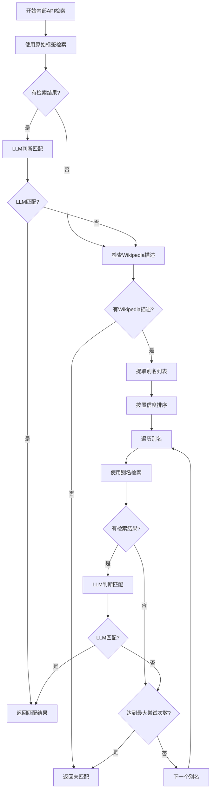

# 内部API架构文档

## 概述

本文档描述了L2知识关联模块中新增的内部API架构，该架构支持根据实体类型自动选择对应的内部API接口，并统一处理API响应和结果解析。

## 架构设计

### 1. 核心组件

1. **InternalAPIRouter**: 根据实体类型路由到对应的API接口
2. **InternalAPIClient**: 各API客户端的基类，提供通用的HTTP请求功能
3. **ResponseParser**: 统一的响应解析器，根据配置提取和映射字段
4. **InternalAPIRegistry**: 内部API注册表，管理所有API客户端

### 2. 支持的实体类型和API接口

| 实体类型 | API接口 | 描述 |
|---------|---------|------|
| person | person_api | 人物API，检索人物信息 |
| location | place_api | 地点API，检索地点信息 |
| organization | organization_api | 机构API，检索机构信息 |
| event | event_api | 事件API，检索事件信息 |
| work | work_api | 作品API，检索作品信息 |
| architecture | architecture_api | 影剧院API，检索影剧院信息 |

## 配置说明

### 1. API接口配置

每个API接口需要配置URL、密钥、启用状态和实体类型映射等参数：

```yaml
tools:
  person_api:
    enabled: true
    url: http://data1.library.sh.cn/persons/data
    key: "env:SHL_API_KEY"
    limit: 5
    entity_types: ["person"]
    fields:
      extract:
        - fname
        - start
        - end
        - briefBiography
        - uri
        - place
        - place_uri
      mapping:
        fname: label
        start: birth_year
        end: death_year
        briefBiography: description
        uri: uri
        place: place
        place_uri: place_uri
```

### 2. 实体类型与API接口映射

实体类型与API接口的映射关系通过每个API配置中的 `entity_types` 字段定义，系统会自动构建映射关系。

例如：
- `person_api` 的 `entity_types: ["person"]` 表示 person 类型的实体会路由到 person_api
- `place_api` 的 `entity_types: ["location"]` 表示 location 类型的实体会路由到 place_api

## 使用方法

### 1. 初始化

```python
from src.core.l2_knowledge_linking.tools.registry import initialize_internal_apis, get_internal_api_router

# 初始化内部API
settings = load_settings()
initialize_internal_apis(settings)

# 获取API路由器
router = get_internal_api_router(settings)
```

### 2. 调用API

```python
# 根据实体类型调用对应的API
results = router.route_to_api("person", "巴金", "zh", "person")
```

### 4. API启用控制

系统支持单个API启用控制：

1. **单个API控制**：通过`tools.{api_name}.enabled`控制每个具体API的启用状态
2. **整体流程控制**：系统检查是否有任何内部API启用，决定是否执行内部API处理流程

```yaml
# 单个API开关
tools:
  person_api:
    enabled: true   # 启用person_api
  place_api:
    enabled: false  # 禁用place_api
  organization_api:
    enabled: false  # 禁用organization_api
```

当某个API的enabled为false时，系统会跳过该API的调用，并在日志中记录相关信息。如果所有内部API都被禁用，系统将跳过整个内部API处理流程。

### 3. 处理结果

API返回的结果已经过解析和字段映射，可以直接使用：

```python
for result in results:
    print(f"标签: {result['label']}")
    print(f"描述: {result['description']}")
    print(f"URI: {result['uri']}")
```

## 扩展新API

如果需要添加新的API接口，请按照以下步骤：

### 1. 创建API客户端

在 `src/core/l2_knowledge_linking/tools/internal_apis/` 目录下创建新的客户端文件，例如 `new_api.py`：

```python
from typing import Any, Dict, List, Optional
from .base import InternalAPIClient
from ....utils.llm_api import _resolve_env
from ....utils.logger import get_logger

logger = get_logger(__name__)

class NewAPIClient(InternalAPIClient):
    """新API客户端"""
    
    def search(self, entity_label: str, lang: str = "zh", type_hint: Optional[str] = None) -> Any:
        """搜索实体信息"""
        api_url = self.api_config.get("url")
        api_key = _resolve_env(self.api_config.get("key", ""))
        limit = int(self.api_config.get("limit", 5))
        
        if not api_url or not api_key:
            logger.warning("new_api_missing_config")
            return None
        
        params = {
            "query": entity_label,
            "key": api_key,
            "limit": limit
        }
        
        return self._make_request(api_url, params)
```

### 2. 注册API客户端

在 `src/core/l2_knowledge_linking/tools/internal_apis/__init__.py` 中添加：

```python
from .new_api import NewAPIClient

# 在initialize_from_settings方法中添加
elif api_name == "new_api":
    cls.register(api_name, NewAPIClient(api_name, settings))
```

### 3. 更新配置

在 `config/settings.yaml` 中添加：

```yaml
tools:
  new_api:
    enabled: true
    url: http://example.com/api/search
    key: "env:API_KEY"
    limit: 5
    entity_types: ["new_type"]
    fields:
      extract:
        - name
        - description
        - id
      mapping:
        name: label
        description: description
        id: uri
```

## 测试

运行测试以验证功能：

```bash
python tests/core/l2_knowledge_linking/test_internal_apis.py
```

## 注意事项

1. **API密钥**: 请确保在环境变量中设置正确的API密钥
2. **速率限制**: 请根据API提供商的要求配置合适的速率限制
3. **错误处理**: 系统会自动处理API调用错误，但建议监控日志以了解潜在问题
4. **字段映射**: 确保字段映射配置与API实际返回的数据结构匹配

## 故障排除

### 1. API调用失败

检查以下项目：
- API密钥是否正确设置
- API URL是否可访问
- 网络连接是否正常

### 2. 字段解析错误

检查以下项目：
- `fields.extract` 是否与API返回的字段名匹配
- `fields.mapping` 是否正确配置
- API响应格式是否发生变化

### 3. 实体类型映射错误

检查以下项目：
- `entity_types` 是否正确配置
- 实体类型是否在系统中正确定义


---

1. 核心架构实现
创建了完整的内部API框架，包括：

InternalAPIRouter: 根据实体类型路由到对应的API接口
InternalAPIClient: 各API客户端的基类，提供通用的HTTP请求功能
ResponseParser: 统一的响应解析器，根据配置提取和映射字段
InternalAPIRegistry: 内部API注册表，管理所有API客户端
2. API客户端实现
为6种实体类型实现了对应的API客户端：

PersonAPIClient: 人物API客户端
PlaceAPIClient: 地点API客户端
OrganizationAPIClient: 机构API客户端
EventAPIClient: 事件API客户端
WorkAPIClient: 作品API客户端
TheaterAPIClient: 影剧院API客户端
3. 配置系统
在 config/settings.yaml 中添加了完整的配置支持：

各API接口的实体类型映射
各API接口的字段提取和映射规则
API接口的URL、密钥和限制参数
速率限制配置
4. 系统集成
修改了核心系统文件以支持内部API：

更新了 entity_processor.py，添加了内部API处理流程
修改了 entity_matcher.py，支持内部API的候选实体判断
更新了 tools/registry.py，添加了内部API注册功能
5. 提示词和测试
创建了内部API专用的提示词文件 l2_internal_api_disambiguation.md
实现了完整的测试套件 test_internal_apis.py
编写了详细的架构文档 internal_api_architecture.md
6. 主要特性
配置驱动: 通过配置文件控制实体类型与API的映射，以及字段提取规则
统一接口: 所有API调用和解析遵循统一的框架
灵活扩展: 新增API只需添加对应的客户端类和配置
错误处理: 完善的错误处理和日志记录
性能控制: 支持速率限制和并发控制
7. 使用方式
系统会根据实体类型自动选择对应的API接口，调用API并解析结果，然后将解析后的候选实体列表交由LLM判断，最终结果写入JSON文件。整个过程对用户透明，只需在配置文件中设置好相关参数即可。

这个架构实现了您要求的功能：根据实体类型选择对应的检索API，解析API返回结果，提取指定字段，交由大模型判断匹配，并将最终结果写入JSON文件。同时，所有配置都可以在settings.yaml中进行管理，提供了极大的灵活性和可维护性。

## 别名检索备份机制

### 概述

为了提高内部API检索的成功率，系统实现了别名检索备份机制。当使用实体原始标签检索不到结果，或者检索到但大模型没有匹配到时，系统会自动尝试使用别名进行检索。

### 工作原理

1. **触发条件**：
   - 原始标签检索无结果
   - 原始标签检索有结果但大模型判断不匹配
   - 实体有Wikipedia节点且description字段有值

2. **别名提取**：
   - 从Wikipedia的description字段提取实体的各种别名形式
   - 支持人物、地点、机构、事件、作品、影剧院等所有实体类型
   - 使用大模型智能提取，包括本名、笔名、简称、译名等各种别名形式

3. **别名检索**：
   - 按置信度排序，依次尝试使用别名进行检索
   - 每个别名检索后都进行大模型判断匹配
   - 找到匹配后立即终止，避免不必要的检索

4. **结果记录**：
   - 记录使用的别名和尝试次数
   - 将最终结果写入JSON文件
   - 详细的日志记录便于调试和监控

### 核心组件

1. **AliasExtractor**：别名提取器，负责从Wikipedia描述中提取别名
2. **AliasSearchManager**：别名检索管理器，协调整个别名检索流程
3. **InternalAPIRouter**：增强的内部API路由器，支持别名检索

### 配置说明

在settings.yaml中添加以下配置：

```yaml
# 别名检索配置
alias_search:
  enabled: true                    # 是否启用别名检索
  max_alias_attempts: 3           # 最大别名尝试次数
  min_confidence_threshold: 0.6   # 最小置信度阈值
  rate_limit_ms: 1000            # 速率限制（毫秒）

# 别名提取大模型配置
tasks:
  l2_alias_extraction:
    provider_type: "text"
    model: "DeepSeek-V3.2-Exp"
    temperature: 0.2
    system_prompt_file: "l2_alias_extraction.md"

# 各API的别名检索开关
tools:
  person_api:
    enable_alias_search: true
  place_api:
    enable_alias_search: true
  # ... 其他API配置
```

### 使用示例

```python
# 在entity_processor.py中的使用示例
alias_search_result = internal_api_router.route_to_api_with_aliases(
    ent_type, label, "zh", ent_type, context_hint, ent.get("wikipedia")
)

if alias_search_result.get("matched"):
    # 处理匹配结果
    alias_used = alias_search_result.get("alias_used")
    if alias_used:
        logger.info(f"使用别名'{alias_used}'匹配成功")
```

### 流程图



### 性能优化

1. **速率限制**：在别名检索之间添加延迟，避免API调用过于频繁
2. **置信度过滤**：只使用高置信度的别名进行检索
3. **早期退出**：一旦找到匹配立即返回
4. **最大尝试次数**：限制别名检索次数，避免无限循环

### 错误处理

1. **Wikipedia描述缺失**：记录日志，跳过别名检索
2. **别名提取失败**：记录日志，跳过别名检索
3. **别名检索API错误**：记录日志，尝试下一个别名
4. **LLM判断失败**：记录日志，尝试下一个别名

### 监控和日志

系统提供详细的日志记录，包括：
- 别名提取开始和结果
- 每个别名检索尝试
- 最终匹配结果和使用的别名
- 各种错误情况

这些日志便于监控系统性能、调试问题和优化配置。


