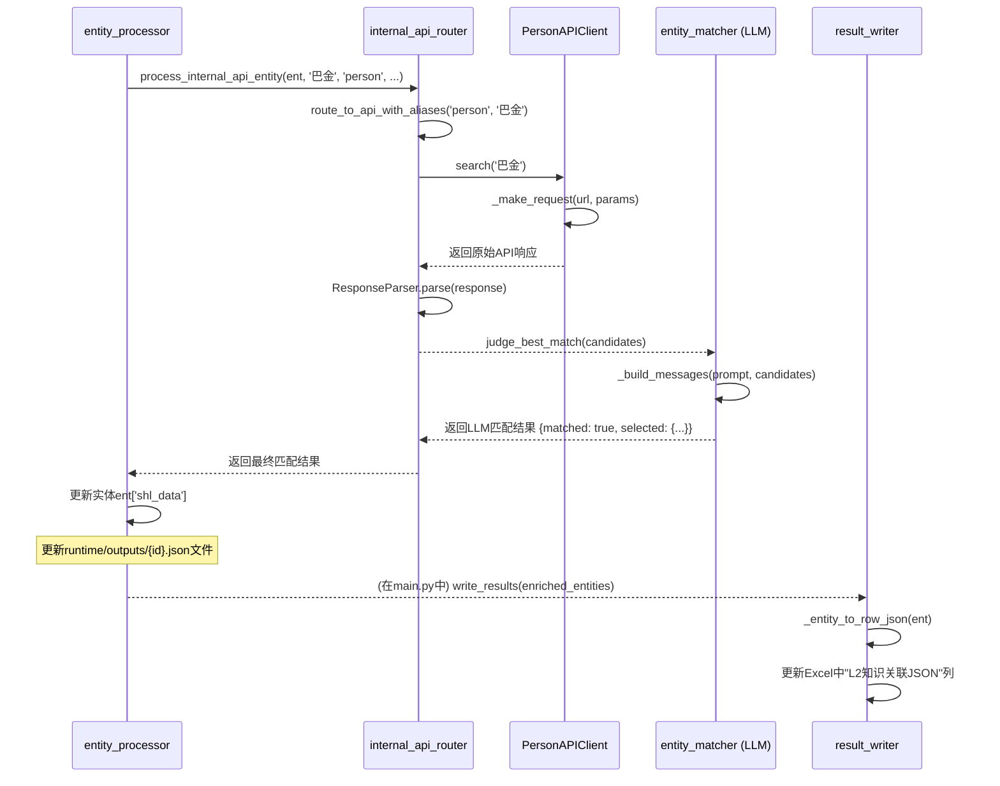

# 内部API代码分析：以Person API为例

本文档旨在详细分析L2知识关联模块中，内部API（以`person_api`为例）从实体处理到结果写回的完整工作流程。通过拆解其配置、代码实现和交互逻辑，为其他内部API的接入提供清晰的、可复用的参考。

## 1. 核心工作流

整个流程由实体处理的入口触发，经过路由、API检索、大模型（LLM）匹配、别名检索备份，最终将成功的匹配结果写回JSON文件和Excel。



## 2. 详细步骤拆解

### 2.1. 配置 (`config/settings.yaml`)

`person_api`的行为完全由`settings.yaml`驱动。

- **启用与路由**：
  - `tools.person_api.enabled: true`：全局启用此API。
  - `tools.person_api.entity_types: ["person"]`：将`person`类型的实体路由到此API。

- **API参数**：
  - `url`, `key`, `limit`：定义了API请求的地址、凭证和返回结果数量。

- **字段提取与映射**：
  - `fields.extract`：定义需要从API原始响应中提取的字段名（如 `fname`, `briefBiography`）。
  - `fields.mapping`：将提取的字段重命名为内部统一的键名（如 `fname` -> `label`, `briefBiography` -> `description`）。这是实现数据标准化的关键。

- **别名检索**：
  - `alias_search.enabled: true`：全局启用别名检索备份机制。
  - `tools.person_api.enable_alias_search: true`：为此特定API启用别名检索。

- **结果输出**：
  - `output.include`：控制写入`runtime/outputs/*.json`时，`attributes`对象中包含哪些字段。
  - `output.excel.include`：控制最终写回Excel时，`attributes`对象中包含哪些字段（优先级更高）。

```yaml
# config/settings.yaml
tools:
  person_api:
    enabled: true
    enable_alias_search: true
    url: http://data1.library.sh.cn/persons/data
    key: "env:SHL_API_KEY"
    limit: 5
    entity_types: ["person"]
    fields:
      extract:
        - fname
        - start
        - end
        - briefBiography
        - uri
      mapping:
        fname: label
        start: birth_year
        end: death_year
        briefBiography: description
        uri: uri
    output:
      include:
        - birth_year
        - death_year
```

### 2.2. 流程入口 (`src/core/l2_knowledge_linking/entity_processor.py`)

`process_entities`函数是L2知识关联的顶层协调者。它遍历所有从JSON文件中加载的实体。

1.  **检查与触发**：
    - `internal_apis_enabled` 标志位通过检查`settings.yaml`中是否有任何`_api`后缀的工具被启用而设定。
    - 对每个实体，如果内部API已启用，并且该实体尚未被成功处理过（`_should_skip("shl_data", ent)`为`False`），则调用`process_internal_api_entity`。

2.  **调用核心处理器**：
    将实体对象`ent`、标签`label`、类型`ent_type`以及上下文`context_hint`等信息传递给`process_internal_api_entity`。

```python
# src/core/l2_knowledge_linking/entity_processor.py

# ...
internal_apis_enabled = any(
    api_config.get("enabled", False)
    for api_name, api_config in settings.get("tools", {}).items()
    if api_name.endswith("_api")
)
# ...
for idx, ent in enumerate(entities):
    # ...
    if internal_apis_enabled:
        if process_internal_api_entity(
            ent, label, ent_type, context_hint, settings,
            internal_api_router, rate_limit, _should_skip, _ensure_metadata
        ):
            updated = True
```

### 2.3. 核心处理与路由 (`src/core/l2_knowledge_linking/internal_api_processor.py`)

`process_internal_api_entity`是内部API处理的核心，它协调了API调用和别名检索。

1.  **调用路由器**：
    它直接调用`internal_api_router.route_to_api_with_aliases`方法，这个方法封装了“标准检索 + 别名检索备份”的完整逻辑。

2.  **处理匹配结果**：
    - 如果`route_to_api_with_aliases`返回`"matched": true`，则进入结果处理阶段。
    - **提取核心信息**：从返回的`selected`对象中获取`uri`, `description`, `label`等。
    - **构建`attributes`**：
        - 根据`selected`对象中的`__api_name`（由API客户端在解析时注入）找到对应的API配置。
        - 读取`output.include`白名单，从`selected`对象（包含了所有映射后的字段）中筛选出需要写入`attributes`的键值对。
    - **组装`shl_data`**：将所有信息（api名, uri, description, label, attributes, meta）组装成`shl_data`对象，并更新到实体`ent`上。

3.  **处理未匹配/错误**：
    - 如果未匹配，则在`metadata.shl_data`中记录`"status": "not_matched"`。
    - 如果发生异常，则记录`"status": "error"`。

```python
# src/core/l2_knowledge_linking/internal_api_processor.py

def process_internal_api_entity(...):
    # ...
    alias_search_result = internal_api_router.route_to_api_with_aliases(
        ent_type, label, "zh", ent_type, context_hint, ent.get("wikipedia")
    )

    if alias_search_result.get("matched"):
        sel = alias_search_result.get("selected") or {}
        # ...
        # 根据配置构建 attributes
        # ...
        attributes = {}
        for k in include:
            # ...
            attributes[k] = v
        
        ent["shl_data"] = {
            "api": api_from_sel,
            "uri": uri,
            "description": description,
            "label": sel.get("label") or label,
            "attributes": attributes,
            "meta": { ... }
        }
        return True
    # ...
```

### 2.4. 实体匹配 (`src/core/l2_knowledge_linking/entity_matcher.py`)

`judge_best_match`函数负责调用LLM来判断API返回的候选列表哪个最匹配。

1.  **构建Prompt**：
    - `_build_messages`函数读取`src/prompts/l2_internal_api_disambiguation.md`作为系统提示词。
    - 将实体信息（名称、类型、上下文）和API返回的候选列表（`label`, `description`, `uri`）格式化后作为用户输入。

2.  **调用LLM**：
    - `invoke_model`将构造好的消息发送给大模型。

3.  **解析与充实结果**：
    - `_parse_llm_output`解析LLM返回的JSON字符串，提取`matched`, `selected`, `confidence`, `reason`等字段。
    - **关键步骤**：由于LLM返回的`selected`对象可能只包含`uri`等少量信息，代码会用这个`uri`在原始的`candidates`列表中查找，将完整的候选对象（包含`_raw`和`__api_name`等内部信息）重新赋给`parsed["selected"]`。这保证了下游可以获取完整的元数据。

```python
# src/core/l2_knowledge_linking/entity_matcher.py

def judge_best_match(...):
    # ...
    messages = _build_messages(label, ent_type, context_hint, source, candidates)
    out = invoke_model("l2_disambiguation", messages, settings)
    parsed = _parse_llm_output(out, source)

    # 内部API选择项充实
    if source == "internal_api" and isinstance(parsed, dict):
        sel = parsed.get("selected")
        if isinstance(sel, dict):
            sel_uri = sel.get("uri")
            # ... 在 candidates 中通过 uri 查找 ...
            if matched_candidate:
                parsed["selected"] = matched_candidate # 替换为完整的候选对象
    # ...
    return parsed
```

### 2.5. 别名检索

别名检索逻辑被优雅地封装在`InternalAPIRouter`的`route_to_api_with_aliases`方法中，对调用者透明。其内部逻辑遵循架构文档中的流程图：
1.  使用原始标签调用`route_to_api`进行检索和LLM匹配。
2.  如果匹配成功，直接返回结果。
3.  如果未匹配，检查`enable_alias_search`开关和实体是否有关联的Wikipedia信息。
4.  若满足条件，调用`AliasExtractor`（一个LLM任务）从Wikipedia描述中提取别名。
5.  `AliasSearchManager`会遍历这些别名，依次重新执行`route_to_api`进行检索和匹配。
6.  一旦任何一个别名匹配成功，立即中止循环并返回成功结果。
7.  如果所有别名都尝试失败，返回最终的未匹配结果，并记录尝试次数。

### 2.6. 结果写回 (`src/core/l2_knowledge_linking/result_writer.py`)

当`main.py`的L2流程结束后，会调用`write_results`将内存中更新过的实体信息持久化到Excel。

1.  **过滤实体属性**：
    - `_entity_to_row_json`函数负责将每个实体的`shl_data`转换为最终要写入JSON列的格式。
    - 它会再次检查`tools.<api_name>.output.excel.include`配置，如果存在，则只保留白名单中的`attributes`字段。这允许运行时JSON和最终Excel中的数据有不同的详细程度。

2.  **写入Excel**：
    - 函数遍历Excel的每一行，根据行ID找到对应的实体列表。
    - 将过滤和格式化后的实体列表序列化为JSON字符串。
    - 使用`xio.set_value`将该字符串写入固定的`L2知识关联JSON`列。
    - 最后调用`xio.save()`保存整个Excel文件。

```python
# src/core/l2_knowledge_linking/result_writer.py

def _entity_to_row_json(ent: Dict[str, Any], settings: Dict[str, Any]) -> Dict[str, Any]:
    # ...
    sa = ent.get("shl_data")
    if isinstance(sa, dict) and sa:
        # ... 读取 excel.include 白名单 ...
        include_set: Optional[set] = ... # 根据配置确定
        
        attrs_src = sa.get("attributes") or {}
        attrs_out: Dict[str, Any] = {}
        if isinstance(attrs_src, dict):
            for k, v in attrs_src.items():
                if include_set is None or k in include_set: # 按白名单过滤
                    attrs_out[k] = v
        
        obj["shl_data"] = {
            # ...
            "attributes": attrs_out,
        }
    return obj
```

## 3. 如何扩展新API

基于以上分析，添加一个新的内部API（例如`movie_api`）的步骤非常清晰：

1.  **创建API客户端**：在`src/core/l2_knowledge_linking/tools/internal_apis/`下创建`movie_api.py`，继承`InternalAPIClient`并实现`search`方法。
2.  **注册API**：在`src/core/l2_knowledge_linking/tools/internal_apis/__init__.py`的`initialize_from_settings`中添加对`movie_api`的注册逻辑。
3.  **更新配置**：在`config/settings.yaml`的`tools`下添加`movie_api`的完整配置，包括`enabled`, `url`, `entity_types` (如 `["movie"]`), `fields`和`output`规则。

系统其余部分（路由、匹配、别名检索、写回）将自动适应新的API，无需额外修改代码。
