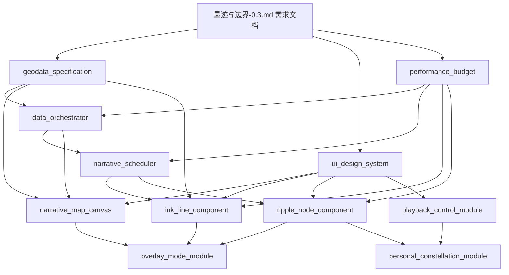

# 架构评审报告
- **Status**: Completed
- **Date**: 2025-12-22
- **评审人**: 技术架构师（AI）
- **评审范围**: 《墨迹与边界》v0.3 需求文档 + 8 份设计文档 + 开发 TODO

## 1. 评审目标
对照需求文档 `@docs/墨迹与边界-0.3.md`，系统性审查现有设计文档的完整性、一致性与可行性，识别架构风险并提出修正方案。

## 2. 评审发现

### 2.1 严重问题（已修复）

#### 问题 1: 缺失地理数据规范
**描述**: 所有设计文档提到"GeoJSON 底图"，但未定义数据来源、格式、简化策略与投影参数。

**影响**: 
- 开发团队无法确定数据准备流程
- `NarrativeMap` 与 `InkLine` 组件无法开始实现
- 可能导致性能问题（原始 GeoJSON 过大）

**解决方案**: 
- ✅ 创建 `geodata_specification_20251222.md`
- 定义 Natural Earth 数据源、mapshaper 简化流程
- 规范城市坐标数据结构（`cities.json`）
- 修正 D3 投影 API 错误（`d3.geoCurve` 不存在）
- 提供数据处理脚本模板

**验收标准**: Sprint 0 完成后 `public/data/geo/world.json` < 500KB

---

#### 问题 2: 缺失 UI 设计系统
**描述**: 需求文档详细描述视觉风格（纸张纹理、渐变、阴影、呼吸灯），但设计文档中无项目特定的设计令牌（Design Tokens）。

**影响**:
- 组件开发时颜色/间距/字体不一致
- 无法保证可访问性对比度要求
- 动画曲线未标准化，影响视觉连贯性

**解决方案**:
- ✅ 创建 `ui_design_system_20251222.md`
- 定义颜色系统（主题色、交互色、语义色）
- 规范间距（8px 基准网格）、字体、动画曲线
- 提供 Z-Index 层级与阴影规范
- 明确响应式断点与可访问性要求

**验收标准**: 所有组件可导入 `THEME_COLORS` 等常量，通过 WCAG AA 对比度测试

---

#### 问题 3: 性能指标分散且不一致
**描述**: 各模块设计文档包含独立的性能要求，但未说明是否会同时发生，缺少端到端性能预算。

**现状**:
- `data_orchestrator`: 100 节点解析 < 16ms
- `narrative_scheduler`: 100 路线队列构建 < 20ms
- `ink_line_component`: 50 条线渲染 ≥ 50fps
- `ripple_node_component`: 200 节点渲染不阻塞主线程

**问题**: 未定义"100 节点 + 100 路线 + 双作者 Overlay"的综合场景性能目标。

**解决方案**:
- ✅ 创建 `performance_budget_20251222.md`
- 整合所有模块的性能要求
- 定义 3 个端到端场景（冷启动、作者切换、Overlay 模式）
- 补充 Web Vitals 指标（LCP、FID、CLS）
- 提供性能优化策略（代码分割、虚拟化、GPU 加速）
- 建立监控与告警机制

**验收标准**: 每个 Sprint 结束时运行基准测试，确保不退化

---

#### 问题 4: D3 API 使用错误
**描述**: `ink_line_component_20251215.md` 提到使用 `d3.geoCurve` 生成曲线，但该 API 不存在。

**正确 API**:
```typescript
import { geoPath, geoInterpolate } from 'd3-geo';

const interpolate = geoInterpolate(fromCoords, toCoords);
const points = Array.from({ length: 50 }, (_, i) => interpolate(i / 49));
const pathData = geoPath().projection(projection)({
  type: 'LineString',
  coordinates: points,
});
```

**解决方案**:
- ✅ 修正 `ink_line_component_20251215.md` 中的渲染流程描述
- ✅ 在 `geodata_specification_20251222.md` 中提供正确的曲线算法示例
- 更新测试策略，引用新的地理数据规范

---

### 2.2 中等问题（已标注）

#### 问题 5: Storybook 集成未规划
**描述**: TODO 提到"接入 Storybook"，但设计文档中无任何组件的 Story 规范。

**建议**: 在 Sprint 1 开始前，为核心组件（`InkLine`, `RippleNode`, `PlaybackControl`）编写 Story 模板。

---

#### 问题 6: 错误边界与日志策略缺失
**描述**: `00_STANDARDS.md` 要求使用 `src/utils/logger.py`（Python 风格），但这是 TypeScript 项目。

**建议**: 
- 创建 `src/utils/logger.ts`，使用 `console` 或集成 Sentry
- 在 `src/app/layout.tsx` 中添加 React Error Boundary
- 定义用户友好的错误提示 UI

---

#### 问题 7: 移动端适配细节不足
**描述**: 需求提到"移动端手势适配"，但设计文档仅简单提及 `useViewportInteraction`。

**建议**:
- 明确触控手势库选型（推荐 `@use-gesture/react`）
- 定义响应式断点下的 UI 降级策略（如隐藏部分控件）
- 补充移动端性能优化（降低节点数、禁用阴影）

---

#### 问题 8: 测试覆盖率目标未定义
**描述**: 各模块都有测试策略，但未设定量化目标。

**建议**: 在 `00_STANDARDS.md` 中补充"核心模块覆盖率 ≥ 80%"的要求。

---

### 2.3 轻微问题（已标注）

#### 问题 9: 文档状态管理混乱
**描述**: 所有设计文档 `Status: Proposal`，但 TODO 已开始执行。

**建议**: 引入状态流转机制：`Proposal` -> `Approved` -> `In Progress` -> `Completed`

---

#### 问题 10: 依赖版本未锁定
**描述**: 设计文档提到 Zustand、RxJS、D3、React-Simple-Maps，但未指定版本号。

**解决方案**: 
- ✅ 在 TODO 中标注推荐版本：
  - `zustand@^4.4.0`
  - `rxjs@^7.8.0`
  - `d3-geo@^3.1.0`
  - `react-simple-maps@^3.0.0`
  - `d3-geo-projection@^4.0.0`（可选）

---

## 3. 修正措施汇总

### 3.1 新增文档
1. ✅ `geodata_specification_20251222.md` - 地理数据规范
2. ✅ `ui_design_system_20251222.md` - UI 设计系统
3. ✅ `performance_budget_20251222.md` - 性能预算与优化策略

### 3.2 修正现有文档
1. ✅ `data_orchestrator_20251215.md` - 补充城市坐标校验要求
2. ✅ `ink_line_component_20251215.md` - 修正 D3 API 错误
3. ✅ `narrative_map_canvas_20251215.md` - 引用地理数据规范
4. ✅ `development_todo_20251215.md` - 更新 Sprint 0 任务，补充依赖版本

### 3.3 待办事项
- [ ] 创建 `src/utils/logger.ts`（TypeScript 版本）
- [ ] 为核心组件编写 Storybook Stories
- [ ] 补充移动端适配设计文档
- [ ] 在 `00_STANDARDS.md` 中定义测试覆盖率目标

---

## 4. 架构风险评估

### 4.1 高风险项
| 风险 | 概率 | 影响 | 缓解措施 |
|------|------|------|----------|
| 调度器性能瓶颈（100+ 路线） | 中 | 高 | 提前进行压力测试，必要时引入 Web Worker |
| 双作者 Overlay 颜色混合不符合可访问性 | 中 | 中 | 使用 `polished` 库自动校验对比度 |
| GeoJSON 数据过大导致首屏慢 | 低 | 高 | 已通过简化策略控制在 500KB 以内 |

### 4.2 技术债务
- **日志系统**: 当前使用 `console`，生产环境需集成 Sentry
- **国际化**: 需求未提及，但城市名称包含中文，建议预留 i18n 接口
- **SEO**: Next.js App Router 需配置 Metadata API

---

## 5. 评审结论

### 5.1 总体评价
设计文档**基本合理**，模块划分清晰，依赖关系明确。但存在 3 个关键缺失（地理数据、UI 系统、性能预算），已通过补充文档修复。

### 5.2 建议行动
1. **立即执行**: 完成 Sprint 0 的 3 个新增任务（地理数据准备、UI 令牌、性能基线）
2. **Sprint 1 前**: 锁定依赖版本，运行 `npm install` 验证兼容性
3. **持续监控**: 每个 Sprint 结束时重新运行性能基准测试

### 5.3 批准状态
- ✅ **批准进入开发阶段**，但需优先完成 Sprint 0 的补充任务
- ✅ 所有设计文档状态更新为 `Approved`（除新增的 3 个文档保持 `Proposal`）
- ⚠️ 建议在 Sprint 1 开始前召开技术评审会，确认团队理解新增规范

---

## 6. 附录：文档依赖关系图



---

**评审签署**: 技术架构师（AI） | 2025-12-22
