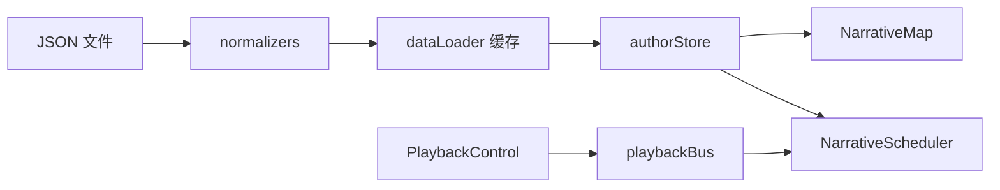

# 数据编排与状态管理模块 设计文档
- **Status**: Proposal
- **Date**: 2025-12-15

## 1. 目标与背景
负责把 `/public/data/authors/*.json` 中的静态数据解析成前端可消费的标准结构，并向动画调度器与可视化组件提供一致的状态访问接口。该模块还承担缓存策略、容错校验以及与 `Zustand`/`RxJS` 的联动，是后续 `narrative_scheduler_20251215.md` 与 `narrative_map_canvas_20251215.md` 的数据基础。

## 2. 详细设计
### 2.1 模块结构
- `src/core/data/dataLoader.ts`: 读取并解析作者 JSON，完成字段校验与默认值补齐。
- `src/core/data/normalizers.ts`: 提供坐标、年份、馆藏元数据等细粒度规范化函数。
- `src/core/state/authorStore.ts`: 基于 `Zustand` 的作者/作品选择状态，负责暴露 `currentAuthor`, `currentWork`, `routes` 等 selector。
- `src/core/state/playbackStore.ts`: 管理播放头、速度、循环模式；通过 `RxJS Subject` 与调度器交互。
- `src/utils/geo/coordinateUtils.ts`: 统一地理投影、边界盒计算与误差校验逻辑。
- `tests/core/dataLoader.test.ts`: 覆盖 JSON 解析、异常数据兜底策略。
- `tests/core/state/authorStore.test.ts`: 验证状态切换、副作用通知与订阅退订。

### 2.2 核心逻辑/接口
- **数据流**：`fetch -> JSON.parse -> normalizers -> dataLoader cache -> authorStore`。
- **接口**：
  - `loadAuthor(authorId: string): Promise<AuthorPayload>` —— 失败时抛出带定位信息的错误对象。
  - `useAuthorStore(selector)` —— 所有 UI 使用该 selector，避免直接访问 loader 缓存。
  - `playbackBus: Subject<PlaybackEvent>` —— 来自 `PlaybackControl` 的事件进入总线，并被 `NarrativeScheduler` 消费。
- **缓存策略**：浏览器层面使用 `Map<string, AuthorPayload>`；在作者切换且已缓存时，仅回放调度队列，不重复发起请求（详见 `performance_budget_20251222.md` 的缓存策略）。
- **城市坐标校验**：所有坐标需与 `geodata_specification_20251222.md` 中的 `cities.json` 对齐。
- **容错**：
  - 坐标缺失 -> 记录 `ERROR` 日志并跳过该路线。
  - 年份缺失 -> 回退到作品出版年；若仍无值则抛错。
  - `has_collection` 为真且无 `collection_meta` -> 自动补空结构，提示 UI 谨慎渲染。

### 2.3 可视化图表

## 3. 测试策略
1. **Happy Path**：加载包含多作品的作者 JSON，验证 selector 输出是否符合预期结构。
2. **异常数据**：模拟坐标缺失、年份为字符串等情况，检查 normalizers 是否抛出/纠正。
3. **缓存**：同一作者重复加载只命中缓存，不再触发 `fetch`。
4. **状态联动**：在 `authorStore` 中切换作者时，确认 `playbackStore` 自动重置播放头并通过 `playbackBus` 广播停止事件。
5. **性能**：基准测试 100 个节点的解析时间，确保小于 16ms，避免主线程卡顿。
