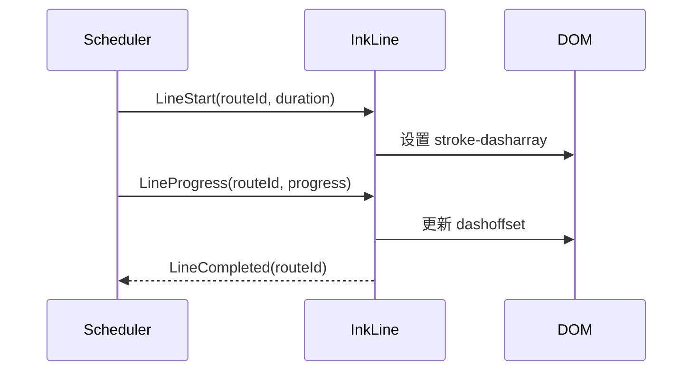

# 墨迹线条组件 设计文档
- **Status**: Proposal
- **Date**: 2025-12-15

## 1. 目标与背景
`InkLine` 负责将路线数据渲染为具有方向渐变、拖尾与生长动画的 SVG 曲线。它需要与 `narrative_scheduler_20251215.md` 的 `LineStart/LineProgress` 保持同步，并遵守 `narrative_map_canvas_20251215.md` 的图层规范。

## 2. 详细设计
### 2.1 模块结构
- `src/core/ink/InkLine.tsx`: React 组件，接收 `from/to`, `progress`, `themeColor` 等属性。
- `src/core/ink/useInkAnimation.ts`: 封装 `stroke-dasharray`、`dashoffset` 计算及 `requestAnimationFrame` 控制。
- `src/core/ink/curveFactory.ts`: 通过 `d3-geo` 生成弧线，支持 `geoNaturalEarth1` 与 `geoAiry`。
- `src/core/ink/gradients.ts`: 管理 `<defs>` 中的渐变定义与复用。
- `tests/core/inkLine.test.tsx`: 快照与动画逻辑测试。

### 2.2 核心逻辑/接口
- **Props**：
  - `routeId: string`
  - `coordinates: [number, number][]`
  - `duration: number`
  - `delay: number`
  - `themeColor: string`
- **渲染流程**：
  1. `curveFactory` 根据坐标生成 `d` 属性。
  2. 计算总长度 `pathLength`，设置 `stroke-dasharray = pathLength`。
  3. `useInkAnimation` 根据调度器传入的 `progress`（0-1）更新 `stroke-dashoffset`，实现“生长”视觉。
  4. 提供 `onLineEnd(routeId)` 回调给调度器，触发 `RippleNode`。
- **性能优化**：使用 `React.memo` + `useRef` 存储 DOM 引用；在 `progress` 未变化时不重新渲染。
- **依赖声明**：需要 `data_orchestrator` 提供的颜色与路线排序，依赖 `scheduler` 的事件推进。

### 2.3 可视化图表

## 3. 测试策略
1. **曲线生成**：对不同投影输入进行单元测试，确保大圆航线不穿越地图边界（参考 `geodata_specification_20251222.md` 的投影配置）。
2. **动画同步**：使用 jest fake timers 驱动 `progress`，断言 `stroke-dashoffset` 精确匹配。
3. **渐变重用**：渲染多个 `InkLine` 时 `<defs>` 不重复注入相同 `id`；可通过 DOM 查询断言。
4. **回调可靠性**：`LineCompleted` 仅在 `progress >= 1` 且 `requestAnimationFrame` 完整执行后调用一次。
5. **性能基准**：在 Storybook 里启用 50 条线同时渲染，记录帧率不低于 50fps（详见 `performance_budget_20251222.md`）。 
