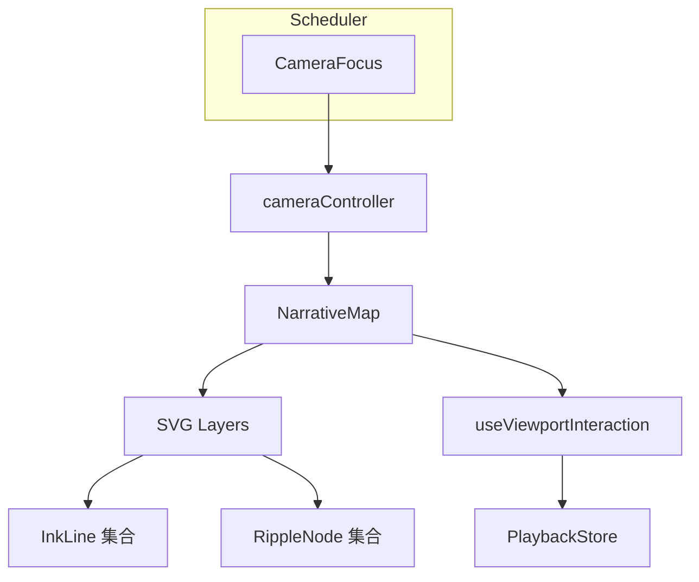

# 叙事地图画布模块 设计文档
- **Status**: Proposal
- **Date**: 2025-12-15

## 1. 目标与背景
`NarrativeMap` 是所有视觉叙事的舞台，负责渲染 GeoJSON 底图、承载 `InkLine` 与 `RippleNode`，并实现 `Smart FlyTo` 运镜。模块需兼容自动播放与用户交互模式，确保动画期间体验顺滑。依赖 `data_orchestrator_20251215.md` 的状态与 `narrative_scheduler_20251215.md` 的事件。

## 2. 详细设计
### 2.1 模块结构
- `src/core/map/NarrativeMap.tsx`: 主组件，组织 React-Simple-Maps 投影、层级管理。
- `src/core/map/cameraController.ts`: 负责 Bounding Box 解析、`Smart FlyTo` 动画参数计算。
- `src/core/map/useViewportInteraction.ts`: 管理鼠标/触控交互，支持在自动播放时锁定用户输入。
- `src/core/map/layers.ts`: 定义底图、线条、节点等 SVG 图层顺序及混合模式。
- `tests/core/cameraController.test.ts`: 校验视角计算与 padding。
- `tests/core/mapInteractions.test.tsx`: 模拟用户交互，验证禁用逻辑与事件冒泡。

### 2.2 核心逻辑/接口
- **图层策略**：底图 -> 线条 -> 节点 -> Tooltip；通过 `mix-blend-mode: multiply` 实现 Overlay 需求（详见 `ui_design_system_20251222.md` 的 Z-Index 规范）。
- **Smart FlyTo**：
  - 输入：`AuthorBBox`, `paddingPct`, `duration`。
  - 输出：`{center, zoom, rotation}` 参数传给 React-Simple-Maps + `react-spring` 动画。
- **GeoJSON 底图**：使用 `geodata_specification_20251222.md` 定义的简化数据与投影配置。
- **交互模式**：
  - `auto`（默认）：锁定缩放和平移，直至用户点击“解锁”。
  - `manual`：开启手势操作并向 `playbackStore` 发送 `Pause`。
- **事件监听**：通过 `scheduler.on(CameraFocus)` 接收 bounding box，触发飞行动画；`InkLine`、`RippleNode` 以 props 形式插入。
- **响应式**：监听 `ResizeObserver` 与 `matchMedia('(prefers-reduced-motion)')`，在低性能模式下降级动画细节。

### 2.3 可视化图表

## 3. 测试策略
1. **Bounding Box**：输入一组跨经纬度点，断言 `cameraController` 返回的 `center/zoom` 合理且包含所有节点。
2. **自动播放限制**：在 `auto` 模式下模拟滚轮，期望事件被 `preventDefault`。
3. **模式切换**：切到 `manual` 后，`playbackStore` 收到 `Pause`，并允许进一步交互。
4. **降级策略**：开启 `prefers-reduced-motion` 时，确保 `react-spring` 动画持续时间缩短或跳过。
5. **Layer 顺序**：基于快照测试（`@testing-library/react` + `jest-axe`）确保 DOM 中层级稳定，为可访问性提供保障。
