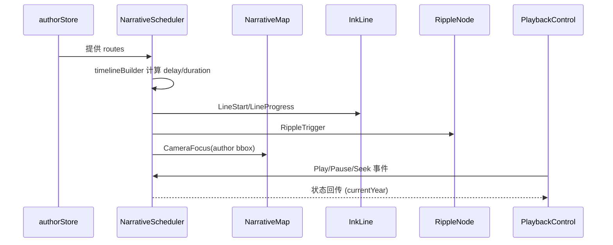

# 叙事调度器模块 设计文档
- **Status**: Proposal
- **Date**: 2025-12-15

## 1. 目标与背景
调度器负责把静态路线数据转化为“线段绘制 + 节点触发”的时间轴事件队列，确保 `InkLine` 与 `RippleNode` 动画严格按先后顺序执行。该模块依赖 `data_orchestrator_20251215.md` 提供的标准化 `routes`，并将事件结果投递给 `narrative_map_canvas_20251215.md` 与播放控制模块。

## 2. 详细设计
### 2.1 模块结构
- `src/core/scheduler/narrativeScheduler.ts`: 核心类，负责构建与执行事件队列。
- `src/core/scheduler/timelineBuilder.ts`: 根据路线年份和距离计算 `delay/duration`。
- `src/core/scheduler/eventBus.ts`: 封装 `RxJS` Subject，统一 `SchedulerEvent` 发布。
- `src/core/scheduler/types.ts`: 定义 `RouteEvent`, `RippleEvent`, `PlaybackEvent` 等 TypeScript 类型。
- `tests/core/narrativeScheduler.test.ts`: 验证时间依赖、事件顺序与暂停恢复逻辑。

### 2.2 核心逻辑/接口
- **事件生成**：
  1. `timelineBuilder` 依据 `routes` 中 `year`、路线长度计算 `duration = base * distanceFactor * yearFactor`。
  2. 为每条路线生成 `LineStart`, `LineEnd`, `RippleTrigger` 三类事件。
- **执行循环**：
  - 内部使用 `requestAnimationFrame` 驱动，结合 `performance.now()` 计算相对时间。
  - 支持 `play`, `pause`, `seek`, `setSpeed` 控制，均通过 `PlaybackEvent` 触发。
- **接口**：
  - `scheduler.load(authorId, routes)` —— 初始化事件队列，返回 Promise 以便 UI 等待。
  - `scheduler.on(eventType, listener)` —— 组件注册监听，如 `InkLine` 只关心 `LineStart/LineProgress`。
  - `scheduler.dispose()` —— 作者切换时清理所有 `RAF` 和订阅。
- **依赖管理**：
  - 需要 `data_orchestrator` 推送的 `routes`。
  - 将 `LineStart` 中的地理信息传给 `NarrativeMap` 做 `Smart FlyTo`。

### 2.3 可视化图表

## 3. 测试策略
1. **顺序正确性**：构造 3 条路线，断言 `LineStart`、`LineEnd`、`RippleTrigger` 的时间戳单调递增。
2. **播放控制**：`pause` 后不再触发任何事件，`resume` 继续从中断位置推进。
3. **Seek**：拖动至任意百分比，调度器应立刻派发 `LineStart` 给对应区间，之前的事件进入完成态。
4. **多作者切换**：在 load 新作者前调用 `dispose`，确保无内存泄漏；通过 `WeakRef`/DevTools 观察对象释放。
5. **性能**：100 条路线下创建事件队列时间 < 20ms；帧循环 jitter 小于 10ms。
