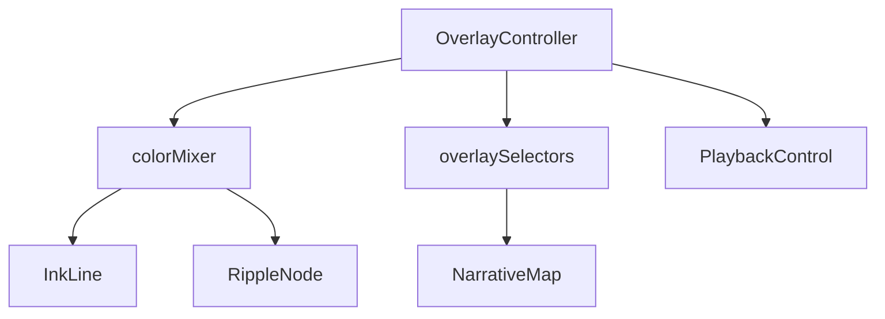

# 作者叠加对比模块 设计文档
- **Status**: Proposal
- **Date**: 2025-12-15

## 1. 目标与背景
Overlay 模式允许用户选择两位作者并在同一张地图上比较其传播轨迹。模块需要协调 `NarrativeMap` 的多图层渲染、`InkLine`/`RippleNode` 的颜色混合以及 `PlaybackControl` 的联动/独立时间轴切换，是 Phase 3 的核心亮点。

## 2. 详细设计
### 2.1 模块结构
- `src/core/overlay/OverlayController.ts`: 负责管理作者选择、颜色分配与模式切换。
- `src/core/overlay/colorMixer.ts`: 根据主副作者颜色生成混合色与对比度补偿。
- `src/core/overlay/useOverlayPlayback.ts`: 处理联动/独立进度条逻辑。
- `src/core/overlay/overlaySelectors.ts`: 暴露合并后的路线与节点数据供 `NarrativeMap` 渲染。
- `tests/core/overlayController.test.ts`: 校验依赖与颜色混合规则。

### 2.2 核心逻辑/接口
- **模式**：
  - `linked`: 两位作者共用同一播放头，依赖主作者时间轴，副作者线条按比例缩放。
  - `independent`: 显示双进度条，允许逐一比较，`PlaybackControl` 需显示 tab。
- **数据合并**：
  - 通过 `authorStore` 同时加载两份作者数据；根据 `cityId` 建立节点映射。
  - 当两者同抵同城时，触发 `RippleNode` 的 `mixColor` 与 `dualTooltip`。
- **颜色策略**：
  - `colorMixer` 采用 HSL 空间混色，避免产生灰色；若颜色对比度低于 4.5:1，自动启用描边。
- **依赖声明**：
  - 与 `ripple_node_component_20251215.md` 协议混色接口 `applyOverlayStyle(cityId, styles)`。
  - 与 `playback_control_module_20251215.md` 协调进度条 UI。

### 2.3 可视化图表

## 3. 测试策略
1. **数据对齐**：构造两位作者共享城市，断言 `overlaySelectors` 输出的节点包含 `primary`/`secondary` 元数据。
2. **颜色混合**：单测 `colorMixer`，确保混合结果满足可访问性对比度要求。
3. **模式切换**：在 `linked` 与 `independent` 间切换不会导致调度器重复初始化；通过模拟事件确认。
4. **性能**：双作者加载后渲染帧率不低于 45fps，必要时降级线条细节。
5. **回退策略**：若第二位作者数据加载失败，模块需要回退到单作者模式并提示用户。
