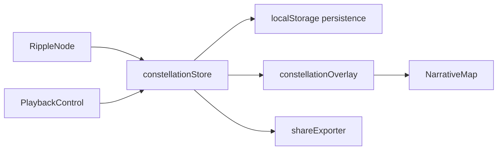

# 个人星图模块 设计文档
- **Status**: Proposal
- **Date**: 2025-12-15

## 1. 目标与背景
个人星图允许用户在节点上标记“我读过/我想去”并持久化到本地，形成可分享的阅读版图。该模块延伸主叙事体验，为 Phase 4 的增值功能，需与 `RippleNode`、`NarrativeMap`、`PlaybackControl` 保持兼容，同时保证隐私与离线能力。

## 2. 详细设计
### 2.1 模块结构
- `src/core/constellation/constellationStore.ts`: 使用 `Zustand` 托管用户标记数据，支持多作者共存。
- `src/core/constellation/persistence.ts`: 负责 `localStorage` 读写与版本迁移。
- `src/core/constellation/constellationOverlay.tsx`: 在地图上渲染金色轨迹与节点外圈。
- `src/core/constellation/shareExporter.ts`: 导出当前视图为 PNG/SVG。
- `tests/core/constellationStore.test.ts`: 状态逻辑测试。
- `tests/core/shareExporter.test.ts`: 导出尺寸与样式校验。

### 2.2 核心逻辑/接口
- **数据模型**：
  ```ts
  type UserMark = {
    authorId: string;
    cityId: string;
    status: 'read' | 'wish';
    note?: string;
    timestamp: number;
  };
  ```
- **事件来源**：
  - 用户在 `RippleNode` Tooltip 里点击“点亮”按钮。
  - 播放控制栏提供“高亮用户节点”开关。
- **持久化**：
  - 初次写入时检测 `localStorage` 容量界限；超限提示用户清理。
  - 支持导入/导出 JSON，方便跨设备迁移。
- **渲染策略**：
  - `constellationOverlay` 读取标记数据，叠加在 `NarrativeMap` 顶层，使用 `mix-blend-mode: screen`。
  - 与 Overlay 模式共存时，优先显示用户标记，作者颜色作为内圈。
- **安全与隐私**：
  - 所有数据仅保存在用户浏览器；共享前要求用户确认。

### 2.3 可视化图表


## 3. 测试策略
1. **状态操作**：增删改标记应保持幂等；同一 `authorId+cityId` 更新时覆盖旧值。
2. **持久化迁移**：模拟旧版本 schema，验证迁移脚本能自动补齐字段。
3. **导出**：生成 PNG/SVG 时包含当前视角与高亮节点；使用像素快照验证。
4. **Overlay 兼容**：在双作者模式下，标记样式不被颜色覆盖，保留高亮优先级。
5. **错误处理**：`localStorage` 抛出异常（隐私模式）时要优雅降级并提示用户。
