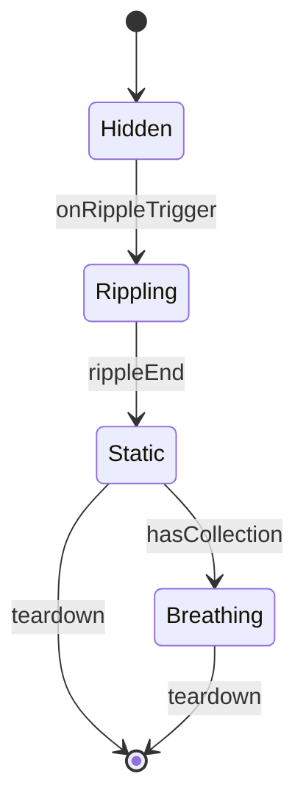

# 涟漪节点组件 设计文档
- **Status**: Proposal
- **Date**: 2025-12-15

## 1. 目标与背景
`RippleNode` 呈现城市节点的冲击、定格与呼吸动画，是用户检索馆藏信息的交互入口。组件需监听 `narrative_scheduler_20251215.md` 的 `RippleTrigger` 事件，并与 `playback_control_module_20251215.md` 共享当前年份以展示时间标签。

## 2. 详细设计
### 2.1 模块结构
- `src/core/nodes/RippleNode.tsx`: React 组件，维护本地状态机。
- `src/core/nodes/useRippleState.ts`: 定义 `Hidden -> Rippling -> Static -> Breathing` 状态转换逻辑。
- `src/core/nodes/rippleStyles.css.ts`: 使用 `vanilla-extract` 或 `styled-components` 管控关键帧。
- `src/core/nodes/nodeTooltip.tsx`: 渲染作品/馆藏信息的 Tooltip。
- `tests/core/rippleNode.test.tsx`: 状态机与无障碍测试。

### 2.2 核心逻辑/接口
- **Props**：`cityId`, `coordinates`, `hasCollection`, `collectionMeta`, `year`。
- **状态机**：
  - `Hidden`: 等待调度器事件。
  - `Rippling`: 触发冲击动画，300-600ms。
  - `Static`: 展示实心墨点；若 `hasCollection` 为真，转入 `Breathing`。
  - `Breathing`: 周期性发光，监听 Hover/Focus。
- **互动**：
  - Hover：调用 `nodeTooltip.show(cityId)`，附带当前年。
  - Click：若存在 `collectionMeta`，通过 `authorStore` 推送侧栏详情。
- **依赖声明**：
  - 与 `InkLine` 共享 `routeId`，确保 Ripple 仅在对应线路完成后触发。
  - 与 `overlay_mode_module_20251215.md` 协议：多作者叠加时，节点根据颜色混合生成新状态。

### 2.3 可视化图表

## 3. 测试策略
1. **状态流转**：使用测试驱动状态机，确保 `hasCollection=false` 时不会进入 `Breathing`。
2. **可访问性**：节点必须具备 `role="button"` 与键盘可触达；`Enter/Space` 触发点击逻辑。
3. **多作者颜色**：在 Overlay 模式下模拟两位作者同时抵达同一城市，断言节点颜色与混合策略一致。
4. **Tooltip 边界**：当节点靠近视口边缘时，Tooltip 自动反转方向。
5. **性能**：批量渲染 200 个节点，检查动画不会阻塞主线程（使用 `performance.mark`）。
