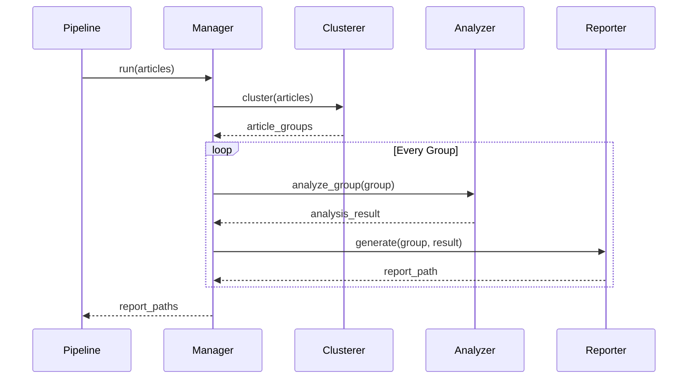

# 文章交叉分析重构设计文档
- **Status**: Proposal
- **Date**: 2025-12-10

## 1. 目标与背景
**目标**：重构文章交叉分析功能，引入基于语义的动态聚类策略，并将分析结果生成独立的 Markdown 报告。
**背景**：当前简单的批处理策略容易将不相关的文章组合在一起，导致 LLM 产生幻觉。通过引入 TF-IDF 和 K-Means 聚类，可以将语义相近的文章分组，提高分析质量。每组的分析结果将生成独立的文档以便查阅。

## 2. 详细设计

## 2. 详细设计

### 2.0 数据输入 (Data Input)
从 Excel 读取以下关键字段用于聚类和分析：
- **基础信息**: `id`, `title`
- **LLM 分析数据**: 
    - `llm_thematic_essence`: 主题本质，用于聚类权重较高。
    - `llm_tags`: 标签，用于辅助聚类。
    - `llm_summary`: **需解析 JSON**，提取 `summary_long` 节点作为主要内容摘要。
    - `llm_mentioned_books`: 提及书籍，作为补充上下文。
    - `llm_score`: (可选) 可用于筛选高质量文章参与交叉分析。

### 2.1 模块结构 (Module Structure)
鉴于逻辑重构，将清理 `src/core/cross_analysis/` 下原有代码，采用以下新结构：

- `src/core/cross_analysis/`
    - `__init__.py`: 导出 `CrossAnalysisManager`，对外暴露统一接口。
    - `manager.py`: **协调者 (Coordinator)**。负责接收文章列表，编排聚类、分析、报告生成的全流程。
    - `clustering.py`: **聚类器 (Clusterer)**。负责文本向量化 (TF-IDF) 和动态 K-Means 聚类。
    - `analysis.py`: **分析器 (Analyzer)**。负责与 LLM 交互，对单组文章进行交叉分析。
    - `report.py`: **报告生成器 (Reporter)**。负责将分析结果渲染为 Markdown 文件。

### 2.2 核心逻辑/接口 (Core Logic)

#### 1. CrossAnalysisManager (manager.py)
- **Class**: `CrossAnalysisManager`
- **Method**: `run(articles: List[Dict], output_dir: str) -> List[str]`
- **Logic**:
    1. 接收原始文章列表。
    2. **筛选 (Filter)**：根据配置的 `cross_analysis.min_score` (默认 92) 过滤文章，仅保留高分文章。
    3. 数据预处理：解析 `llm_summary` 提取 `summary_long`。
    4. 调用 `Clusterer.cluster(articles)` 获取分组列表 `List[List[Dict]]`。
    5. 遍历每个分组：
        - 调用 `Analyzer.analyze_group(group)` 获取分析结果 `Dict`。
        - 调用 `Reporter.generate(group, analysis_result, output_dir)` 生成独立 MD 报告。
    6. 返回生成的所有报告路径列表。

#### 2. Clusterer (clustering.py)
- **Class**: `Clusterer`
- **Method**: `cluster(articles: List[Dict]) -> List[List[Dict]]`
- **Logic**:
    1. 特征构建：拼接 `Title` + `Thematic Essence` + `Tags` + `Summary(Long)`。
    2. 向量化：使用 `TfidfVectorizer`。
    3. 聚类：计算 `k = len(articles) // batch_size` (动态调整)，使用 `KMeans`。
    4. 映射：将聚类标签映射回原始文章对象，返回分组列表。

#### 3. Analyzer (analysis.py)
- **Class**: `Analyzer`
- **Method**: `analyze_group(articles: List[Dict]) -> Dict`
- **Logic**:
    1. 构造 Prompt：包含组内文章的 `ID`, `Title`, `Summary(Long)`, `Tags` 等。
    2. 调用 LLM (Task: `article_cross_analysis`)。大漠新配置 llm.yaml
    3. 解析并返回 JSON 结果（包含母题、深度洞察等）。

#### 4. Reporter (report.py)
- **Class**: `Reporter`
- **Method**: `generate(articles: List[Dict], analysis: Dict, output_dir: str) -> str`
- **Logic**:
    1. 渲染 Markdown 模板。
    2. 包含：文章列表表格、共同母题、详细分析内容。
    3. 保存文件至 `runtime/outputs/cross_analysis/`，文件名包含母题关键词或组ID。

### 2.3 可视化图表 (Visualization)

## 3. 测试策略
遵循 `@.rules/00_STANDARDS.md`：
1.  **单元测试**:
    -   测试 `ThemeCluster` 的向量化和聚类逻辑（Mock sklearn）。
    -   测试 `CrossAnalyzer` 的 Prompt 构造逻辑。
2.  **集成测试**:
    -   运行 `python main.py --stage cross`。
    -   验证 `runtime/outputs/cross_analysis/` 目录下是否生成了 Markdown 报告。
    -   验证报告内容是否包含预期的母题分析和文章列表。
3.  **边界条件**:
    -   文章数量少于 `batch_size` 时的处理（应作为单组处理）。
    -   `scikit-learn` 未安装时的错误处理（应优雅降级或提示）。

## 4. 规范合规性说明
- **代码注释**: 全程使用中文。
- **日志**: 使用中文，通过 `src/utils/logger.py` 输出。
- **文档**: 本设计文档存储于 `docs/cross-analysis/`。
