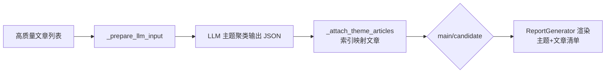

# 主题-文章关联增强设计文档
- **Status**: Proposal
- **Date**: 2025-12-07

## 1. 目标与背景
- 在交叉主题报告中为每个主题列出对应文章，字段包含标题、来源、发布时间、URL，帮助读者回溯主题证据链。
- 补齐 LLM 聚类结果与原始文章的关联信息，避免“相关文章数 0”的空洞输出。
- 优化 `article_cross_analysis` 提示词与解析流程，确保主题-文章索引稳定可复用，并最小化代码改动范围。

## 2. 详细设计

### 2.1 模块结构
- `prompts/article_cross_analysis.md`：强化输出约束，增加对 `article_indices`、字段含义与 JSON 结构的明确约定。
- `src/core/cross_analysis/theme_cluster.py`：
  - `_filter_articles`：保留 `source`、`link/url` 等字段，为后续映射提供数据。
  - `_prepare_llm_input`：补充 `source`、`url` 等上下文，帮助模型更准确地聚类。
  - `_analyze_batch` / `_parse_response`：新增 `_attach_theme_articles` 帮助函数，将 `article_indices` 映射到原始文章，生成 `articles` 与 `article_count`。
- `src/core/cross_analysis/report_generator.py`：在主/候选主题部分渲染文章清单，展示所需四个字段，保持 Markdown 可读性。

### 2.2 核心逻辑/接口
1. **数据准备**  
   - `ThemeCluster._filter_articles` 产出 `processed_articles` 时保留 `source`、`published_date`、`link`（无此字段则回退到 `url`）。  
   - `_prepare_llm_input` 继续提供 `index`，确保与 LLM 输出 `article_indices` 一一对应。

2. **提示词约束**  
   - `Goals` 中强调主/候选主题必须返回 `article_indices`，且索引对应输入 JSON 的 `index` 字段。  
   - `Output Format` 中加入 `article_indices` 必须非空数组、不得重复，并附示例字段说明。  
   - 说明模型无需列出完整文章内容，只需返回索引，后续由系统匹配元数据。

3. **主题-文章映射**  
   - 在 `_analyze_batch` 中于 `_parse_response` 后调用 `_attach_theme_articles(result, articles)`：  
     - 校验 `article_indices`：去重、过滤越界、记录日志。  
     - 根据索引构建 `{"title": ..., "source": ..., "published_date": ..., "url": ...}` 列表。  
     - 计算 `article_count`，并写入 `main_theme["articles"]` 与 `candidate_theme["articles"]`。  
   - 若 `article_indices` 缺失或均无效，保留空列表但在日志中提示，避免报告出现“相关文章数 0”且无说明。

4. **报告渲染**  
   - 主要主题：在描述后追加 Markdown 表格（标题 | 来源 | 发布时间 | URL）。  
   - 候选主题：将 `- **相关文章**:` 改为表格或列表，字段同上。  
   - 无文章时显示“暂无关联文章”以提示数据缺失。

5. **健壮性**  
   - 所有新增字段采用可选写法，旧数据或失败分支仍能输出报告。  
   - 仅在 `ThemeCluster` 内处理映射，`CrossAnalyzer` 与调用方无需改动，保证最小侵入。

### 2.3 可视化图表

## 3. 测试策略
- **单元测试**：为 `_attach_theme_articles` 编写用例，覆盖正常映射、索引越界、重复索引、缺失字段等场景，确保返回的 `article_count` 与文章列表正确。
- **集成测试/手工回归**：运行阶段4交叉分析，核对 `runtime/outputs/主题报告_*.md` 中主/候选主题的文章表是否展示标题、来源、发布时间、URL，并验证 Markdown 渲染无破版。
- **回归验证**：确认在 `article_indices` 缺失时报告仍可生成，只是展示“暂无关联文章”，同时日志包含清晰告警。
