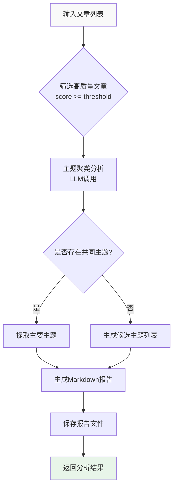

# 文章交叉主题分析功能设计文档
- **Status**: Proposal
- **Date**: 2024-12-07

## 1. 目标与背景

### 1.1 目标
实现一个文章交叉对比分析系统，通过识别多篇文章间的共同母题，为每个主题生成相关的书籍推荐报告。

### 1.2 背景与问题
- 现有的 Agent 2 对每篇文章独立分析，缺乏横向关联
- 需要识别文章集群背后的共同主题
- 基于共同主题向量化检索相关书籍
- 输出 Markdown 格式的分析报告

### 1.3 价值
- 从单篇分析提升到主题集群分析
- 实现从"文章"到"主题"再到"书籍"的价值闭环
- 为用户提供更深入的阅读推荐

## 2. 详细设计

### 2.1 模块结构

```
src/core/cross_analysis/
├── __init__.py              # 模块导出
├── analyzer.py              # 交叉分析器主类
├── theme_cluster.py         # 主题聚类器
└── report_generator.py      # 报告生成器

tests/test_cross_analysis/
├── test_analyzer.py         # 分析器测试
├── test_theme_cluster.py    # 主题聚类测试
└── test_report_generator.py # 报告生成测试
```

### 2.2 核心逻辑/接口

#### 2.2.1 CrossAnalyzer 主接口

```python
class CrossAnalyzer:
    """文章交叉分析器"""

    def __init__(self, llm_client: UnifiedLLMClient, config: Dict):
        """初始化分析器"""
        pass

    async def analyze(self, articles: List[Dict[str, Any]]) -> Dict[str, Any]:
        """
        执行完整的交叉分析流程

        Input:
            articles: 文章列表，从Excel提取的关键字段：
                - title: 标题
                - llm_thematic_essence: 母题描述 (核心分析字段)
                - llm_tags: 标签 (辅助聚类)
                - llm_score: 评分 (权重参考)
                - published_date: 发布日期 (时间维度参考)

        Output:
            {
                "success": bool,
                "main_theme": Optional[Dict],  # 主要主题
                "candidate_themes": List[Dict],  # 候选主题
                "report_path": str,  # 报告文件路径
                "metadata": Dict  # 分析元数据
            }
        """
        pass
```

#### 2.2.2 ThemeCluster 接口

```python
class ThemeCluster:
    """主题聚类器"""

    async def cluster_themes(self, articles: List[Dict]) -> Dict:
        """
        聚类文章主题

        Output:
            {
                "has_common_theme": bool,
                "main_theme": Optional[Dict],
                "candidate_themes": List[Dict]
            }
        """
        pass
```


### 2.3 配置设计

#### 2.3.1 LLM任务配置（config/llm.yaml）
```yaml
tasks:
  article_cross_analysis:
    provider_type: text
    temperature: 0.3
    prompt:
      type: md
      source: "prompts/article_cross_analysis.md"
    json_repair:
      enabled: true
      output_format: json
    langfuse:
      enabled: true
      name: "文章交叉主题分析"
      tags: ["cross-analysis"]
```

#### 2.3.2 业务配置（config/subject_bibliography.yaml）
```yaml
cross_analysis:
  score_threshold: 80  # 评分筛选阈值，只分析评分>=此值的文章
  batch_size: 10       # 每批次分析的文章数量
```

### 2.4 数据流设计



### 2.5 关键算法设计

#### 2.5.1 文章筛选与分批逻辑
```python
def prepare_batches(articles: List[Dict], batch_size: int = 10) -> List[List[Dict]]:
    """
    1. 筛选：score >= threshold, thematic_essence 非空
    2. 排序：按 score 降序
    3. 字段提取：只保留 title, llm_thematic_essence, llm_tags
    4. 分批：按 batch_size 切分
    """
    pass
```

#### 2.5.2 Map-Reduce 主题聚合
如果文章数量超过 batch_size，采用 Map-Reduce 策略：
1. **Map阶段**：对每个 batch 调用 LLM 提取局部主题。
2. **Reduce阶段**：将所有局部主题汇总，再次调用 LLM 进行合并与提炼，生成全局共同主题。


## 3. 测试策略

### 3.1 单元测试
- **test_filter_articles**: 测试文章筛选逻辑
- **test_cluster_themes**: 测试主题聚类功能
- **test_generate_report**: 测试报告生成

### 3.2 集成测试
- **test_end_to_end_flow**: 完整流程测试
  - 准备测试文章数据
  - 执行分析流程
  - 验证输出格式
  - 检查报告文件生成

### 3.3 边界测试
- 测试文章数量不足（<3篇）
- 测试文章数量过多（>20篇）
- 测试无效的thematic_essence
- 测试LLM调用失败场景

### 3.4 性能测试
- 10篇文章的分析时间 < 2分钟
- 内存使用稳定
- LLM API调用次数合理

## 4. 部署与集成

### 4.1 Pipeline集成
在 `src/core/pipeline.py` 中添加 `stage4_cross_analysis` 方法，作为可选阶段。

### 4.2 CLI命令
新增 `cross` 阶段，支持手动触发：
```bash
# 使用配置文件中的阈值（默认80）
python -m src.core.pipeline --stage cross

# 自定义评分阈值
python -m src.core.pipeline --stage cross --score-threshold 70

# 指定输入文件
python -m src.core.pipeline --stage cross --input runtime/outputs/analyze_20241207_100000.xlsx
```

### 4.3 输出路径
报告保存至：`runtime/outputs/主题报告_YYYYMMDD_HHMMSS.md`