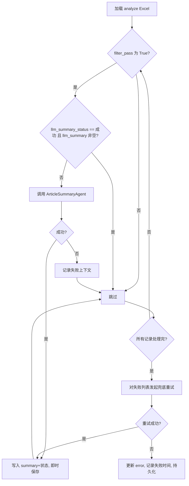

# 文章总结流程 设计文档
- **Status**: Proposal
- **Date**: 2025-12-08

## 1. 目标与背景
- 为 `filter_pass=True` 的文章生成全文大纲式总结，写入 Excel `llm_summary` 列，保证数据随处理即时落盘。
- 复用现有 LLM/Storage 设施，提供断点续跑与兜底重试，减少重复调用成本。
- 约束：不改动已验证的过滤、深度分析逻辑，仅在过滤后附加总结流水线，便于后面的深度分析逻辑。

## 2. 详细设计

### 2.1 模块结构
- `src/core/analysis/summary_agent.py`: 新增总结 Agent，封装 `UnifiedLLMClient` 调用，输入文章元信息，输出总结+状态。
- `src/core/article_summary_runner.py`: 流程协调器，负责加载 Excel、过滤可总结文章、执行即时保存与兜底重试。
- `src/core/storage.py`: 扩展 `STANDARD_COLUMNS["analyze"]` 与更新字段列表，支持 `llm_summary`、`llm_summary_status`、`llm_summary_error`、`llm_summary_last_try` 的字段级写回。
- `src/core/pipeline.py`: 新增 `run_stage_summary` 并在 CLI `--stage` 中暴露 `summary`，流程与 analyze 解耦。
- `tests/test_article_summary_runner.py`: 针对过滤逻辑、即时保存与兜底重试的单元测试（使用内存 DataFrame/临时文件）。

### 2.2 核心逻辑/接口

#### SummaryAgent
```python
class ArticleSummaryAgent:
    def __init__(self, task_name: str = "article_summary"):
        ...

    def summarize(self, article: Dict[str, Any]) -> Dict[str, Any]:
        """
        Args:
            article: 包含 title/full_text/content/link 的字典。
        Returns:
            {
                "llm_summary": str,
                "llm_summary_status": Literal["成功","失败"],
                "llm_summary_error": Optional[str]
            }
        """
```
- Prompt 由 `src/utils/llm/prompt_loader` 读取 `prompts/article_summary.md`。
- 内容优先 `full_text`，否则 `content`；追加标题、来源用于上下文。

#### ArticleSummaryRunner
```python
class ArticleSummaryRunner:
    def __init__(self, storage: StorageManager, summary_agent: ArticleSummaryAgent):
        ...

    def run(self, input_file: Optional[str]) -> str:
        """
        1. 载入阶段3（analyze）Excel。
        2. first pass: 对 filter_pass 为 True 且 llm_summary_status != 成功 的文章调用 summarize。
           - 每生成一条结果调用 StorageManager.save_analyze_results 更新四个字段，实现即时保存。
        3. 记录失败项，等待 first pass 完成。
        4. retry pass: 针对失败或空 summary 的记录按既定最大次数（默认1）再跑一次，仍失败则写入 error 与时间戳。
        """
```
- 跳过条件：`filter_pass` 非 True、`llm_summary_status == "成功"` 且 `llm_summary` 非空。
- 断点续跑：依赖上述跳过策略与立即写回。
- 状态错误判定：`llm_summary_status` 为空、`失败`、或 `llm_summary` 空字符串。
- 兜底重试：失败列表再次调用，若继续失败，记录 `llm_summary_error` 并保留 `失败` 状态。

#### StorageManager 扩展
- 在 `STANDARD_COLUMNS["analyze"]` 与 `ANALYZE_UPDATE_FIELDS` 中追加上述四列。
- `save_analyze_results` 原有字段级更新逻辑即可复用，新字段自然写回。

#### Pipeline 接入
- `SubjectBibliographyPipeline.run_stage_summary(input_file=None)`：
  1. 若未指定文件，调用 `storage.find_latest_stage_file("analyze")`。
  2. 初始化 `ArticleSummaryRunner`，执行 `run` 并返回最终文件路径。
- `run_pipeline` CLI 新增 `summary` 选项，便于单独调度。

### 2.3 可视化图表


## 3. 测试策略
- `test_select_articles_for_summary`: 构造多条记录验证只会挑选 `filter_pass=True` 且未成功总结的文章。
- `test_immediate_save_called_per_article`: 使用 `StorageManager` mock，确保每次总结调用后写回一次。
- `test_retry_mechanism`: 模拟一次失败一次成功的 LLM 响应，确认重试后状态更新为成功并停止继续重试。
- `test_persistent_failure_records_error`: 即便多次失败也正确写入 `llm_summary_error`、`llm_summary_status="失败"`。

---

请确认该设计方案是否通过？批准后我将切换到开发专家模式开始实现。***
