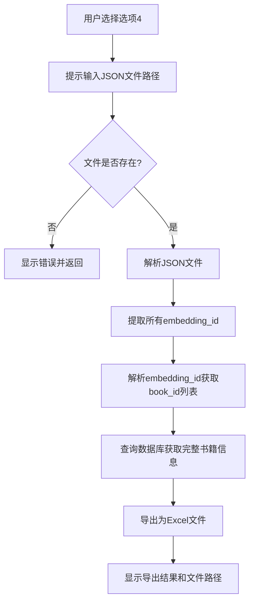

# 图书检索结果Excel导出功能设计文档
- **Status**: Proposal
- **Date**: 2025-12-14

## 1. 目标与背景

当前图书向量检索系统已支持将检索结果保存为JSON和Markdown格式，但这些格式仅包含部分字段。用户需要能够从JSON结果中的`embedding_id`获取数据库中的完整书籍信息，并导出为Excel格式以便进一步分析和处理。

本功能旨在为`scripts/retrieve_books.py`的交互式模式新增一个选项，允许用户：
1. 输入已有JSON检索结果文件路径
2. 从中提取`book_id`
3. 根据`book_id`从数据库查询（数据库中字段为`id`）完整书籍信息
4. 将完整信息导出为Excel文件

## 2. 详细设计

### 2.1 模块结构

- `src/core/book_vectorization/json_parser.py`: JSON文件解析器，负责从检索结果中提取embedding_id和book_id
- `src/core/book_vectorization/excel_exporter.py`: Excel导出器，负责从数据库查询书籍信息并导出为Excel
- `tests/test_book_vectorization/test_json_parser.py`: JSON解析器单元测试
- `tests/test_book_vectorization/test_excel_exporter.py`: Excel导出器单元测试

### 2.2 核心逻辑/接口

#### JsonParser类
```python
class JsonParser:
    """JSON文件解析器，用于从检索结果中提取embedding_id和book_id"""
    
    def extract_embedding_ids(self, json_file_path: str) -> List[str]:
        """
        从JSON文件中提取所有embedding_id
        
        Args:
            json_file_path: JSON文件路径
            
        Returns:
            embedding_id列表
            
        Raises:
            FileNotFoundError: 文件不存在
            ValueError: JSON格式错误或缺少必要字段
        """
        
    def parse_book_id_from_embedding_id(self, embedding_id: str) -> int:
        """
        从embedding_id中解析book_id
        
        Args:
            embedding_id: 格式为"book_{book_id}_{timestamp}"
            
        Returns:
            解析出的book_id
            
        Raises:
            ValueError: embedding_id格式不正确
        """
```

#### ExcelExporter类
```python
class ExcelExporter:
    """Excel导出器，负责从数据库查询书籍信息并导出为Excel"""
    
    def __init__(self, db_config: Dict, excel_config: Dict):
        """
        初始化Excel导出器
        
        Args:
            db_config: 数据库配置
            excel_config: Excel导出配置
        """
        
    def export_books_to_excel(self, book_ids: List[int], output_path: str) -> str:
        """
        根据book_id列表查询数据库并导出为Excel
        
        Args:
            book_ids: 书籍ID列表
            output_path: 输出Excel文件路径
            
        Returns:
            实际保存的Excel文件路径
            
        Raises:
            DatabaseError: 数据库查询错误
            IOError: 文件写入错误
        """
```

### 2.3 配置扩展

在`config/book_vectorization.yaml`中添加Excel导出相关配置：

```yaml
# Excel导出配置
excel_export:
  enabled: true
  default_directory: "runtime/outputs/excel"
  filename_template: "books_full_info_{timestamp}"
  timestamp_format: "%Y%m%d_%H%M%S"
  auto_create_directory: true
```

### 2.4 交互式界面扩展

在`scripts/retrieve_books.py`的`interactive_mode()`函数中添加第4个选项：

```python
search_modes = [
    "文本检索 - 根据关键词搜索相似书籍",
    "分类检索 - 按索书号分类浏览高评分书籍",
    "多查询检索 - 从Markdown文件生成多个子查询",
    "Excel导出 - 从JSON结果导出完整书籍信息到Excel"
]
```

添加相应的处理逻辑：

```python
elif mode_choice == 3:  # Excel导出
    print("\n📊 Excel导出模式")
    
    json_file_path = get_user_input("请输入JSON结果文件路径", required=True)
    if not Path(json_file_path).exists():
        print(f"❌ 文件不存在: {json_file_path}")
        return None
    
    # 使用默认输出路径或用户自定义路径
    default_excel_path = f"runtime/outputs/excel/books_full_info_{datetime.now().strftime('%Y%m%d_%H%M%S')}.xlsx"
    excel_path = get_user_input("Excel输出路径", default_excel_path, required=False)
```

### 2.5 可视化图表



## 3. 测试策略

### 3.1 单元测试

**JsonParser测试**:
- 测试正常JSON文件解析
- 测试缺少embedding_id字段的JSON文件
- 测试格式错误的embedding_id
- 测试不存在的JSON文件

**ExcelExporter测试**:
- 测试正常数据库查询和Excel导出
- 测试不存在的book_id
- 测试数据库连接错误
- 测试文件写入权限错误

### 3.2 集成测试

- 测试完整的交互式流程
- 测试各种异常情况的处理
- 测试配置加载和使用

### 3.3 边界条件测试

- 空的JSON结果文件
- 包含大量书籍ID的JSON文件
- 特殊字符的文件路径
- 数据库中不存在的书籍ID

## 4. 实现注意事项

1. **错误处理**: 需要妥善处理文件不存在、JSON格式错误、数据库连接失败等异常情况
2. **性能考虑**: 当书籍数量较多时，考虑批量查询数据库以提高性能
3. **用户体验**: 提供清晰的错误提示和进度反馈
4. **配置灵活性**: 支持用户自定义Excel输出路径和文件名
5. **代码复用**: 尽量复用现有的数据库连接和查询逻辑