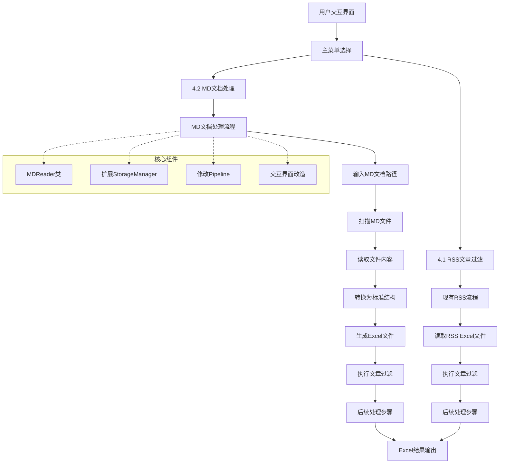
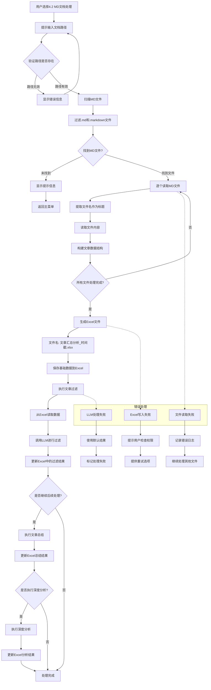
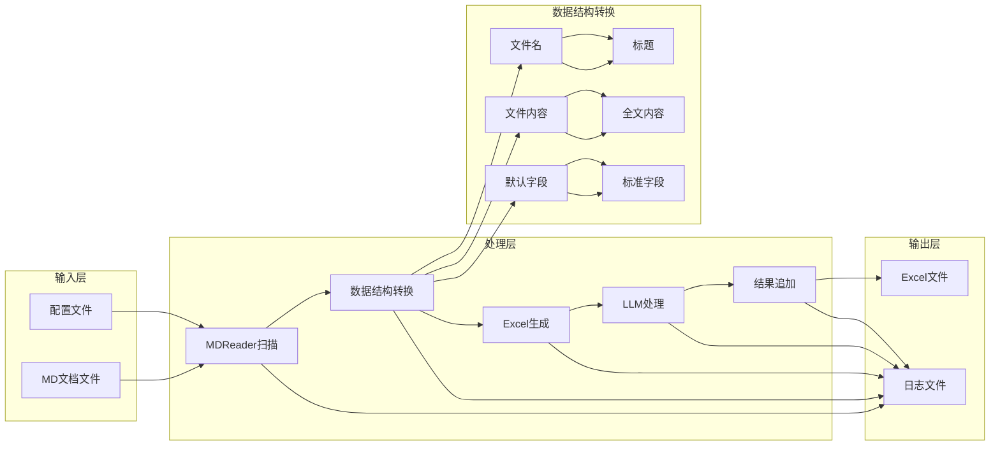
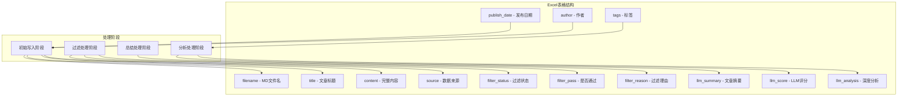

# MD文档处理功能流程图

## 系统整体架构图



## MD文档处理详细流程图



## 数据流图



## Excel数据结构图



## 配置文件扩展图

```mermaid
graph TB
    A[subject_bibliography.yaml] --> B[原有配置]
    A --> C[新增MD处理配置]
    
    C --> D[md_processing]
    D --> E[default_base_path]
    D --> F[recursive_scan]
    D --> G[excel_filename_pattern]
    D --> H[supported_extensions]
    D --> I[title_extraction]
    
    I --> J[remove_extension]
    I --> K[cleanup_rules]
    
    subgraph "配置示例"
        L[default_base_path: data/md_documents]
        M[recursive_scan: true]
        N[excel_filename_pattern: 文章汇总分析_{timestamp}]
        O[supported_extensions: [.md, .markdown]]
    end
    
    E --> L
    F --> M
    G --> N
    H --> O
    J --> P[remove_extension: true]
    K --> Q[cleanup_rules: true]
```

这些流程图清晰地展示了：

1. **整体架构**：新功能如何与现有系统集成
2. **详细流程**：MD文档处理的每个步骤
3. **数据流**：数据在系统中的流转过程
4. **Excel结构**：输出文件的组织方式
5. **配置扩展**：新增的配置项如何组织

这些设计确保了新功能的模块化、可维护性和可扩展性。