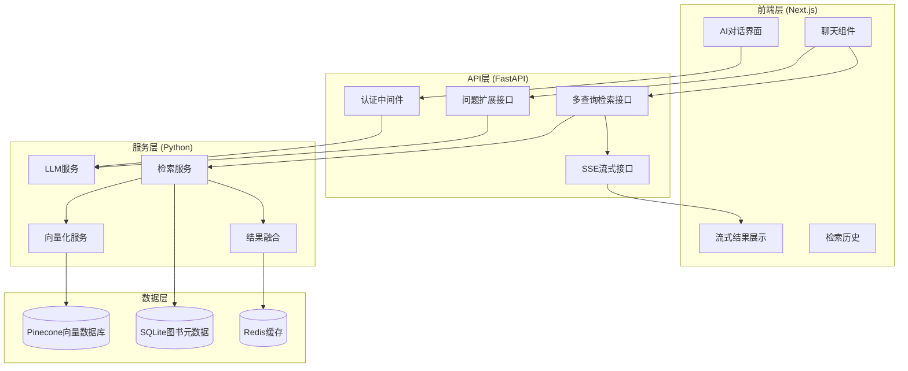

# 图书检索系统Next.js集成架构设计

## 系统架构概览



## 技术栈选择

### 向量数据库：Pinecone
**选择理由：**
- 业界领先的云端向量数据库
- 高性能向量检索（毫秒级响应）
- 完善的SDK和API
- 自动扩缩容和备份
- 支持多种距离度量（Cosine, Euclidean, Dot Product）
- 成本透明，按使用量计费

**配置方案：**
```yaml
vector_db:
  type: "pinecone"
  environment: "us-west1-gcp"
  index_name: "books-collection"
  dimension: 4096  # Qwen3-Embedding-8B维度
  metric: "cosine"
```

### API接口设计

#### 1. 问题扩展检索接口
```typescript
POST /api/v1/expand-query
{
  "query": "用户在对话中输入的问题",
  "context": "可选的上下文信息",
  "options": {
    "expansion_type": "comprehensive", // comprehensive | focused
    "max_subqueries": 8
  }
}

Response:
{
  "expanded_queries": [
    {
      "type": "primary",
      "content": "核心查询",
      "weight": 1.0
    },
    {
      "type": "tags", 
      "content": "相关标签",
      "weight": 0.8
    }
  ],
  "markdown_document": "生成的分析文档内容",
  "metadata": {
    "generation_time": 150,
    "query_count": 5
  }
}
```

#### 2. 多子查询检索接口
```typescript
POST /api/v1/multi-search
{
  "query_package": {
    "primary": ["核心查询1", "核心查询2"],
    "tags": ["标签1", "标签2"],
    "insight": ["洞察1", "洞察2"],
    "books": ["书名1", "书名2"]
  },
  "options": {
    "per_query_top_k": 15,
    "final_top_k": 15,
    "min_rating": 7.5,
    "enable_rerank": true
  }
}

Response:
{
  "results": [
    {
      "book_id": "123",
      "title": "书名",
      "author": "作者",
      "rating": 8.5,
      "summary": "简介...",
      "similarity_score": 0.85,
      "match_source": "title",
      "call_no": "分类号"
    }
  ],
  "metadata": {
    "total_candidates": 45,
    "fusion_time": 120,
    "rerank_time": 80
  }
}
```

#### 3. 流式输出接口 (SSE)
```typescript
GET /api/v1/stream-search?query_id=xxx

Event Stream:
data: {"type": "progress", "stage": "query_expansion", "progress": 0.3}
data: {"type": "result", "book": {...}, "rank": 1}
data: {"type": "result", "book": {...}, "rank": 2}
data: {"type": "complete", "total_results": 15, "total_time": 2500}
```

### 数据库迁移策略

#### 阶段1：数据准备
1. **现有数据导出**
   ```python
   # 从ChromaDB导出向量和元数据
   def export_from_chromadb():
       collection = client.get_collection("books_collection")
       all_data = collection.get()
       
       for i, (embedding, metadata, document, id) in enumerate(
           zip(all_data['embeddings'], all_data['metadatas'], 
               all_data['documents'], all_data['ids'])
       ):
           yield {
               'id': id,
               'values': embedding,
               'metadata': metadata,
               'text': document
           }
   ```

2. **数据格式转换**
   ```python
   def transform_for_pinecone(data):
       return {
           'id': data['id'],
           'values': data['embedding'],
           'metadata': {
               'book_id': data['metadata']['id'],
               'title': data['metadata']['douban_title'],
               'author': data['metadata']['douban_author'],
               'rating': data['metadata']['douban_rating'],
               'call_no': data['metadata']['call_no'],
               'year': data['metadata']['douban_pub_year']
           }
       }
   ```

#### 阶段2：Pinecone索引创建
```python
import pinecone

# 初始化Pinecone
pinecone.init(
    api_key="your-api-key",
    environment="us-west1-gcp"
)

# 创建索引
pinecone.create_index(
    name="books-collection",
    dimension=4096,
    metric="cosine",
    metadata_config={
        "indexed": ["book_id", "rating", "call_no", "year"]
    }
)
```

#### 阶段3：数据迁移
```python
def migrate_to_pinecone(batch_size=100):
    index = pinecone.Index("books-collection")
    
    for batch in chunks(exported_data, batch_size):
        vectors = [transform_for_pinecone(item) for item in batch]
        index.upsert(vectors=vectors)
```

#### 阶段4：验证和优化
1. **检索质量验证**：对比迁移前后的检索结果
2. **性能基准测试**：测试查询延迟和吞吐量
3. **成本优化**：根据使用模式调整索引配置

### 前端架构设计

#### 组件结构
```
components/
├── chat/
│   ├── ChatInterface.tsx       # 主聊天界面
│   ├── MessageList.tsx         # 消息列表
│   ├── MessageInput.tsx        # 输入框
│   └── StreamingMessage.tsx    # 流式消息组件
├── search/
│   ├── SearchResults.tsx       # 检索结果展示
│   ├── BookCard.tsx           # 图书卡片
│   └── ResultStats.tsx        # 结果统计
└── common/
    ├── LoadingSpinner.tsx      # 加载动画
    ├── ErrorBoundary.tsx       # 错误边界
    └── Layout.tsx              # 布局组件
```

#### 状态管理
```typescript
// stores/chatStore.ts
interface ChatState {
  messages: Message[];
  isStreaming: boolean;
  currentQuery: string;
  searchHistory: SearchResult[];
}

interface Message {
  id: string;
  type: 'user' | 'assistant';
  content: string;
  timestamp: Date;
  streaming?: boolean;
}
```

#### 流式处理实现
```typescript
// hooks/useStreamingSearch.ts
export function useStreamingSearch() {
  const [results, setResults] = useState<BookResult[]>([]);
  const [isLoading, setIsLoading] = useState(false);
  
  const startSearch = async (query: string) => {
    setIsLoading(true);
    setResults([]);
    
    const eventSource = new EventSource(
      `/api/v1/stream-search?query=${encodeURIComponent(query)}`
    );
    
    eventSource.onmessage = (event) => {
      const data = JSON.parse(event.data);
      
      switch (data.type) {
        case 'progress':
          // 更新进度
          break;
        case 'result':
          setResults(prev => [...prev, data.book]);
          break;
        case 'complete':
          setIsLoading(false);
          eventSource.close();
          break;
      }
    };
  };
  
  return { startSearch, results, isLoading };
}
```

### 部署架构

#### Vercel配置
```json
{
  "builds": [
    {
      "src": "package.json",
      "use": "@vercel/next"
    }
  ],
  "routes": [
    {
      "src": "/api/(.*)",
      "dest": "/api/$1"
    }
  ],
  "env": {
    "PINECONE_API_KEY": "@pinecone-api-key",
    "OPENAI_API_KEY": "@openai-api-key",
    "DATABASE_URL": "@database-url"
  }
}
```

#### 性能优化策略
1. **CDN加速**：静态资源使用Vercel CDN
2. **缓存策略**：
   - Redis缓存常用查询结果
   - Next.js页面缓存
   - API响应缓存
3. **代码分割**：按路由和功能模块分割
4. **图片优化**：Next.js Image组件优化

### 监控和日志

#### 关键指标
- API响应时间
- 向量检索延迟
- 错误率
- 用户活跃度
- 成本监控

#### 日志结构
```json
{
  "timestamp": "2025-12-16T03:08:00Z",
  "level": "INFO",
  "service": "book-retrieval-api",
  "action": "multi_search",
  "user_id": "user123",
  "query_id": "query456",
  "metrics": {
    "query_expansion_time": 150,
    "retrieval_time": 200,
    "rerank_time": 80,
    "total_time": 430
  },
  "result_count": 15
}
```

## 总结

此架构设计实现了：
1. **高可用性**：多层次的错误处理和降级机制
2. **高性能**：向量数据库+缓存的组合优化
3. **良好的用户体验**：流式输出和实时反馈
4. **可扩展性**：模块化设计便于后续扩展
5. **成本效益**：按需使用的云服务降低运营成本

下一步将开始具体的API实现和前端开发工作。