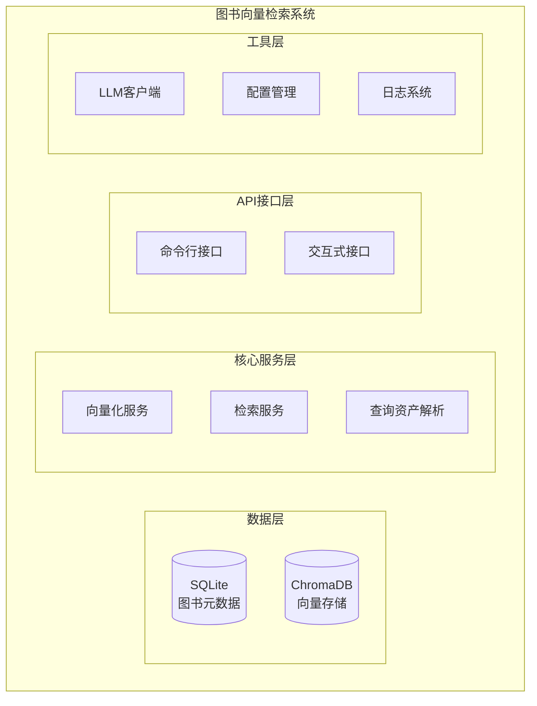

# 图书检索系统Python代码文件整理清单与说明

## 概述

本文档整理了图书向量检索系统的所有核心Python代码文件，按功能模块分类，为新Next.js项目提供完整的参考实现。

## 核心架构图



## 文件分类清单

### 1. 核心业务逻辑模块 (src/core/book_vectorization/)

#### 1.1 向量存储与管理
**文件**: `vector_store.py`
- **功能**: ChromaDB向量数据库的封装管理
- **核心类**: `VectorStore`
- **主要方法**:
  - `add()`: 添加单个向量
  - `add_batch()`: 批量添加向量
  - `search()`: 向量相似度检索
  - `reset()`: 重置向量库
- **配置依赖**: `vector_db`配置段
- **新项目用途**: 需要替换为Pinecone或其他云端向量数据库

#### 1.2 向量化服务
**文件**: `vectorizer.py`
- **功能**: 图书数据向量化主控制器
- **核心类**: `BookVectorizer`
- **主要方法**:
  - `run()`: 执行向量化流程
  - `dry_run()`: 试运行模式
  - `_vectorize_batch()`: 批量向量化处理
- **依赖模块**: `EmbeddingClient`, `VectorStore`, `DatabaseReader`
- **新项目用途**: 保留核心逻辑，适配新的向量数据库

#### 1.3 嵌入向量客户端
**文件**: `embedding_client.py`
- **功能**: 文本向量化API调用封装
- **核心类**: `EmbeddingClient`
- **主要方法**:
  - `get_embedding()`: 获取文本向量
  - `get_embeddings_batch()`: 批量获取向量
- **API支持**: SiliconFlow (主要), OpenAI兼容
- **新项目用途**: 继续使用或替换为其他embedding服务

#### 1.4 图书检索核心
**文件**: `retriever.py`
- **功能**: 图书检索接口，统一检索入口
- **核心类**: `BookRetriever`
- **主要方法**:
  - `search_by_text()`: 单文本检索
  - `search_by_category()`: 分类检索
  - `search_multi_query()`: 多子查询检索融合
- **特色功能**: 
  - 精确匹配分支
  - 结果重排序(Rerank)
  - 多路查询融合
- **新项目用途**: 核心检索逻辑，需要API化封装

#### 1.5 查询资产解析
**文件**: `query_assets.py`
- **功能**: 从Markdown文档提取检索查询资产
- **核心类**: `QueryPackage`, `MarkdownAssetParser`
- **主要方法**:
  - `parse()`: 解析MD文档
  - `recover_with_llm()`: LLM兜底解析
  - `_augment_with_llm()`: LLM查询扩写
- **支持的查询类型**: primary, tags, insight, books
- **新项目用途**: 问题扩展检索的核心逻辑

#### 1.6 结果融合器
**文件**: `fusion.py`
- **功能**: 多查询结果的融合和排序
- **核心函数**:
  - `fuse_query_results()`: 融合查询结果
  - `merge_exact_matches()`: 合并精确匹配
- **配置**: `fusion.weights`权重配置
- **新项目用途**: 保持不变，直接使用

#### 1.7 重排序服务
**文件**: `reranker.py`
- **功能**: 基于LLM的结果重排序
- **核心类**: `RerankerClient`
- **主要方法**:
  - `rerank()`: 重排序API调用
  - `rerank_candidates()`: 对候选结果重排序
- **支持**: SiliconFlow Reranker
- **新项目用途**: 可选功能，提升检索质量

#### 1.8 数据库读取器
**文件**: `database_reader.py`
- **功能**: SQLite图书元数据读取
- **核心类**: `DatabaseReader`
- **主要方法**:
  - `load_books()`: 加载图书数据
  - `get_book_by_id()`: 获取单本图书信息
  - `search_books_by_terms()`: 精确匹配搜索
- **新项目用途**: 需要适配新的数据存储方案

#### 1.9 Excel处理工具
**文件**: `excel_exporter.py`, `excel_enhancer.py`, `excel_reader.py`
- **功能**: Excel文件的读写和增强处理
- **核心类**: 
  - `ExcelExporter`: 导出图书信息到Excel
  - `ExcelEnhancer`: Excel数据增强
  - `ExcelReader`: Excel数据读取
- **新项目用途**: 可选功能，用于数据分析

#### 1.10 输出格式化器
**文件**: `output_formatter.py`
- **功能**: 检索结果的格式化输出
- **核心类**: `OutputFormatter`
- **主要方法**:
  - `format_as_markdown()`: 格式化为Markdown
  - `format_as_json()`: 格式化为JSON
  - `save_results()`: 保存结果到文件
- **新项目用途**: 可用于调试和日志记录

#### 1.11 其他工具模块
**文件**: `filter.py`, `json_parser.py`, `theme_screener.py`, `recommendation_writer.py`
- **功能**: 
  - `filter.py`: 图书数据过滤
  - `json_parser.py`: JSON文件解析
  - `theme_screener.py`: 主题筛选
  - `recommendation_writer.py`: 推荐导语生成
- **新项目用途**: 可选功能模块

### 2. 工具类模块 (src/utils/)

#### 2.1 配置管理
**文件**: `config_manager.py`
- **功能**: 统一的配置管理系统
- **核心类**: `ConfigManager`
- **主要方法**:
  - `get()`: 获取配置值
  - `get_secure()`: 安全获取敏感配置
  - `reload_config()`: 重新加载配置
- **新项目用途**: 继续使用或迁移到环境变量

#### 2.2 日志系统
**文件**: `logger.py`
- **功能**: 统一日志管理，支持中文格式化
- **核心类**: `LoggerManager`, `ChineseFormatter`
- **主要功能**:
  - 中文日志格式化
  - 函数调用装饰器
  - 异步日志支持
- **新项目用途**: 继续使用

#### 2.3 文件工具
**文件**: `file_utils.py`
- **功能**: 文件操作工具
- **主要函数**:
  - `ensure_directory_exists()`: 确保目录存在
  - `generate_filename()`: 生成文件名
  - `safe_write_file()`: 安全写文件
- **新项目用途**: 继续使用

#### 2.4 时间工具
**文件**: `time_utils.py`
- **功能**: 时间处理工具
- **核心类**: `TimeUtils`
- **主要方法**:
  - `parse_datetime()`: 解析时间
  - `get_recent_three_months()`: 获取最近三个月
- **新项目用途**: 可选使用

#### 2.5 规则解析器
**文件**: `rule_file_parser.py`
- **功能**: 规则文件解析和匹配
- **核心类**: `RuleFileParser`, `CallNumberMatcher`, `TitleKeywordsMatcher`
- **新项目用途**: 可选功能

#### 2.6 状态迁移
**文件**: `migrate_status_fields.py`
- **功能**: 数据库状态字段迁移
- **新项目用途**: 数据迁移工具

### 3. LLM客户端模块 (src/utils/llm/)

#### 3.1 统一LLM客户端
**文件**: `client.py`
- **功能**: 统一的LLM API调用客户端
- **核心类**: `UnifiedLLMClient`
- **主要方法**:
  - `call()`: 统一调用接口
  - `get_task_config()`: 获取任务配置
- **支持特性**:
  - 多Provider支持
  - 重试机制
  - 观测集成
  - 上下文传播
- **新项目用途**: 核心依赖，必须保留

#### 3.2 配置加载器
**文件**: `config_loader.py`
- **功能**: LLM专用配置加载
- **核心类**: `ConfigLoader`
- **新项目用途**: 与配置管理配合使用

#### 3.3 异常定义
**文件**: `exceptions.py`
- **功能**: LLM相关异常定义
- **异常类型**: `PromptError`, `ProviderError`, `TimeoutError`等
- **新项目用途**: 错误处理

#### 3.4 JSON工具
**文件**: `json_utils.py`
- **功能**: JSON解析和修复工具
- **核心类**: `JSONHandler`
- **主要方法**:
  - `parse_response()`: 容错JSON解析
  - `format_output()`: 输出格式化
- **新项目用途**: 处理LLM返回的JSON

#### 3.5 提示词加载器
**文件**: `prompt_loader.py`
- **功能**: 提示词模板加载
- **核心类**: `PromptLoader`
- **支持格式**: Markdown, Langfuse, Dictionary
- **新项目用途**: 提示词管理

#### 3.6 重试管理器
**文件**: `retry.py`
- **功能**: 统一重试策略
- **核心类**: `RetryManager`
- **特性**: 指数退避, 抖动, 主备切换
- **新项目用途**: API调用重试

### 4. 配置文件

#### 4.1 图书向量化配置
**文件**: `config/book_vectorization.yaml`
- **功能**: 图书向量化系统配置
- **配置段**:
  - `database`: SQLite数据库配置
  - `vector_db`: 向量数据库配置
  - `embedding`: 嵌入模型配置
  - `filters`: 数据过滤规则
  - `multi_query`: 多查询配置
  - `fusion`: 结果融合配置
  - `reranker`: 重排序配置
- **新项目用途**: 基础配置模板

#### 4.2 LLM配置
**文件**: `config/llm.yaml`
- **功能**: LLM服务配置
- **配置内容**:
  - Provider配置
  - 任务模板
  - 提示词配置
- **新项目用途**: LLM调用配置

#### 4.3 环境变量模板
**文件**: `config/.env.example`
- **功能**: 环境变量配置模板
- **新项目用途**: 环境配置参考

### 5. 命令行接口

#### 5.1 主检索脚本
**文件**: `scripts/retrieve_books.py`
- **功能**: 图书检索命令行接口
- **支持模式**:
  - 交互式模式
  - 命令行模式
  - 单文本检索
  - 分类检索
  - 多查询检索
- **新项目用途**: 理解检索流程，参考API设计

#### 5.2 向量化脚本
**文件**: `scripts/vectorize_books.py`
- **功能**: 图书向量化命令行工具
- **新项目用途**: 数据预处理参考

### 6. 数据库迁移

#### 6.1 迁移脚本
**文件**: `scripts/migrate_add_embedding_fields.sql`
- **功能**: 数据库字段迁移SQL
- **新项目用途**: 数据库结构参考

## 新项目实施建议

### 第一阶段：核心模块移植
1. **移植LLM客户端模块** (`src/utils/llm/`)
2. **移植配置管理** (`src/utils/config_manager.py`)
3. **移植日志系统** (`src/utils/logger.py`)
4. **移植核心检索逻辑** (`src/core/book_vectorization/retriever.py`, `query_assets.py`, `fusion.py`)

### 第二阶段：数据库适配
1. **替换向量存储** (`vector_store.py` → Pinecone)
2. **适配元数据存储** (`database_reader.py` → 新数据库)
3. **配置迁移** (`config/book_vectorization.yaml`)

### 第三阶段：API化改造
1. **创建FastAPI服务**
2. **封装检索接口**
3. **实现流式输出**
4. **添加认证和限流**

### 第四阶段：前端集成
1. **Next.js项目搭建**
2. **API客户端开发**
3. **实时通信实现**
4. **UI组件开发**

## 关键依赖包

### Python依赖
```txt
chromadb>=0.4.0          # 向量数据库
openai>=1.0.0            # OpenAI兼容API
sqlite3                  # 内置，数据库
pandas>=2.0.0           # 数据处理
pyyaml>=6.0             # 配置解析
python-dotenv>=1.0.0    # 环境变量
fastapi>=0.104.0        # Web框架
uvicorn>=0.24.0         # ASGI服务器
```

### 可选依赖
```txt
langfuse>=2.0.0         # 观测平台
redis>=5.0.0            # 缓存
pinecone-client>=2.2.0  # Pinecone客户端
```

## 注意事项

1. **API密钥管理**: 所有敏感配置都通过环境变量管理
2. **错误处理**: 完善的异常处理和重试机制
3. **日志记录**: 详细的操作日志便于调试
4. **配置分离**: 业务配置与敏感配置分离
5. **模块化设计**: 高度模块化便于测试和维护

## 总结

本代码库提供了完整的图书检索系统实现，包括向量存储、检索、融合、重排序等核心功能。新项目可以基于这些模块快速构建API服务，实现类似的功能。关键是要处理好数据库迁移和API化改造两个环节。