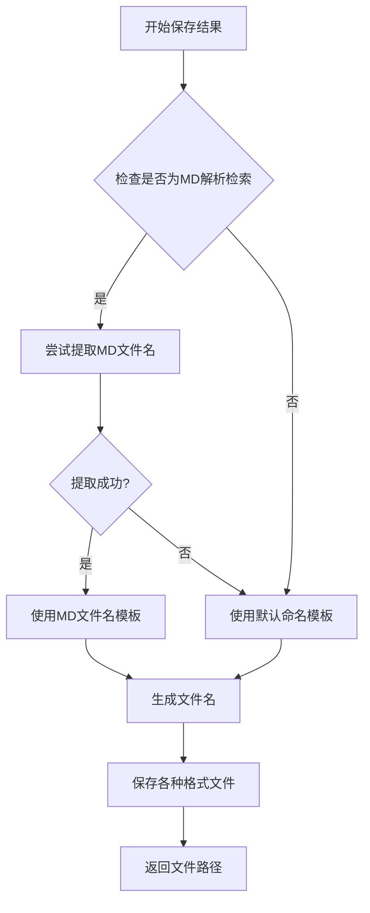

# MD解析检索结果文件名智能命名设计文档
- **Status**: Proposal
- **Date**: 2025-12-14

## 1. 目标与背景

当前系统在执行多查询检索（从Markdown文件解析）时，输出文件名使用通用模板 `books_{mode}_{timestamp}`，无法体现与原始MD文件的关联性。本设计旨在为MD解析检索流程实现智能文件命名，提高文件的可读性和关联性。

具体需求：
- 当用户选择"多查询检索"（交互模式选项3）时，输出文件名使用原始MD文件名作为前缀
- 文件名格式：`{原MD文件名}_相关书目_{新时间戳}.扩展名`
- 非MD解析流程保持原有命名逻辑
- MD文件名提取失败时自动降级到原有命名逻辑

## 2. 详细设计

### 2.1 模块结构
- `src/core/book_vectorization/output_formatter.py`: 修改文件名生成逻辑，增加MD文件名提取功能
- `tests/test_book_vectorization/test_output_formatter.py`: 增加单元测试覆盖新功能

### 2.2 核心逻辑/接口

#### 2.2.1 文件名提取函数
```python
def extract_md_filename(md_path: str) -> Optional[str]:
    """
    从MD文件路径中提取文件名（不含扩展名）
    
    Args:
        md_path: Markdown文件路径
        
    Returns:
        提取的文件名（不含扩展名），失败时返回None
    """
```

#### 2.2.2 修改OutputFormatter.save_results方法
在现有的 `save_results` 方法中增加MD文件名检测和处理逻辑：

1. 检测元数据中是否包含 `from_md` 字段
2. 如果包含，尝试提取MD文件名
3. 成功提取则使用新命名模板：`{md_filename}_相关书目_{timestamp}`
4. 失败则降级到原有命名逻辑

#### 2.2.3 数据结构
- 输入：现有的 `results: List[Dict]` 和 `metadata: Dict`
- 输出：文件路径字典 `Dict[str, str]`
- 新增元数据字段：`from_md`（已存在）

### 2.3 可视化图表



## 3. 测试策略

### 3.1 单元测试用例
1. **正常MD文件名提取**：验证从标准路径正确提取文件名
2. **无效MD路径处理**：验证无效路径时返回None
3. **MD检索模式文件命名**：验证MD检索时使用新命名模板
4. **非MD检索模式文件命名**：验证非MD检索时使用原有模板
5. **MD文件名提取失败降级**：验证提取失败时降级到原有逻辑
6. **特殊字符处理**：验证MD文件名中特殊字符被正确处理

### 3.2 集成测试
1. 完整的MD解析检索流程，验证输出文件名符合预期
2. 交互模式选择多查询检索，验证文件命名正确
3. 命令行模式使用 `--from-md` 参数，验证文件命名正确

### 3.3 边界条件测试
1. MD文件路径为空字符串
2. MD文件路径不存在
3. MD文件名包含特殊字符
4. MD文件名过长