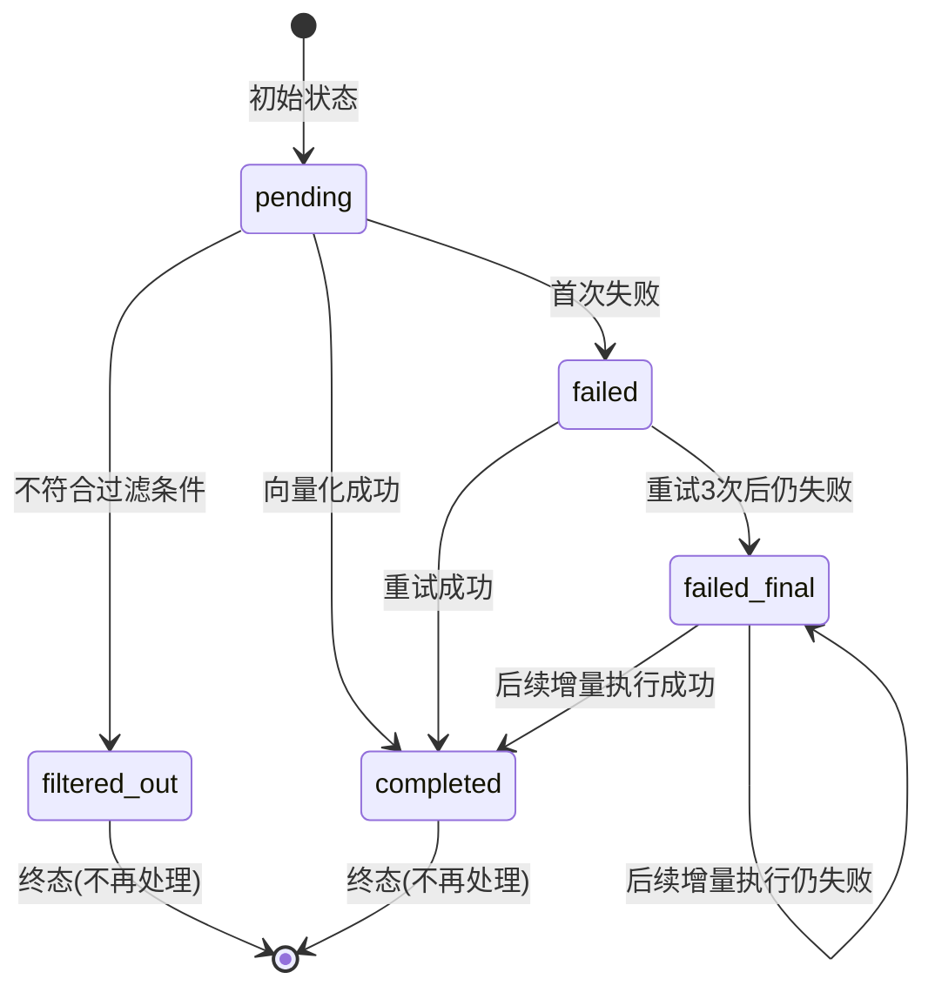
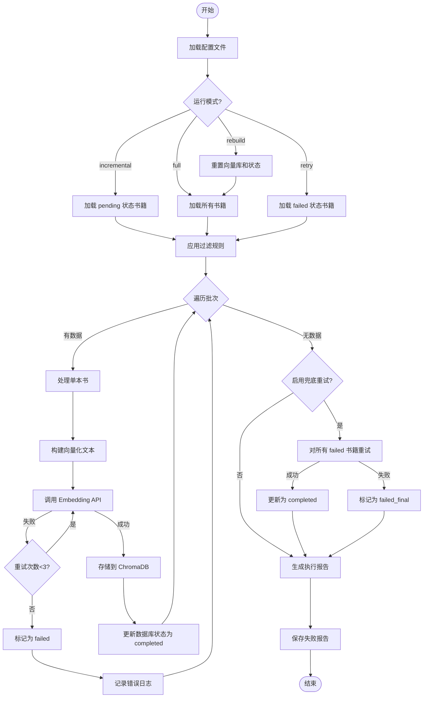
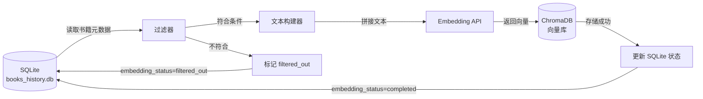

# 图书向量化预处理功能设计文档
- **Status**: Proposal
- **Date**: 2025-12-13
- **Author**: AI Architect
- **Version**: v1.0

---

## 1. 目标与背景

### 1.1 背景
根据 DeepRead 系统架构,系统需要通过**混合检索 (Hybrid Retrieval)** 实现"从文章母题到相关书籍"的语义关联推荐。这要求预先将本地图书数据库中的书籍进行向量化,建立语义检索能力。

### 1.2 目标
构建一个**独立的图书向量化预处理模块**,实现以下功能:
1. ✅ 从 SQLite 数据库 (`books_history.db`) 中读取图书元数据
2. ✅ 根据配置规则过滤符合条件的书籍(必填字段 + 评分阈值)
3. ✅ 调用 Embedding API 生成书籍的向量表示
4. ✅ 将向量存储到 ChromaDB,建立语义检索索引
5. ✅ 支持增量更新、错误重试、进度监控
6. ✅ 预留检索接口,供后续推荐模块调用

### 1.3 非目标
- ❌ 本阶段不实现与主程序的集成
- ❌ 本阶段不实现完整的推荐逻辑(仅预留接口)

---

## 2. 详细设计

### 2.1 模块结构

```
src/core/book_vectorization/
├── __init__.py
├── vectorizer.py           # 核心向量化逻辑
├── database_reader.py      # SQLite 数据读取
├── filter.py               # 数据过滤规则
├── embedding_client.py     # Embedding API 调用封装
├── vector_store.py         # ChromaDB 存储管理
└── retriever.py            # 检索接口(预留)

scripts/
└── vectorize_books.py      # 命令行入口

config/
└── book_vectorization.yaml # 独立配置文件

tests/
└── test_book_vectorization/
    ├── test_vectorizer.py
    ├── test_filter.py
    └── test_vector_store.py
```

---

### 2.2 数据库 Schema 变更

#### 2.2.1 新增字段
在 `books` 表中新增以下字段,用于向量化状态追踪:

| 字段名 | 类型 | 说明 | 默认值 |
|--------|------|------|--------|
| `embedding_id` | TEXT | ChromaDB 中的文档ID | NULL |
| `embedding_status` | TEXT | 向量化状态 | `pending` |
| `embedding_date` | DATETIME | 向量化完成时间 | NULL |
| `embedding_error` | TEXT | 失败原因(可选) | NULL |

#### 2.2.2 状态枚举与状态机

**状态定义**:
```python
EMBEDDING_STATUS = {
    "pending": "待处理",
    "filtered_out": "已过滤(不符合条件)",
    "completed": "已完成",
    "failed": "失败(自动重试)",
    "failed_final": "多次失败(自动重试)"
}
```

**状态转换规则**:


**关键设计**:
- ✅ `failed` 和 `failed_final` 在增量模式下**自动包含**,实现自动重试
- ✅ `filtered_out` 和 `completed` 为终态,增量模式下跳过
- ✅ 成功后统一更新为 `completed`,清除错误信息

#### 2.2.3 迁移脚本
提供 SQL 迁移脚本:
```sql
-- 新增字段
ALTER TABLE books ADD COLUMN embedding_id TEXT;
ALTER TABLE books ADD COLUMN embedding_status TEXT DEFAULT 'pending';
ALTER TABLE books ADD COLUMN embedding_date DATETIME;
ALTER TABLE books ADD COLUMN embedding_error TEXT;
ALTER TABLE books ADD COLUMN retry_count INTEGER DEFAULT 0;  -- 新增:重试次数追踪

-- 创建索引,加速增量查询
CREATE INDEX idx_embedding_status ON books(embedding_status);
CREATE INDEX idx_retry_count ON books(retry_count);
```

---

### 2.3 配置文件设计

#### 2.3.1 配置文件路径
`config/book_vectorization.yaml`

#### 2.3.2 配置结构
```yaml
# ============================================================================
# 图书向量化配置文件
# ============================================================================

# 数据库配置
database:
  path: "F:\\Github\\Library-AI-demos\\book-echoes\\runtime\\database\\books_history.db"
  table: "books"

# 向量数据库配置
vector_db:
  type: "chromadb"
  persist_directory: "runtime/vector_db/books"
  collection_name: "books_collection"
  distance_metric: "cosine"  # cosine / l2 / ip

# Embedding 模型配置
embedding:
  provider: "openai"  # openai / local_bge
  model: "text-embedding-3-large"
  api_key: "env:ONEAPI_API_KEY"
  base_url: "http://47.103.50.106:3000/v1"
  dimensions: 1536  # text-embedding-3-large 的维度
  batch_size: 50    # 每批处理数量
  max_retries: 3    # 单次调用重试次数
  timeout: 30       # 超时时间(秒)
  retry_delay: 2    # 重试间隔(秒)

# 数据过滤规则
filters:
  # 必填字段检查
  required_fields:
    - douban_summary
    - douban_title
    - douban_author
    - douban_catalog
  
  # 评分阈值(根据索书号首字母)
  rating_thresholds:
    B: 8.2
    C: 7.5
    D: 7.1
    E: 7.4
    F: 7.1
    G: 7.3
    H: 7.2
    I: 7.3
    J: 7.7
    K: 8.0
    N: 7.6
    S: 7.4
    T: 7.6
    default: 7.5  # 其他分类默认阈值

# 向量化文本构建
text_construction:
  # 文本模板
  template: |
    书名: {douban_title}
    作者: {douban_author}
    简介: {douban_summary}
    {douban_summary}
    目录: {douban_catalog}
  
  # 字段处理规则
  max_catalog_length: 3000  # 目录最大长度,避免超过模型限制
  summary_weight: 2         # 简介重复次数(加权)
  empty_placeholder: "[无]" # 空字段占位符

# 运行模式
mode:
  incremental: true         # 增量处理(处理 pending/failed/failed_final 状态)
  skip_on_error: true       # 单本书失败是否跳过
  final_retry: true         # 全部处理完后,对失败数据进行兜底重试
  final_retry_count: 1      # 兜底重试次数
  max_retry_count: 5        # 单本书最大重试次数(超过后不再自动重试)

# Metadata 存储策略
metadata:
  # 存储到 ChromaDB 的元数据字段
  fields:
    - book_id
    - douban_title
    - douban_author
    - call_no
    - douban_rating
    - douban_pub_year

# 日志配置
logging:
  level: "INFO"
  progress_interval: 10     # 每处理N本书输出一次进度
  save_failed_report: true  # 是否生成失败报告
  failed_report_path: "runtime/logs/vectorization_failed_{timestamp}.json"

# 性能优化
performance:
  batch_commit_size: 100    # 每处理N本书提交一次 ChromaDB
  enable_progress_bar: true # 是否显示进度条
```

---

### 2.4 核心逻辑设计

#### 2.4.1 主流程 (vectorizer.py)

```python
class BookVectorizer:
    """图书向量化主控制器"""
    
    def __init__(self, config_path: str):
        """初始化向量化器"""
        pass
    
    def run(self, mode: str = "incremental") -> Dict:
        """
        执行向量化流程
        
        Args:
            mode: 运行模式
                - "full": 全量处理(重置所有状态)
                - "incremental": 增量处理(只处理 pending)
                - "retry": 只重试失败的书籍
                - "rebuild": 重建向量库(删除后重新处理)
        
        Returns:
            执行结果统计
        """
        # 1. 读取符合条件的书籍
        books = self._load_books(mode)
        
        # 2. 批量向量化
        results = self._vectorize_batch(books)
        
        # 3. 兜底重试
        if self.config.mode.final_retry:
            failed_books = [b for b in results if b['status'] == 'failed']
            if failed_books:
                retry_results = self._final_retry(failed_books)
                results.extend(retry_results)
        
        # 4. 生成报告
        report = self._generate_report(results)
        
        return report
    
    def _load_books(self, mode: str) -> List[Dict]:
        """加载待处理书籍"""
        # 1. 从数据库读取
        reader = DatabaseReader(self.config.database)
        all_books = reader.load_books()
        
        # 2. 根据模式过滤
        if mode == "incremental":
            # 增量模式:包含 pending + failed + failed_final(自动重试)
            # 但排除超过最大重试次数的书籍
            max_retry = self.config.mode.max_retry_count
            books = [
                b for b in all_books 
                if b['embedding_status'] in ['pending', 'failed', 'failed_final']
                and b.get('retry_count', 0) < max_retry
            ]
            logger.info(f"增量模式: 加载 {len(books)} 本书 (pending/failed/failed_final, retry_count < {max_retry})")
        elif mode == "retry":
            # 仅重试失败的书籍
            books = [b for b in all_books if b['embedding_status'] in ['failed', 'failed_final']]
            logger.info(f"重试模式: 加载 {len(books)} 本失败书籍")
        elif mode == "full":
            books = all_books
            logger.info(f"全量模式: 加载 {len(books)} 本书")
        elif mode == "rebuild":
            # 重建模式:删除向量库,重置状态
            self.vector_store.reset()
            reader.reset_embedding_status()
            books = all_books
            logger.info(f"重建模式: 重置向量库,加载 {len(books)} 本书")
        
        # 3. 应用过滤规则
        filter_engine = BookFilter(self.config.filters)
        filtered_books = filter_engine.apply(books)
        
        return filtered_books
    
    def _vectorize_batch(self, books: List[Dict]) -> List[Dict]:
        """批量向量化"""
        results = []
        total = len(books)
        
        for i in range(0, total, self.config.embedding.batch_size):
            batch = books[i:i + self.config.embedding.batch_size]
            
            for book in batch:
                try:
                    # 1. 构建文本
                    text = self._build_text(book)
                    
                    # 2. 调用 Embedding API
                    embedding = self.embedding_client.get_embedding(text)
                    
                    # 3. 存储到 ChromaDB
                    metadata = self._build_metadata(book)
                    embedding_id = self.vector_store.add(
                        embedding=embedding,
                        metadata=metadata,
                        document=text
                    )
                    
                    # 4. 更新数据库状态为成功
                    self.db_reader.update_embedding_status(
                        book_id=book['id'],
                        status='completed',
                        embedding_id=embedding_id,
                        clear_error=True  # 清除之前的错误信息
                    )
                    
                    results.append({'book_id': book['id'], 'status': 'completed'})
                    
                except Exception as e:
                    logger.error(f"向量化失败: book_id={book['id']}, error={str(e)}")
                    
                    # 增加重试计数
                    current_retry = book.get('retry_count', 0) + 1
                    
                    # 根据重试次数决定状态
                    if current_retry >= 3:
                        new_status = 'failed_final'
                    else:
                        new_status = 'failed'
                    
                    # 更新失败状态
                    self.db_reader.update_embedding_status(
                        book_id=book['id'],
                        status=new_status,
                        retry_count=current_retry,
                        error=str(e)
                    )
                    
                    results.append({'book_id': book['id'], 'status': 'failed', 'error': str(e)})
            
            # 定期输出进度
            if (i // self.config.embedding.batch_size) % self.config.logging.progress_interval == 0:
                logger.info(f"进度: {i}/{total} ({i/total*100:.1f}%)")
        
        return results
    
    def _final_retry(self, failed_books: List[Dict]) -> List[Dict]:
        """兜底重试逻辑"""
        logger.info(f"开始兜底重试,共 {len(failed_books)} 本书")
        
        retry_results = []
        for book in failed_books:
            try:
                # 重新尝试向量化
                text = self._build_text(book)
                embedding = self.embedding_client.get_embedding(text)
                metadata = self._build_metadata(book)
                embedding_id = self.vector_store.add(
                    embedding=embedding,
                    metadata=metadata,
                    document=text
                )
                
                self.db_reader.update_embedding_status(
                    book_id=book['id'],
                    status='completed',
                    embedding_id=embedding_id,
                    clear_error=True
                )
                
                retry_results.append({'book_id': book['id'], 'status': 'completed'})
                
            except Exception as e:
                logger.error(f"兜底重试仍失败: book_id={book['id']}, error={str(e)}")
                
                # 增加重试计数
                current_retry = book.get('retry_count', 0) + 1
                
                # 更新为 failed_final
                self.db_reader.update_embedding_status(
                    book_id=book['id'],
                    status='failed_final',
                    retry_count=current_retry,
                    error=str(e)
                )
                
                retry_results.append({'book_id': book['id'], 'status': 'failed_final', 'error': str(e)})
        
        return retry_results
    
    def _build_text(self, book: Dict) -> str:
        """构建向量化文本"""
        # 处理目录长度
        catalog = book.get('douban_catalog', '')
        if len(catalog) > self.config.text_construction.max_catalog_length:
            catalog = catalog[:self.config.text_construction.max_catalog_length] + "..."
        
        # 简介加权(重复)
        summary = book.get('douban_summary', '')
        summary_repeated = '\n'.join([summary] * self.config.text_construction.summary_weight)
        
        # 填充模板
        text = self.config.text_construction.template.format(
            douban_title=book.get('douban_title', self.config.text_construction.empty_placeholder),
            douban_author=book.get('douban_author', self.config.text_construction.empty_placeholder),
            douban_summary=summary_repeated,
            douban_catalog=catalog
        )
        
        return text
    
    def _build_metadata(self, book: Dict) -> Dict:
        """构建 ChromaDB Metadata"""
        metadata = {}
        for field in self.config.metadata.fields:
            value = book.get(field)
            if value is not None:
                metadata[field] = str(value)  # ChromaDB 要求值为字符串
        
        return metadata
    
    def _generate_report(self, results: List[Dict]) -> Dict:
        """生成执行报告"""
        total = len(results)
        completed = len([r for r in results if r['status'] == 'completed'])
        failed = len([r for r in results if r['status'] == 'failed'])
        failed_final = len([r for r in results if r['status'] == 'failed_final'])
        
        report = {
            'total': total,
            'completed': completed,
            'failed': failed,
            'failed_final': failed_final,
            'success_rate': f"{completed/total*100:.2f}%" if total > 0 else "0%"
        }
        
        # 保存失败报告
        if self.config.logging.save_failed_report and (failed + failed_final) > 0:
            failed_books = [r for r in results if r['status'] in ['failed', 'failed_final']]
            self._save_failed_report(failed_books)
        
        return report
    
    def _save_failed_report(self, failed_books: List[Dict]):
        """保存失败报告"""
        timestamp = datetime.now().strftime("%Y%m%d_%H%M%S")
        report_path = self.config.logging.failed_report_path.format(timestamp=timestamp)
        
        os.makedirs(os.path.dirname(report_path), exist_ok=True)
        
        with open(report_path, 'w', encoding='utf-8') as f:
            json.dump(failed_books, f, ensure_ascii=False, indent=2)
        
        logger.info(f"失败报告已保存: {report_path}")
```

---

#### 2.4.2 数据库读取器 (database_reader.py)

```python
class DatabaseReader:
    """SQLite 数据库读取器"""
    
    def __init__(self, db_config: Dict):
        self.db_path = db_config['path']
        self.table = db_config['table']
    
    def load_books(self) -> List[Dict]:
        """
        加载所有书籍数据
        
        Returns:
            书籍列表
        """
        import sqlite3
        
        conn = sqlite3.connect(self.db_path)
        conn.row_factory = sqlite3.Row  # 返回字典格式
        cursor = conn.cursor()
        
        cursor.execute(f"SELECT * FROM {self.table}")
        rows = cursor.fetchall()
        
        books = [dict(row) for row in rows]
        
        conn.close()
        
        logger.info(f"从数据库加载 {len(books)} 本书")
        return books
    
    def get_book_by_id(self, book_id: int) -> Dict:
        """根据 ID 获取单本书籍信息"""
        import sqlite3
        
        conn = sqlite3.connect(self.db_path)
        conn.row_factory = sqlite3.Row
        cursor = conn.cursor()
        
        cursor.execute(f"SELECT * FROM {self.table} WHERE id = ?", (book_id,))
        row = cursor.fetchone()
        
        conn.close()
        
        return dict(row) if row else None
    
    def update_embedding_status(
        self, 
        book_id: int, 
        status: str, 
        embedding_id: str = None,
        retry_count: int = None,
        error: str = None,
        clear_error: bool = False
    ):
        """
        更新书籍的向量化状态
        
        Args:
            book_id: 书籍ID
            status: 新状态
            embedding_id: ChromaDB 文档ID(可选)
            retry_count: 重试次数(可选)
            error: 错误信息(可选)
            clear_error: 是否清除错误信息(成功时使用)
        """
        import sqlite3
        from datetime import datetime
        
        conn = sqlite3.connect(self.db_path)
        cursor = conn.cursor()
        
        # 构建更新语句
        update_fields = ["embedding_status = ?"]
        params = [status]
        
        if embedding_id:
            update_fields.append("embedding_id = ?")
            params.append(embedding_id)
        
        if retry_count is not None:
            update_fields.append("retry_count = ?")
            params.append(retry_count)
        
        if error:
            update_fields.append("embedding_error = ?")
            params.append(error)
        
        if clear_error:
            update_fields.append("embedding_error = NULL")
            update_fields.append("retry_count = 0")
        
        # 成功时更新完成时间
        if status == 'completed':
            update_fields.append("embedding_date = ?")
            params.append(datetime.now().isoformat())
        
        params.append(book_id)
        
        sql = f"""
            UPDATE {self.table} 
            SET {', '.join(update_fields)}
            WHERE id = ?
        """
        
        cursor.execute(sql, params)
        conn.commit()
        conn.close()
        
        logger.debug(f"更新书籍状态: book_id={book_id}, status={status}")
    
    def reset_embedding_status(self):
        """重置所有书籍的向量化状态(用于 rebuild 模式)"""
        import sqlite3
        
        conn = sqlite3.connect(self.db_path)
        cursor = conn.cursor()
        
        cursor.execute(f"""
            UPDATE {self.table}
            SET 
                embedding_status = 'pending',
                embedding_id = NULL,
                embedding_date = NULL,
                embedding_error = NULL,
                retry_count = 0
        """)
        
        conn.commit()
        conn.close()
        
        logger.warning("已重置所有书籍的向量化状态")
    
    def get_books_by_category(self, call_no_prefix: str, limit: int = 10) -> List[Dict]:
        """根据索书号首字母查询书籍"""
        import sqlite3
        
        conn = sqlite3.connect(self.db_path)
        conn.row_factory = sqlite3.Row
        cursor = conn.cursor()
        
        cursor.execute(f"""
            SELECT * FROM {self.table}
            WHERE call_no LIKE ?
            AND embedding_status = 'completed'
            ORDER BY douban_rating DESC
            LIMIT ?
        """, (f"{call_no_prefix}%", limit))
        
        rows = cursor.fetchall()
        books = [dict(row) for row in rows]
        
        conn.close()
        
        return books
    
    def get_statistics(self) -> Dict:
        """获取向量化统计信息"""
        import sqlite3
        
        conn = sqlite3.connect(self.db_path)
        cursor = conn.cursor()
        
        stats = {}
        
        # 各状态数量统计
        cursor.execute(f"""
            SELECT embedding_status, COUNT(*) as count
            FROM {self.table}
            GROUP BY embedding_status
        """)
        
        for row in cursor.fetchall():
            status = row[0] or 'pending'
            stats[status] = row[1]
        
        # 总数
        stats['total'] = sum(stats.values())
        
        # 成功率
        completed = stats.get('completed', 0)
        stats['completion_rate'] = f"{completed/stats['total']*100:.2f}%" if stats['total'] > 0 else "0%"
        
        conn.close()
        
        return stats
```

---

#### 2.4.3 数据过滤器 (filter.py)

```python
class BookFilter:
    """图书过滤器"""
    
    def __init__(self, filter_config: Dict):
        self.config = filter_config
    
    def apply(self, books: List[Dict]) -> List[Dict]:
        """
        应用过滤规则
        
        Returns:
            符合条件的书籍列表
        """
        filtered = []
        
        for book in books:
            # 检查必填字段
            if not self._check_required_fields(book):
                self._mark_filtered(book, "缺少必填字段")
                continue
            
            # 检查评分阈值
            if not self._check_rating_threshold(book):
                self._mark_filtered(book, "评分未达标")
                continue
            
            filtered.append(book)
        
        logger.info(f"过滤完成: 总数={len(books)}, 符合条件={len(filtered)}, 过滤={len(books)-len(filtered)}")
        
        return filtered
    
    def _check_required_fields(self, book: Dict) -> bool:
        """检查必填字段"""
        for field in self.config['required_fields']:
            value = book.get(field)
            if not value or (isinstance(value, str) and value.strip() == ''):
                return False
        return True
    
    def _check_rating_threshold(self, book: Dict) -> bool:
        """检查评分阈值"""
        rating = book.get('douban_rating')
        if rating is None:
            return False
        
        # 获取索书号首字母
        call_no = book.get('call_no', '')
        prefix = call_no[0].upper() if call_no else ''
        
        # 获取对应阈值
        threshold = self.config['rating_thresholds'].get(
            prefix,
            self.config['rating_thresholds']['default']
        )
        
        return float(rating) >= threshold
    
    def _mark_filtered(self, book: Dict, reason: str):
        """标记为已过滤"""
        # 更新数据库状态
        from .database_reader import DatabaseReader
        reader = DatabaseReader(...)  # 需要传入配置
        reader.update_embedding_status(
            book_id=book['id'],
            status='filtered_out',
            error=reason
        )
```

---

#### 2.4.3 Embedding 客户端 (embedding_client.py)

```python
class EmbeddingClient:
    """Embedding API 调用封装"""
    
    def __init__(self, config: Dict):
        self.config = config
        self.client = self._init_client()
    
    def _init_client(self):
        """初始化 OpenAI 客户端"""
        from openai import OpenAI
        
        api_key = self._resolve_env(self.config['api_key'])
        
        return OpenAI(
            api_key=api_key,
            base_url=self.config['base_url'],
            timeout=self.config['timeout']
        )
    
    def get_embedding(self, text: str) -> List[float]:
        """
        获取文本的向量表示(带重试)
        
        Args:
            text: 输入文本
        
        Returns:
            向量列表
        """
        for attempt in range(self.config['max_retries']):
            try:
                response = self.client.embeddings.create(
                    model=self.config['model'],
                    input=text,
                    dimensions=self.config.get('dimensions')  # 可选参数
                )
                
                return response.data[0].embedding
                
            except Exception as e:
                logger.warning(f"Embedding API 调用失败(尝试 {attempt+1}/{self.config['max_retries']}): {str(e)}")
                
                if attempt < self.config['max_retries'] - 1:
                    time.sleep(self.config['retry_delay'])
                else:
                    raise
    
    def _resolve_env(self, value: str) -> str:
        """解析环境变量"""
        if value.startswith('env:'):
            env_var = value[4:]
            return os.getenv(env_var)
        return value
```

---

#### 2.4.4 向量存储 (vector_store.py)

```python
class VectorStore:
    """ChromaDB 存储管理"""
    
    def __init__(self, config: Dict):
        self.config = config
        self.client = self._init_client()
        self.collection = self._get_or_create_collection()
    
    def _init_client(self):
        """初始化 ChromaDB 客户端"""
        import chromadb
        
        return chromadb.PersistentClient(
            path=self.config['persist_directory']
        )
    
    def _get_or_create_collection(self):
        """获取或创建 Collection"""
        return self.client.get_or_create_collection(
            name=self.config['collection_name'],
            metadata={"hnsw:space": self.config['distance_metric']}
        )
    
    def add(self, embedding: List[float], metadata: Dict, document: str) -> str:
        """
        添加向量到数据库
        
        Returns:
            embedding_id
        """
        # 生成唯一 ID
        embedding_id = f"book_{metadata['book_id']}_{int(time.time())}"
        
        self.collection.add(
            embeddings=[embedding],
            metadatas=[metadata],
            documents=[document],
            ids=[embedding_id]
        )
        
        return embedding_id
    
    def search(self, query_embedding: List[float], top_k: int = 10, 
               filter_metadata: Dict = None) -> List[Dict]:
        """
        向量检索
        
        Args:
            query_embedding: 查询向量
            top_k: 返回结果数量
            filter_metadata: 元数据过滤条件
        
        Returns:
            检索结果列表
        """
        results = self.collection.query(
            query_embeddings=[query_embedding],
            n_results=top_k,
            where=filter_metadata  # 例如: {"douban_rating": {"$gte": "8.0"}}
        )
        
        # 格式化结果
        formatted_results = []
        for i in range(len(results['ids'][0])):
            formatted_results.append({
                'embedding_id': results['ids'][0][i],
                'metadata': results['metadatas'][0][i],
                'distance': results['distances'][0][i],
                'document': results['documents'][0][i]
            })
        
        return formatted_results
    
    def reset(self):
        """重置向量库(删除所有数据)"""
        self.client.delete_collection(self.config['collection_name'])
        self.collection = self._get_or_create_collection()
        logger.warning("向量库已重置")
```

---

#### 2.4.5 检索接口 (retriever.py)

```python
class BookRetriever:
    """图书检索接口(预留)"""
    
    def __init__(self, config_path: str):
        """初始化检索器"""
        self.config = self._load_config(config_path)
        self.embedding_client = EmbeddingClient(self.config['embedding'])
        self.vector_store = VectorStore(self.config['vector_db'])
        self.db_reader = DatabaseReader(self.config['database'])
    
    def search_by_text(self, query_text: str, top_k: int = 10, 
                       min_rating: float = None) -> List[Dict]:
        """
        根据文本查询相似书籍
        
        Args:
            query_text: 查询文本(例如:文章的 thematic_essence)
            top_k: 返回结果数量
            min_rating: 最低评分过滤
        
        Returns:
            书籍列表,包含相似度分数
        """
        # 1. 将查询文本向量化
        query_embedding = self.embedding_client.get_embedding(query_text)
        
        # 2. 构建过滤条件
        filter_metadata = {}
        if min_rating:
            filter_metadata['douban_rating'] = {"$gte": str(min_rating)}
        
        # 3. 向量检索
        results = self.vector_store.search(
            query_embedding=query_embedding,
            top_k=top_k,
            filter_metadata=filter_metadata if filter_metadata else None
        )
        
        # 4. 补充完整书籍信息(从 SQLite)
        enriched_results = []
        for result in results:
            book_id = result['metadata']['book_id']
            book_info = self.db_reader.get_book_by_id(book_id)
            
            enriched_results.append({
                'book_id': book_id,
                'title': book_info['douban_title'],
                'author': book_info['douban_author'],
                'rating': book_info['douban_rating'],
                'summary': book_info['douban_summary'],
                'similarity_score': 1 - result['distance'],  # 转换为相似度
                'embedding_id': result['embedding_id']
            })
        
        return enriched_results
    
    def search_by_category(self, call_no_prefix: str, top_k: int = 10) -> List[Dict]:
        """
        根据分类查询书籍
        
        Args:
            call_no_prefix: 索书号首字母
            top_k: 返回结果数量
        """
        # 直接从数据库查询,不使用向量检索
        books = self.db_reader.get_books_by_category(call_no_prefix, limit=top_k)
        return books
```

---

### 2.5 命令行入口设计

#### 2.5.1 脚本路径
`scripts/vectorize_books.py`

#### 2.5.2 使用示例
```bash
# 增量向量化(默认)
python scripts/vectorize_books.py

# 全量向量化
python scripts/vectorize_books.py --mode full

# 只重试失败的书籍
python scripts/vectorize_books.py --mode retry

# 重建向量库
python scripts/vectorize_books.py --mode rebuild

# 试运行(只统计,不实际执行)
python scripts/vectorize_books.py --dry-run

# 指定配置文件
python scripts/vectorize_books.py --config config/custom_vectorization.yaml
```

#### 2.5.3 代码实现
```python
#!/usr/bin/env python
# -*- coding: utf-8 -*-
"""
图书向量化命令行入口
"""

import argparse
from src.core.book_vectorization.vectorizer import BookVectorizer
from src.utils.logger import get_logger

logger = get_logger(__name__)

def main():
    parser = argparse.ArgumentParser(description='图书向量化预处理工具')
    
    parser.add_argument(
        '--config',
        type=str,
        default='config/book_vectorization.yaml',
        help='配置文件路径'
    )
    
    parser.add_argument(
        '--mode',
        type=str,
        choices=['full', 'incremental', 'retry', 'rebuild'],
        default='incremental',
        help='运行模式'
    )
    
    parser.add_argument(
        '--dry-run',
        action='store_true',
        help='试运行模式(只统计,不实际执行)'
    )
    
    args = parser.parse_args()
    
    # 初始化向量化器
    vectorizer = BookVectorizer(config_path=args.config)
    
    if args.dry_run:
        # 试运行:只统计符合条件的书籍数量
        stats = vectorizer.dry_run(mode=args.mode)
        logger.info(f"试运行结果: {stats}")
    else:
        # 正式运行
        logger.info(f"开始向量化,模式: {args.mode}")
        report = vectorizer.run(mode=args.mode)
        logger.info(f"向量化完成: {report}")

if __name__ == '__main__':
    main()
```

---

### 2.6 可视化流程图

#### 2.6.1 主流程图



#### 2.6.2 数据流图



---

## 3. 测试策略

### 3.1 单元测试

#### 3.1.1 测试覆盖范围
| 模块 | 测试用例 |
|------|---------|
| `filter.py` | ✅ 必填字段检查<br/>✅ 评分阈值检查<br/>✅ 边界条件(评分刚好等于阈值) |
| `embedding_client.py` | ✅ API 调用成功<br/>✅ API 调用失败重试<br/>✅ 环境变量解析 |
| `vector_store.py` | ✅ 添加向量<br/>✅ 检索向量<br/>✅ 重置向量库 |
| `vectorizer.py` | ✅ 文本构建逻辑<br/>✅ Metadata 构建<br/>✅ 兜底重试逻辑 |

#### 3.1.2 测试数据
创建测试数据库 `tests/fixtures/test_books.db`,包含:
- 10 本符合条件的书籍
- 5 本缺少必填字段的书籍
- 5 本评分未达标的书籍

#### 3.1.3 Mock 策略
- Mock Embedding API 调用,避免实际消耗 Token
- 使用内存 ChromaDB (`chromadb.Client()`) 进行测试

---

### 3.2 集成测试

#### 3.2.1 端到端测试
```python
def test_end_to_end_vectorization():
    """端到端测试:从数据库读取到向量存储"""
    # 1. 准备测试数据库
    # 2. 运行向量化
    # 3. 验证 ChromaDB 中的数据
    # 4. 验证 SQLite 状态更新
    pass
```

#### 3.2.2 性能测试
- 测试 1000 本书的处理时间
- 验证批处理逻辑的内存占用

---

### 3.3 测试命令
```bash
# 运行所有测试
pytest tests/test_book_vectorization/

# 运行单个测试文件
pytest tests/test_book_vectorization/test_filter.py -v

# 查看覆盖率
pytest --cov=src/core/book_vectorization tests/test_book_vectorization/
```

---

## 4. 依赖库补充

在 `requirements.txt` 中新增:

```txt
# 向量数据库
chromadb>=0.4.22

# 进度条(可选)
tqdm>=4.66.0
```

---

## 5. 实施计划

### 5.2 验收标准

✅ 能够从 SQLite 读取 50W 书籍数据  
✅ 正确过滤出符合条件的 20W 书籍  
✅ 成功调用 Embedding API 并存储到 ChromaDB  
✅ 支持增量更新(只处理新增书籍)  
✅ 失败重试机制工作正常  
✅ 生成详细的执行报告和失败日志  
✅ 单元测试覆盖率 > 80%  
✅ 预留的检索接口可正常调用  

---

## 6. 风险与缓解

| 风险 | 影响 | 缓解措施 |
|------|------|----------|
| Embedding API 限流 | 处理中断 | 实现指数退避重试,支持断点续传 |
| 向量库磁盘空间不足 | 存储失败 | 预估空间需求(20W * 1536 * 4字节 ≈ 1.2GB),提前检查 |
| 数据库锁冲突 | 状态更新失败 | 使用事务,设置合理的超时时间 |
| 长文本超过模型限制 | API 调用失败 | 设置 `max_catalog_length`,截断过长字段 |
| 网络不稳定 | 批量失败 | 增量模式自动重试,`max_retry_count` 保护 |

---

## 7. 性能优化最佳实践

### 7.1 批量 Embedding 调用优化

**问题**: 当前设计是逐本书调用 Embedding API,20W 本书需要 20W 次 API 调用

**优化方案**: 使用批量 Embedding API(如果模型支持)

```python
# embedding_client.py 中新增方法
def get_embeddings_batch(self, texts: List[str]) -> List[List[float]]:
    """
    批量获取多个文本的向量(性能优化)
    
    Args:
        texts: 文本列表(最多100个)
    
    Returns:
        向量列表
    """
    response = self.client.embeddings.create(
        model=self.config['model'],
        input=texts,  # 传入列表
        dimensions=self.config.get('dimensions')
    )
    
    return [item.embedding for item in response.data]
```

**预期提升**:
- API 调用次数: 20W → 4000 (每批50个)
- 总耗时: 27.8小时 → **约2小时**

---

### 7.2 数据库连接池

**问题**: 每次状态更新都创建新连接,频繁开关连接影响性能

**优化方案**: 使用连接池或长连接

```python
# database_reader.py 优化
class DatabaseReader:
    def __init__(self, db_config: Dict):
        self.db_path = db_config['path']
        self.table = db_config['table']
        self._conn = None  # 复用连接
    
    def _get_connection(self):
        """获取或创建数据库连接"""
        if self._conn is None:
            import sqlite3
            self._conn = sqlite3.connect(self.db_path, check_same_thread=False)
            self._conn.row_factory = sqlite3.Row
        return self._conn
    
    def close(self):
        """关闭连接"""
        if self._conn:
            self._conn.close()
            self._conn = None
```

---

### 7.3 异步处理(可选)

**问题**: 当前是同步处理,CPU 在等待 API 响应时空闲

**优化方案**: 使用 `asyncio` + `httpx` 实现异步并发

```python
# 异步版本的 Embedding 客户端
import asyncio
import httpx

class AsyncEmbeddingClient:
    async def get_embedding_async(self, text: str) -> List[float]:
        """异步获取 Embedding"""
        async with httpx.AsyncClient() as client:
            response = await client.post(
                f"{self.config['base_url']}/embeddings",
                json={
                    "model": self.config['model'],
                    "input": text
                },
                headers={"Authorization": f"Bearer {self.api_key}"}
            )
            return response.json()['data'][0]['embedding']
    
    async def process_batch_async(self, books: List[Dict]) -> List[Dict]:
        """异步批量处理"""
        tasks = [self.get_embedding_async(self._build_text(book)) for book in books]
        embeddings = await asyncio.gather(*tasks)
        return embeddings
```

**预期提升**:
- 并发度: 10-20 个请求同时进行
- 总耗时: 2小时 → **约15-30分钟**

---

### 7.4 进度持久化

**问题**: 处理中断后,难以知道具体进度

**优化方案**: 定期保存进度快照

```python
# vectorizer.py 中新增
def _save_progress(self, processed_count: int, total_count: int):
    """保存进度快照"""
    progress_file = "runtime/logs/vectorization_progress.json"
    
    progress = {
        "timestamp": datetime.now().isoformat(),
        "processed": processed_count,
        "total": total_count,
        "percentage": f"{processed_count/total_count*100:.2f}%"
    }
    
    with open(progress_file, 'w', encoding='utf-8') as f:
        json.dump(progress, f, ensure_ascii=False, indent=2)
```

---

### 7.5 内存优化

**问题**: 一次性加载 50W 书籍数据到内存可能导致 OOM

**优化方案**: 使用生成器 + 分页查询

```python
# database_reader.py 优化
def load_books_generator(self, page_size: int = 1000):
    """
    生成器方式加载书籍(节省内存)
    
    Yields:
        每次返回 page_size 本书
    """
    import sqlite3
    
    conn = sqlite3.connect(self.db_path)
    conn.row_factory = sqlite3.Row
    cursor = conn.cursor()
    
    offset = 0
    while True:
        cursor.execute(f"""
            SELECT * FROM {self.table}
            LIMIT ? OFFSET ?
        """, (page_size, offset))
        
        rows = cursor.fetchall()
        if not rows:
            break
        
        yield [dict(row) for row in rows]
        offset += page_size
    
    conn.close()
```

---

### 7.6 配置文件优化建议

根据性能优化,建议更新配置:

```yaml
# 性能优化配置
performance:
  batch_commit_size: 100        # 每处理N本书提交一次 ChromaDB
  enable_progress_bar: true     # 是否显示进度条
  use_batch_embedding: true     # 是否使用批量 Embedding API
  batch_embedding_size: 50      # 批量 Embedding 每批数量
  enable_async: false           # 是否启用异步处理(实验性)
  async_concurrency: 10         # 异步并发数
  memory_page_size: 1000        # 分页加载大小(节省内存)
  progress_snapshot_interval: 100  # 每处理N本书保存一次进度快照
```

---

## 8. 后续扩展

### 7.1 支持多种 Embedding 模型
- 本地部署 `bge-m3`
- 支持 `text-embedding-3-large`

### 7.2 混合检索增强
- 结合 BM25 关键词检索
- 实现 Rerank 机制

### 7.3 向量库迁移
- 支持导出到 Faiss
- 支持迁移到 Milvus

---

## 8. 参考文档

- [ChromaDB 官方文档](https://docs.trychroma.com/)
- [OpenAI Embeddings API](https://platform.openai.com/docs/guides/embeddings)
- [DeepRead 系统架构文档](../DeepRead：基于深度文章分析的主题书目推荐系统.md)
