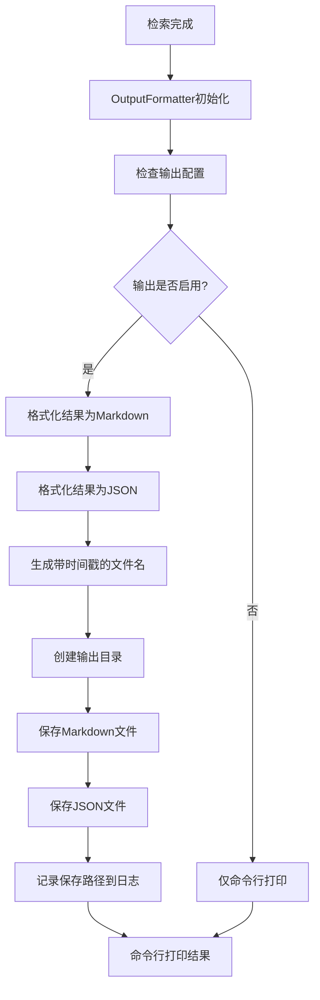

# 检索结果输出功能设计文档
- **Status**: Proposal
- **Date**: 2025-12-14

## 1. 目标与背景

当前图书检索工具(`scripts/retrieve_books.py`)仅支持将结果打印到命令行，不便于结果的保存、分享和后续处理。本设计旨在添加将检索结果保存到文件的功能，支持Markdown和JSON两种格式，并提供灵活的配置选项。

## 2. 详细设计

### 2.1 模块结构

- `src/core/book_vectorization/output_formatter.py`: 负责将检索结果格式化为Markdown和JSON
- `src/utils/file_utils.py`: 通用文件操作工具
- `tests/test_book_vectorization/test_output_formatter.py`: 测试输出格式化功能

### 2.2 核心逻辑/接口

#### 配置文件扩展

在 `config/book_vectorization.yaml` 中添加以下配置节：

```yaml
# 结果输出配置
output:
  enabled: true                    # 是否启用文件输出
  formats: ["markdown", "json"]    # 输出格式列表
  base_directory: "runtime/outputs/retrieval"  # 输出基础目录
  filename_template: "books_{mode}_{timestamp}"  # 文件名模板
  include_timestamp: true          # 是否包含时间戳
  timestamp_format: "%Y%m%d_%H%M%S"  # 时间戳格式
  auto_create_directory: true     # 自动创建目录
```

#### 核心接口设计

```python
class OutputFormatter:
    """检索结果格式化器"""
    
    def __init__(self, config: Dict):
        """
        初始化格式化器
        
        Args:
            config: 输出配置字典
        """
    
    def format_as_markdown(self, results: List[Dict], metadata: Dict) -> str:
        """
        将结果格式化为Markdown
        
        Args:
            results: 检索结果列表
            metadata: 元数据（查询信息、时间等）
            
        Returns:
            格式化后的Markdown字符串
        """
    
    def format_as_json(self, results: List[Dict], metadata: Dict) -> str:
        """
        将结果格式化为JSON
        
        Args:
            results: 检索结果列表
            metadata: 元数据（查询信息、时间等）
            
        Returns:
            格式化后的JSON字符串
        """
    
    def save_results(self, results: List[Dict], metadata: Dict) -> Dict[str, str]:
        """
        保存结果到文件
        
        Args:
            results: 检索结果列表
            metadata: 元数据（查询信息、时间等）
            
        Returns:
            文件路径字典，键为格式名，值为文件路径
        """
```

#### 文件工具设计

```python
def ensure_directory_exists(directory_path: str) -> None:
    """
    确保目录存在，不存在则创建
    
    Args:
        directory_path: 目录路径
    """

def generate_filename(template: str, metadata: Dict, timestamp_format: str, include_timestamp: bool) -> str:
    """
    根据模板生成文件名
    
    Args:
        template: 文件名模板
        metadata: 元数据字典
        timestamp_format: 时间戳格式
        include_timestamp: 是否包含时间戳
        
    Returns:
        生成的文件名
    """
```

### 2.3 可视化图表



### 2.4 集成方案

修改 `scripts/retrieve_books.py` 中的 `run_cli` 和 `_run_multi_query_flow` 函数：

1. 在函数开始时初始化 `OutputFormatter`
2. 在结果打印后调用 `save_results` 方法
3. 在日志中记录文件保存路径

## 3. 测试策略

### 3.1 单元测试

1. **格式化测试**:
   - 测试Markdown格式化是否正确
   - 测试JSON格式化是否正确
   - 测试特殊字符处理

2. **文件操作测试**:
   - 测试目录自动创建
   - 测试文件名生成
   - 测试文件保存

3. **配置测试**:
   - 测试配置加载
   - 测试默认值处理
   - 测试无效配置处理

### 3.2 集成测试

1. **端到端测试**:
   - 测试完整的检索-保存流程
   - 测试不同检索模式的输出
   - 测试命令行参数与配置的交互

2. **边界条件测试**:
   - 测试空结果集
   - 测试大量结果
   - 测试文件权限问题

## 4. 实现注意事项

1. 保持向后兼容，确保不启用输出功能时原有行为不变
2. 使用统一的日志记录，便于调试
3. 确保生成的Markdown格式美观易读
4. JSON输出应包含完整的检索元数据，便于程序处理
5. 考虑大结果集的性能问题，必要时可添加分页或截断选项