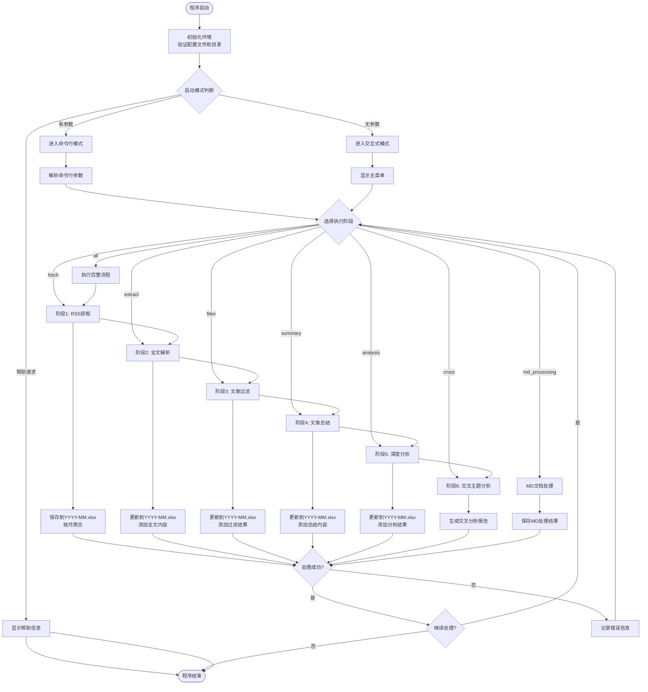
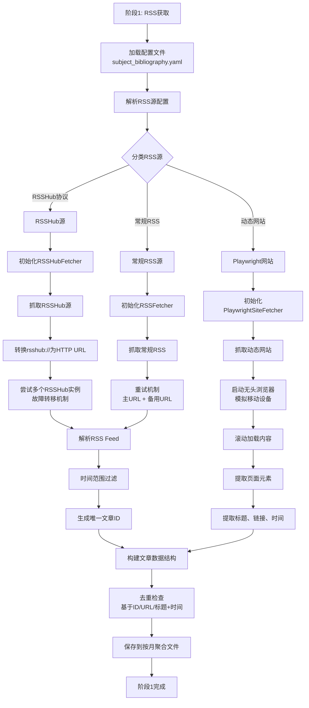
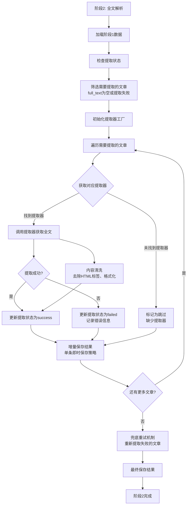
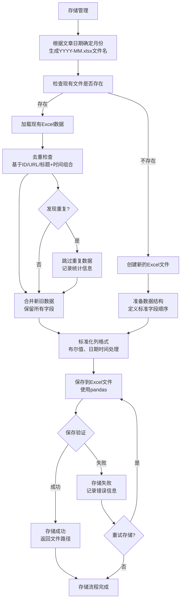

# RSS文章抓取与LLM分析系统 - 代码运行逻辑流程图

## 整体数据流转流程



## 阶段1: RSS获取详细流程



## 阶段2: 全文解析详细流程



## 阶段3: 文章过滤详细流程

```mermaid
flowchart TD
    FILTER_START[阶段3: 文章过滤] --> LOAD_EXTRACT_DATA[加载阶段2数据]
    
    LOAD_EXTRACT_DATA --> CHECK_FILTER_STATUS[检查过滤状态<br/>filter_status字段]
    
    CHECK_FILTER_STATUS --> FILTER_UNPROCESSED[筛选未处理文章<br/>提取成功且未过滤]
    
    FILTER_UNPROCESSED --> INIT_FILTER[初始化ArticleFilter]
    
    INIT_FILTER --> FOR_EACH_ARTICLE_FILTER[遍历需要过滤的文章]
    
    FOR_EACH_ARTICLE_FILTER --> PREPARE_CONTENT[准备过滤内容<br/>标题 + 前1000字符]
    
    PREPARE_CONTENT --> CALL_LLM_FILTER[调用LLM进行初筛<br/>使用article_filter任务]
    
    CALL_LLM_FILTER --> PARSE_LLM_RESPONSE[解析LLM返回结果<br/>JSON格式]
    
    PARSE_LLM_RESPONSE --> PARSE_SUCCESS{解析成功?}
    
    PARSE_SUCCESS -->|是| CHECK_PASS{过滤结果}
    
    PARSE_SUCCESS -->|否| MARK_FILTER_FAILED[标记为失败<br/>JSON解析错误]
    
    CHECK_PASS -->|通过| MARK_PASS[标记为通过<br/>filter_pass=true]
    CHECK_PASS -->|拒绝| MARK_REJECT[标记为拒绝<br/>filter_pass=false<br/>记录拒绝理由]
    
    MARK_PASS --> UPDATE_FILTER_STATUS[更新filter_status为"成功"]
    MARK_REJECT --> UPDATE_FILTER_STATUS[更新filter_status为"已拒绝"]
    MARK_FILTER_FAILED --> UPDATE_FILTER_STATUS[更新filter_status为"失败"]
    
    UPDATE_FILTER_STATUS --> SAVE_FILTER_RESULT[保存过滤结果<br/>即时保存策略]
    
    SAVE_FILTER_RESULT --> NEXT_FILTER{还有更多文章?}
    
    NEXT_FILTER -->|是| FOR_EACH_ARTICLE_FILTER
    NEXT_FILTER -->|否| FILTER_END[阶段3完成]
    
    FILTER_UNPROCESSED --> CONTENT_CHECK[内容完整性检查<br/>确保有full_text或content]
    CONTENT_CHECK -->|缺少内容| SKIP_NO_CONTENT[跳过并标记原因]
    CONTENT_CHECK -->|有内容| FOR_EACH_ARTICLE_FILTER
    
    SKIP_NO_CONTENT --> SAVE_FILTER_RESULT
```

## 阶段4: 文章总结详细流程

```mermaid
flowchart TD
    SUMMARY_START[阶段4: 文章总结] --> LOAD_FILTER_DATA[加载阶段3数据]
    
    LOAD_FILTER_DATA --> SELECT_PASSED_ARTICLES[筛选通过过滤的文章<br/>filter_pass=true]
    
    SELECT_PASSED_ARTICLES --> CHECK_SUMMARY_STATUS[检查总结状态<br/>llm_summary_status]
    
    CHECK_SUMMARY_STATUS --> FILTER_NEED_SUMMARY[筛选需要总结的文章<br/>状态非"成功"且有内容]
    
    FILTER_NEED_SUMMARY --> INIT_SUMMARY_AGENT[初始化ArticleSummaryAgent]
    
    INIT_SUMMARY_AGENT --> FOR_EACH_ARTICLE_SUM[遍历需要总结的文章]
    
    FOR_EACH_ARTICLE_SUM --> BUILD_SUMMARY_PROMPT[构建总结提示词<br/>标题 + 来源 + 正文]
    
    BUILD_SUMMARY_PROMPT --> CALL_LLM_SUMMARY[调用LLM进行总结<br/>使用article_summary任务]
    
    CALL_LLM_SUMMARY --> PROCESS_LLM_OUTPUT[处理LLM输出<br/>JSON或文本格式]
    
    PROCESS_LLM_OUTPUT --> VALIDATE_SUMMARY{总结结果有效?}
    
    VALIDATE_SUMMARY -->|是| SAVE_SUMMARY[保存总结结果<br/>llm_summary字段]
    VALIDATE_SUMMARY -->|否| SAVE_SUMMARY_ERROR[保存错误信息<br/>llm_summary_error字段]
    
    SAVE_SUMMARY --> UPDATE_SUMMARY_STATUS[更新总结状态为"成功"]
    SAVE_SUMMARY_ERROR --> UPDATE_SUMMARY_STATUS[更新总结状态为"失败"]
    
    UPDATE_SUMMARY_STATUS --> SAVE_SUMMARY_RESULT[保存总结结果<br/>即时保存策略]
    
    SAVE_SUMMARY_RESULT --> RETRY_FAILED_SUMMARY{重试失败文章?}
    
    RETRY_FAILED_SUMMARY -->|是| RETRY_SUMMARY[兜底重试机制<br/>最多2次重试]
    RETRY_FAILED_SUMMARY -->|否| NEXT_SUMMARY{还有更多文章?}
    
    RETRY_SUMMARY --> CALL_LLM_SUMMARY
    NEXT_SUMMARY -->|是| FOR_EACH_ARTICLE_SUM
    NEXT_SUMMARY -->|否| SUMMARY_END[阶段4完成]
    
    FILTER_NEED_SUMMARY --> CONTENT_VALIDATION[内容验证<br/>确保有full_text或content]
    CONTENT_VALIDATION -->|内容不足| SKIP_INSUFFICIENT[跳过并标记原因]
    CONTENT_VALIDATION -->|内容充足| FOR_EACH_ARTICLE_SUM
    
    SKIP_INSUFFICIENT --> SAVE_SUMMARY_RESULT
```

## 阶段5: 深度分析详细流程

```mermaid
flowchart TD
    ANALYSIS_START[阶段5: 深度分析] --> LOAD_SUMMARY_DATA[加载阶段4数据]
    
    LOAD_SUMMARY_DATA --> SELECT_SUMMARIZED[筛选已完成总结的文章<br/>llm_summary_status="成功"]
    
    SELECT_SUMMARIZED --> CHECK_ANALYSIS_STATUS[检查分析状态<br/>llm_analysis_status]
    
    CHECK_ANALYSIS_STATUS --> FILTER_NEED_ANALYSIS[筛选需要分析的文章<br/>状态非"成功"]
    
    FILTER_NEED_ANALYSIS --> INIT_ANALYST[初始化ArticleAnalyst]
    
    INIT_ANALYST --> FOR_EACH_ARTICLE_ANALYZE[遍历需要分析的文章]
    
    FOR_EACH_ARTICLE_ANALYZE --> PREPARE_ANALYSIS[准备分析内容<br/>基于llm_summary]
    
    PREPARE_ANALYSIS --> CALL_LLM_ANALYSIS[调用LLM进行深度分析<br/>使用article_analysis任务]
    
    CALL_LLM_ANALYSIS --> PARSE_ANALYSIS_RESULT[解析分析结果<br/>JSON格式提取多维度信息]
    
    PARSE_ANALYSIS_RESULT --> EXTRACT_FIELDS{提取结构化字段}
    
    EXTRACT_FIELDS -->|成功| EXTRACT_SCORE[提取评分0-100]
    EXTRACT_FIELDS -->|失败| MARK_ANALYSIS_ERROR[标记为分析失败]
    
    EXTRACT_SCORE --> EXTRACT_DIMENSION[提取主要维度<br/>四大原则之一]
    EXTRACT_DIMENSION --> EXTRACT_TOPIC[提取主题聚焦<br/>50字用于聚类]
    EXTRACT_TOPIC --> EXTRACT_THEME[提取母题本质<br/>150-200字用于向量库]
    
    EXTRACT_THEME --> EXTRACT_TAGS[提取标签列表<br/>JSON数组格式]
    EXTRACT_TAGS --> EXTRACT_BOOKS[提取提及书籍<br/>JSON数组格式]
    
    EXTRACT_BOOKS --> SAVE_ANALYSIS_DATA[保存分析数据<br/>多字段更新]
    MARK_ANALYSIS_ERROR --> SAVE_ANALYSIS_ERROR[保存错误信息]
    
    SAVE_ANALYSIS_DATA --> UPDATE_ANALYSIS_STATUS[更新分析状态为"成功"]
    SAVE_ANALYSIS_ERROR --> UPDATE_ANALYSIS_STATUS[更新分析状态为"失败"]
    
    UPDATE_ANALYSIS_STATUS --> SAVE_ANALYSIS_RESULT[保存分析结果<br/>即时保存策略]
    
    SAVE_ANALYSIS_RESULT --> RETRY_FAILED_ANALYSIS{重试失败文章?}
    
    RETRY_FAILED_ANALYSIS -->|是| RETRY_ANALYSIS[兜底重试机制<br/>最多2次重试]
    RETRY_FAILED_ANALYSIS -->|否| NEXT_ANALYSIS{还有更多文章?}
    
    RETRY_ANALYSIS --> CALL_LLM_ANALYSIS
    NEXT_ANALYSIS -->|是| FOR_EACH_ARTICLE_ANALYZE
    NEXT_ANALYSIS -->|否| SCORE_STATISTICS[生成评分统计分析]
    
    SCORE_STATISTICS --> ANALYSIS_END[阶段5完成]
```

## 存储管理详细流程



这个流程图详细展示了系统各个阶段的处理逻辑，包括数据流转、错误处理、重试机制和存储管理。系统采用了增量处理、即时保存和兜底重试的策略，确保了处理的可靠性和数据的安全性。