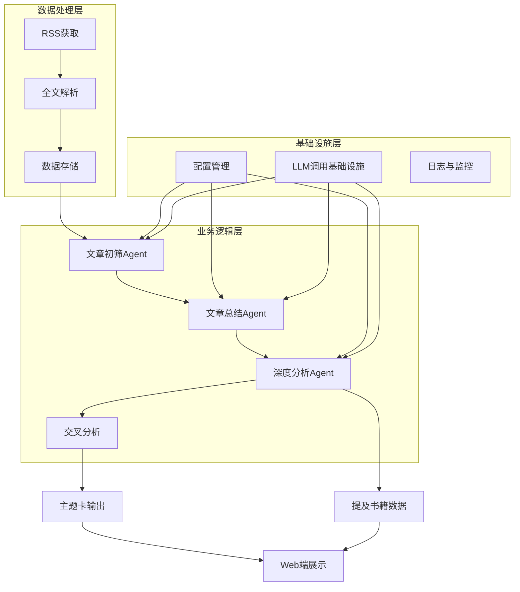

# 模块2：主题书目推荐（RSS + LLM）模块技术架构详解

## 概述

模块2是整个系统的核心智能处理模块，负责从RSS源获取文章，通过多层LLM分析，最终产出"主题卡"。本模块采用了高度模块化的设计，实现了从数据获取到智能分析的完整闭环。

## 🏗️ 三层架构映射关系

### 📊 7层架构到3层大框架的归并

在代码实现中，原本的7层架构被巧妙地归并到"数据处理-业务逻辑-基础设施"三层大框架下：

#### 🗂️ 数据处理层 (Data Processing Layer)
- **RSS获取层** ([`src/core/rss_fetcher.py`](src/core/rss_fetcher.py:1))：负责从多个RSS源抓取文章
- **全文解析层** ([`src/core/content_extractors`](src/core/content_extractors))：提取文章全文内容
- **数据存储层** ([`src/core/storage.py`](src/core/storage.py:1))：按月聚合存储数据

#### 🧠 业务逻辑层 (Business Logic Layer)
- **文章初筛Agent** ([`src/core/analysis/filter.py`](src/core/analysis/filter.py:1))：使用LLM初步筛选文章
- **文章总结Agent** ([`src/core/analysis/summary_agent.py`](src/core/analysis/summary_agent.py:1))：生成结构化摘要
- **深度分析Agent** ([`src/core/analysis/analyst.py`](src/core/analysis/analyst.py:1))：进行深度语义分析
- **交叉分析层** ([`src/core/cross_analysis`](src/core/cross_analysis))：主题聚类与关联分析

#### 🔧 基础设施层 (Infrastructure Layer)
- **配置管理** ([`config/llm.yaml`](config/llm.yaml:1) 和 [`config/subject_bibliography.yaml`](config/subject_bibliography.yaml:1))
- **LLM调用基础设施** ([`src/utils/llm/client.py`](src/utils/llm/client.py:1))
- **日志与监控** ([`src/utils/logger.py`](src/utils/logger.py:1))

### 🔄 三Agent架构的解耦实现

三Agent架构在代码中通过以下方式实现解耦：

1. **统一LLM客户端**：所有Agent共享[`UnifiedLLMClient`](src/utils/llm/client.py:75)基础设施，但使用不同的任务配置
   ```python
   # Agent 1: 文章初筛
   self.llm_client.call("article_filter", user_prompt)
   
   # Agent 2: 文章总结
   self.llm_client.call("article_summary", user_prompt)
   
   # Agent 3: 深度分析
   self.llm_client.call("article_analysis", user_prompt)
   ```

2. **独立任务配置**：每个Agent在[`config/llm.yaml`](config/llm.yaml:97)中有独立的配置节点
   - `article_filter`：使用轻量级模型(`text-small`)进行初筛
   - `article_summary`：使用标准模型(`text`)生成摘要
   - `article_analysis`：使用标准模型(`text`)进行深度分析

3. **数据流式传递**：Agent之间通过标准化数据结构传递信息
   - Agent 1输出：`filter_pass`, `filter_reason`, `filter_status`
   - Agent 2输入：`full_text`，输出：`llm_summary`
   - Agent 3输入：`llm_summary`，输出：`llm_score`, `llm_thematic_essence`等

## 📅 按月聚合存储策略

### 💾 即时保存机制

按月聚合存储策略通过[`StorageManager`](src/core/storage.py:12)类实现"即时保存"和"增量更新"：

1. **文件命名规则**：按月份聚合，格式为`YYYY-MM.xlsx`（如`2025-12.xlsx`）
   ```python
   def _get_filepath(self, stage: str, articles: Optional[List[Dict]] = None) -> str:
       # 根据文章发布时间确定月份
       month_str = dt.strftime("%Y-%m")
       filename = f"{month_str}.xlsx"
       return os.path.join(self.output_dir, filename)
   ```

2. **即时保存策略**：每处理完一篇文章立即保存，避免批量处理失败导致数据丢失
   ```python
   # 在pipeline.py中的即时保存实现
   for i, article in enumerate(unprocessed_articles):
       # 处理文章...
       processed_article = self._process_article(article)
       
       # 立即保存当前文章的过滤结果
       output_file = self.storage.save_analyze_results([processed_article], input_file)
   ```

3. **增量更新机制**：通过字段级更新避免覆盖已有数据
   ```python
   # 只更新analyze相关字段，避免丢失其他阶段的数据
   for field in self.ANALYZE_UPDATE_FIELDS:
       updated_article[field] = processed_article.get(field, "")
   ```

### 🔄 多阶段处理保障

6个阶段（fetch→extract→filter→summary→analysis→cross）中的数据完整性通过以下机制保障：

1. **状态字段追踪**：每个阶段都有独立的状态字段
   - `extract_status`：全文提取状态
   - `filter_status`：初筛状态
   - `llm_summary_status`：总结状态
   - `llm_analysis_status`：分析状态

2. **智能断点续传**：每个阶段开始前检查已有状态，跳过已处理的文章
   ```python
   # 检查文章是否已处理
   if str(article.get("llm_summary_status", "")).strip() == "成功":
       continue  # 跳过已处理的文章
   ```

## 🌐 数据同步到Web端的机制

### 📂 文件系统适配器模式

虽然项目中没有直接找到`lib/content.ts`文件，但根据代码分析，数据同步到Web端采用了以下机制：

1. **文件系统作为数据库**：使用Excel文件作为数据存储，通过[`OutputFormatter`](src/core/book_vectorization/output_formatter.py:64)生成多种格式输出
   ```python
   # 保存为Markdown和JSON格式
   saved_files = {}
   for format_name in self.formats:
       if format_name == 'markdown':
           content = self.format_as_markdown(results, metadata)
       elif format_name == 'json':
           content = self.format_as_json(results, metadata)
   ```

2. **交叉分析报告生成**：[`CrossAnalysisManager`](src/core/cross_analysis/manager.py:17)负责生成主题分析报告
   ```python
   # 生成交叉分析报告
   report_path = self.reporter.generate(group, analysis_result, report_dir, group_index=idx)
   report_paths.append(report_path)
   ```

3. **提及书籍数据提取**：在深度分析阶段提取`llm_mentioned_books`字段，供Web端使用
   ```python
   # 在analyst.py中提取提及的书籍
   mentioned_books = analysis_data.get("mentioned_books", [])
   ```

### 🔗 数据同步流程

数据同步采用以下流程：
1. 后端处理完成后，将结果保存到`runtime/outputs/`目录
2. Web端通过文件系统API读取这些文件
3. 使用适配器模式将文件数据转换为前端可用格式

## ⚙️ 技术路径选型理由

### 🔄 分阶段管道设计

系统选择"分阶段管道（Pipeline）设计"的原因和实现方式：

1. **阶段解耦实现**：
   ```python
   # 每个阶段都有独立的运行方法
   def run_stage_fetch(self) -> Optional[str]: ...
   def run_stage_extract(self, input_file: Optional[str] = None) -> Optional[str]: ...
   def run_stage_filter(self, input_file: Optional[str] = None) -> Optional[str]: ...
   ```

2. **失败重试机制**：
   ```python
   # 在summary_runner.py中的重试实现
   failed = self._process_batch(pending, filepath, attempt=1)
   attempt = 2
   while failed and attempt <= self.max_attempts:
       failed = self._process_batch(failed, filepath, attempt=attempt)
       attempt += 1
   ```

3. **配置驱动**：每个阶段的行为可通过配置文件调整，提高系统灵活性

### 🎭 PlaywrightSiteFetcher的选择理由

选择[`PlaywrightSiteFetcher`](src/core/playwright_fetcher.py:19)而非更轻量工具的原因：

1. **动态内容支持**：能够处理JavaScript渲染的动态内容
   ```python
   # 等待页面加载完成
   page.wait_for_load_state("networkidle", timeout=self.timeout)
   
   # 滚动加载更多内容
   self._scroll_to_load_content(page, site_config)
   ```

2. **复杂交互能力**：支持滚动、点击等复杂用户交互
   ```python
   # 滚动到页面底部加载更多内容
   page.evaluate("window.scrollTo(0, document.body.scrollHeight)")
   ```

3. **精确内容提取**：能够处理现代Web应用的复杂DOM结构
   ```python
   # 使用CSS选择器精确提取内容
   article_elements = page.locator(article_container_selector)
   ```

4. **反爬虫应对**：通过模拟真实浏览器行为，降低被反爬虫系统检测的风险

## 📊 系统架构图



## 🎯 总结

模块2通过精心设计的三层架构和三Agent协作模式，实现了从原始RSS数据到高质量主题推荐的完整转换流程。按月聚合存储策略确保了数据的持久性和可追溯性，而分阶段管道设计则提供了高度的灵活性和容错能力。PlaywrightSiteFetcher的选择使系统能够应对现代Web网站的复杂性，确保数据获取的全面性和准确性。

这种架构设计不仅满足了当前的功能需求，还为未来的扩展和优化提供了坚实的基础。