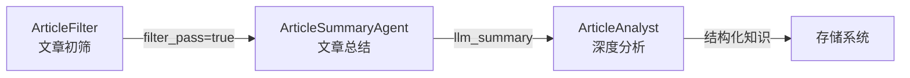
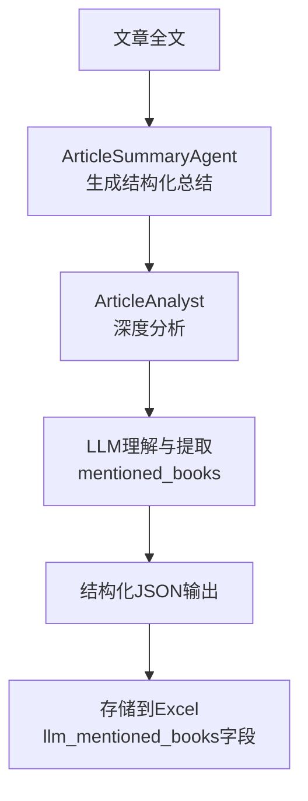

# 第四章节问题回答：AI驱动的深度评选与知识发现技术细节

## 模块 2：主题书目推荐与 RSS 分析模块（侧重知识发现与 Agent 协作）

### 1. 三 Agent 协作的通信机制

在系统中，`ArticleFilter`、`ArticleSummaryAgent` 和 `ArticleAnalyst` 三个 Agent 之间采用了**顺序式数据传递和状态同步**机制，确保后一个 Agent 能够参考前一个 Agent 的中间结果。

#### 🔗 数据流转与状态同步



**具体实现机制**：

1. **ArticleFilter → ArticleSummaryAgent**：
   - 数据传递：通过 Excel 文件中的 `filter_pass` 字段标记是否通过筛选
   - 状态同步：`filter_status` 字段记录处理状态（"成功"/"失败"/"已拒绝"）
   - 中间结果引用：只有 `filter_pass=true` 的文章才会进入总结阶段

2. **ArticleSummaryAgent → ArticleAnalyst**：
   - 数据传递：通过 `llm_summary` 字段传递结构化总结内容
   - 状态同步：`llm_summary_status` 字段记录总结处理状态
   - 中间结果引用：Analyst 直接使用 SummaryAgent 生成的 JSON 格式总结作为输入

3. **存储层状态管理**：
   - 采用**按月聚合Excel存储**策略，每个阶段的处理结果即时保存
   - 使用状态字段（如 `filter_status`、`llm_summary_status`）确保处理可追溯和可恢复
   - 支持增量处理，只处理未成功或状态异常的文章

**代码实现示例**：
```python
# pipeline.py 中的状态检查逻辑
for article in articles:
    # 检查前一个Agent的处理状态
    filter_status = article.get("filter_status", "")
    if filter_status == "成功":
        # 只有通过筛选的文章才会进入总结阶段
        unprocessed_articles.append(article)
```

### 2. 层次聚类算法 (Hierarchical Clustering) 细节

系统在交叉分析阶段使用了基于 TF-IDF 与层次聚类的文章聚类算法，具体实现细节如下：

#### 📊 距离度量方式

系统采用**余弦相似度 (Cosine Similarity)** 作为距离度量方式：

```python
# clustering.py 中的聚类配置
model = clustering_cls(
    n_clusters=None,  # 不预设簇数
    distance_threshold=self.distance_threshold,  # 默认0.8
    metric="cosine",  # 余弦相似度，适合文本
    linkage="average",  # 平均链接
)
```

**选择余弦相似度的原因**：
- 适合高维稀疏文本向量
- 对文本长度不敏感，更关注方向而非绝对值
- 在语义相似性计算中表现优异

#### 🎯 聚类停止点确定机制

系统采用**距离阈值自动确定分组数量**的策略，无需预设主题数量：

1. **距离阈值控制**：
   - 默认 `distance_threshold=0.8`（可在配置中调整）
   - 阈值越小，分组越细（0.5~1.2为合理范围）
   - 通过阈值自动控制聚类粒度

2. **自适应分组机制**：
   ```python
   # 不预设簇数，让算法根据距离阈值自动确定
   n_clusters=None
   distance_threshold=0.8
   ```

3. **特征文本构建策略**：
   - 使用 `topic_focus`（主题聚焦点，50字）作为核心聚类特征
   - 优先使用 `full_text` 前2000字，fallback 到 `summary_long`
   - 标题和标签重复加权以提高权重
   - **移除 `thematic_essence`**（太抽象，会干扰聚类）

```python
# 特征文本构建示例
return " ".join(filter(None, [
    title, title,                       # 标题权重 x2
    topic_focus, topic_focus, topic_focus,  # 主题聚焦点权重 x3（聚类核心特征）
    raw_content,                        # 原始内容（full_text前2000字或summary_long）
    tags_text, tags_text,               # 标签权重 x2
    summary_long,
    mentioned_text,
]))
```

### 3. 向量检索 (Vector Retrieval) 实现

系统实现了完整的向量检索流程，用于文章与图书的关联分析：

#### 🧠 Embedding 模型

系统使用 **Qwen/Qwen3-Embedding-8B** 作为 Embedding 模型：

```yaml
# book_vectorization.yaml 中的配置
embedding:
  provider: "SiliconFlow"
  model: "Qwen/Qwen3-Embedding-8B"
  api_key: "env:SiliconFlow_API_KEY"
  base_url: "https://api.siliconflow.cn/v1"
  dimensions: 4096  # 向量维度
```

**模型特点**：
- 4096维高维向量表示
- 支持中英文双语语义理解
- 适合学术文献和专业内容的向量化

#### 🗄️ 向量数据库集成

系统使用 **ChromaDB** 作为向量数据库，与按月聚合 Excel 存储紧密结合：

```yaml
# vector_db 配置
vector_db:
  type: "chromadb"
  persist_directory: "runtime/vector_db/books"
  collection_name: "books_collection"
  distance_metric: "cosine"  # 余弦距离
```

**集成机制**：

1. **数据流向**：
   ```mermaid
   flowchart LR
       A[按月聚合Excel<br>文章数据] --> B[Thematic Essence<br>主题精要]
       B --> C[Embedding模型<br>向量化]
       C --> D[ChromaDB<br>向量存储]
       D --> E[相似度检索<br>关联图书]
   ```

2. **向量化文本构建**：
   ```python
   # 使用 llm_thematic_essence 字段（150-200字）作为检索文本
   thematic_essence = article.get("llm_thematic_essence", "")
   ```

3. **检索流程**：
   - 从 Excel 中提取高质量文章的 `llm_thematic_essence`
   - 通过 Embedding 模型转换为向量
   - 在 ChromaDB 中进行相似度检索
   - 返回相关图书推荐

### 4. 知识抽取逻辑

系统从非结构化文章中提取"提及书籍"(`mentioned_books`)采用了**多层次混合策略**：

#### 📚 LLM 直接提取为主

系统主要通过 LLM 的自然语言理解能力直接提取书籍信息：

```python
# analyst.py 中的提取逻辑
mentioned_books = analysis_data.get("mentioned_books", [])
```

**Prompt 设计策略**：
```markdown
### 3. 书籍/资源清洗 (Resource Curation)
- **审核**: 剔除无关紧要或反面教材的书籍，或者非图书类资源。
- **格式化**: 输出标准 JSON。
```

**输出格式**：
```json
{
  "mentioned_books": [
    {"title": "瓦尔登湖", "author": "亨利·戴维·梭罗", "context": "..."}
  ]
}
```

#### 🔍 提取质量保障机制

1. **结构化输出要求**：
   - 强制要求 JSON 格式输出
   - 包含书名、作者、上下文三个字段
   - 通过 `json_repair` 机制确保格式正确

2. **质量过滤**：
   - 剔除无关紧要或反面教材的书籍
   - 过滤非图书类资源
   - 保留有上下文引用的高质量书籍信息

3. **上下文保留**：
   - 不仅提取书名和作者，还保留引用上下文
   - 便于后续评估书籍与文章的关联强度

#### 📈 处理流程



**技术优势**：
- 利用 LLM 的语义理解能力，识别隐式书籍引用
- 支持多种表达形式的书籍提及（直接引用、间接提及等）
- 通过上下文信息验证提取的准确性
- 自动过滤非图书类资源，提高数据质量

---

## 总结

系统的三 Agent 协作机制、层次聚类算法、向量检索实现和知识抽取逻辑共同构成了一个完整的知识发现与推荐链条。通过顺序式数据传递、自适应聚类、高维向量检索和智能知识抽取，系统能够从海量文章中发现有价值的知识关联，为用户提供精准的主题书目推荐服务。

这种设计充分体现了"AI驱动的深度评选与知识发现"的核心理念，将传统的内容处理升级为智能化的知识发现过程。