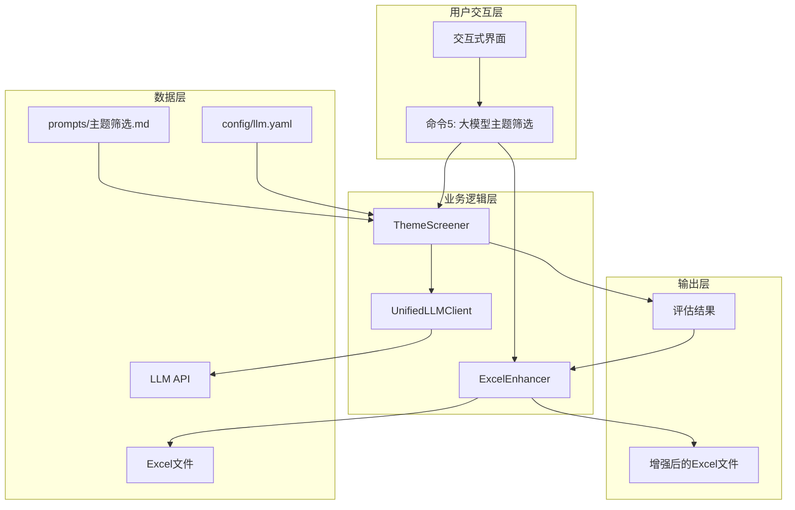
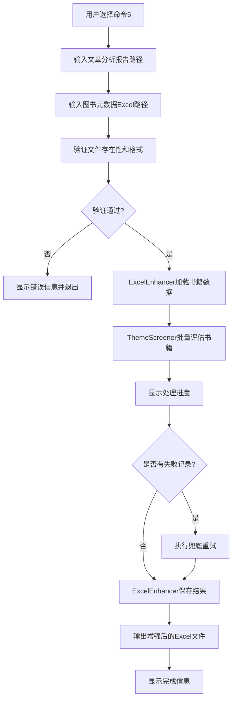
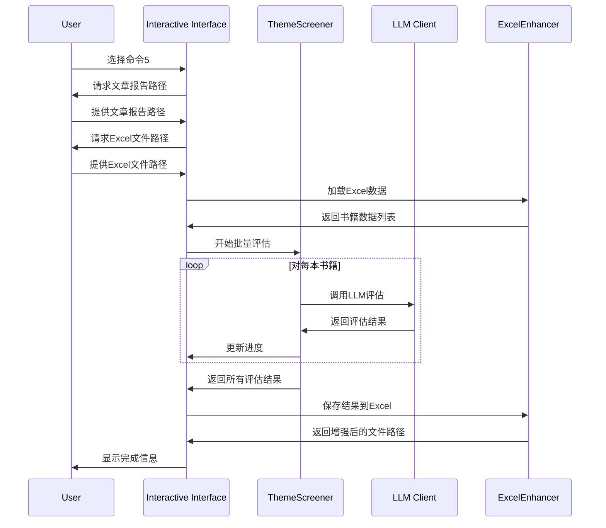

# 大模型主题筛选功能设计文档
- **Status**: Proposal
- **Date**: 2025-12-15

## 1. 目标与背景

在现有图书检索导出功能基础上，新增大模型主题筛选功能。该功能将根据用户输入的文章主题分析报告，对Excel中的每本书目进行主题相关性和维度契合度的智能评估，提高书目推荐的精准度。

### 解决的问题
- 当前图书检索主要基于语义相似度，缺乏对主题深度的理解
- 需要人工筛选大量检索结果，效率低下
- 无法评估书籍与特定文章主题的互文关系质量

### 核心价值
- 通过大模型深度分析，建立文章与书籍的语义连接
- 自动化评估过程，减少人工干预
- 提供结构化的评估结果，便于决策

## 2. 详细设计

### 2.1 模块结构

#### 核心业务逻辑模块 (`src/core/`)
- `src/core/book_vectorization/theme_screener.py`: 主题筛选器核心逻辑
  - 职责：使用LLM评估书籍与文章主题的匹配度
  - 核心方法：`evaluate_book()`, `evaluate_books_batch()`
  
- `src/core/book_vectorization/excel_enhancer.py`: Excel增强器
  - 职责：处理Excel文件的读写和列管理
  - 核心方法：`load_books_data()`, `add_evaluation_results()`

#### 测试模块 (`tests/`)
- `tests/test_book_vectorization/test_theme_screener.py`: 主题筛选器测试
  - 测试范围：LLM调用逻辑、结果解析、错误处理
  
- `tests/test_book_vectorization/test_excel_enhancer.py`: Excel增强器测试
  - 测试范围：Excel读写、列管理、数据验证

#### 配置更新
- `config/llm.yaml`: 新增主题筛选任务配置
- `scripts/retrieve_books.py`: 交互式界面扩展，新增命令5

### 2.2 核心逻辑/接口

#### ThemeScreener 类接口设计
```python
class ThemeScreener:
    """主题筛选器，负责使用LLM评估书籍与文章主题的匹配度"""
    
    def __init__(self, llm_client: UnifiedLLMClient, config: Dict):
        """
        初始化主题筛选器
        
        Args:
            llm_client: 统一LLM客户端实例
            config: 主题筛选配置字典
        """
        
    def evaluate_book(self, article_report: str, book_metadata: Dict) -> Dict:
        """
        评估单本书籍与文章主题的匹配度
        
        Args:
            article_report: 文章主题分析报告内容
            book_metadata: 书籍元数据字典，包含书名、作者、内容简介等
            
        Returns:
            包含评估结果的字典，格式为：
            {
                "is_selected": bool,           # 是否通过筛选
                "score": float,                # 1-5分评分
                "evaluation_logic": {
                    "relevance_check": str,    # 主题相关性描述
                    "dimension_match": str     # 维度契合度描述
                },
                "reason": str                  # New Yorker风格评语
            }
            
        Raises:
            LLMCallError: LLM调用失败
            JSONParseError: 结果解析失败
        """
        
    def evaluate_books_batch(self, article_report: str, books_data: List[Dict]) -> List[Dict]:
        """
        批量评估多本书籍
        
        Args:
            article_report: 文章主题分析报告内容
            books_data: 书籍元数据列表
            
        Returns:
            评估结果列表，与输入书籍列表顺序一致。
            失败的项目包含error字段记录错误信息
        """
```

#### ExcelEnhancer 类接口设计
```python
class ExcelEnhancer:
    """Excel增强器，负责处理Excel文件的读写和列管理"""
    
    def __init__(self, excel_path: str):
        """
        初始化Excel增强器
        
        Args:
            excel_path: Excel文件路径
            
        Raises:
            FileNotFoundError: 文件不存在
            ExcelFormatError: 文件格式错误
        """
        
    def load_books_data(self) -> List[Dict]:
        """
        从Excel加载书籍数据
        
        Returns:
            书籍数据列表，每个字典包含完整的书籍元数据
            
        Raises:
            MissingColumnError: 缺少必需的列
        """
        
    def add_evaluation_results(self, results: List[Dict]) -> str:
        """
        将评估结果添加到Excel文件中
        
        Args:
            results: 评估结果列表，顺序需与书籍数据一致
            
        Returns:
            增强后的Excel文件路径
            
        Raises:
            DataMismatchError: 结果数量与书籍数量不匹配
        """
        
    def get_failed_books(self) -> List[Dict]:
        """
        获取处理失败的书籍列表，用于重试
        
        Returns:
            失败书籍的索引和错误信息列表
        """
```

#### 数据结构设计
```python
# 输入数据结构
BookMetadata = {
    "书目条码": str,
    "豆瓣书名": str,
    "豆瓣副标题": str,
    "豆瓣作者": str,
    "豆瓣丛书": str,
    "豆瓣内容简介": str,
    "豆瓣作者简介": str,
    "豆瓣目录": str
}

# 输出数据结构
EvaluationResult = {
    "is_selected": bool,
    "score": float,
    "evaluation_logic": {
        "relevance_check": str,
        "dimension_match": str
    },
    "reason": str,
    "llm_status": str,  # "success", "failed", "retry_needed"
    "error_message": str  # 仅失败时有值
}
```

### 2.3 可视化图表

#### 系统架构图


#### 数据流程图


#### LLM调用流程图


### 2.4 配置设计

#### LLM任务配置
在 `config/llm.yaml` 中新增：
```yaml
theme_screening:
  provider_type: text
  temperature: 0.3
  prompt:
    type: langfuse
    langfuse_name: "主题筛选"
  retry:
    max_retries: 3
    base_delay: 1.0
    max_delay: 10
    enable_provider_switch: true
  json_repair:
    enabled: true
    strict_mode: false
    output_format: json
  langfuse:
    enabled: true
    name: "主题筛选"
    tags: ["book-echoes", "主题筛选"]
    metadata:
      module: "图书向量化"
```

#### Excel列配置
新增列命名规范：
- `主题筛选_是否通过`: boolean类型，存储is_selected
- `主题筛选_评分`: float类型，存储score
- `主题筛选_相关性`: string类型，存储relevance_check
- `主题筛选_契合度`: string类型，存储dimension_match
- `主题筛选_评语`: string类型，存储reason
- `主题筛选_状态`: string类型，存储llm_status
- `主题筛选_错误信息`: string类型，存储error_message

## 3. 测试策略

### 3.1 单元测试

#### ThemeScreener 测试用例
```python
def test_evaluate_book_success():
    """测试单本书籍评估成功场景"""
    
def test_evaluate_book_llm_failure():
    """测试LLM调用失败的重试机制"""
    
def test_evaluate_book_json_parse_failure():
    """测试JSON解析失败的修复机制"""
    
def test_evaluate_books_batch_mixed_results():
    """测试批量评估中部分成功部分失败的场景"""
    
def test_evaluate_books_batch_empty_input():
    """测试空输入的处理"""
```

#### ExcelEnhancer 测试用例
```python
def test_load_books_data_success():
    """测试成功加载Excel数据"""
    
def test_load_books_data_missing_columns():
    """测试缺少必需列的错误处理"""
    
def test_add_evaluation_results_success():
    """测试成功添加评估结果"""
    
def test_add_evaluation_results_mismatch():
    """测试结果数量不匹配的错误处理"""
    
def test_get_failed_books():
    """测试获取失败书籍列表"""
```

### 3.2 集成测试

```python
def test_end_to_end_workflow():
    """测试完整的端到端工作流程"""
    
def test_interactive_interface_integration():
    """测试交互式界面集成"""
    
def test_error_recovery_workflow():
    """测试错误恢复工作流程"""
```

### 3.3 性能测试

```python
def test_large_batch_processing():
    """测试大批量处理性能"""
    
def test_concurrent_llm_calls():
    """测试并发LLM调用性能"""
    
def test_memory_usage_optimization():
    """测试内存使用优化"""
```

### 3.4 边界条件测试

- 文章报告为空或格式错误
- Excel文件包含大量书籍（>1000本）
- 网络异常或API限流
- LLM返回格式错误的JSON
- Excel文件包含特殊字符或超长文本

## 4. 部署与运维

### 4.1 依赖管理
- 复用现有依赖，无需新增第三方库
- 确保 `openpyxl` 版本兼容性
- 验证 `langfuse` 集成正常

### 4.2 监控指标
- LLM调用成功率和响应时间
- 批量处理进度和错误率
- Excel文件处理性能
- 内存使用情况

### 4.3 日志记录
- 关键流程节点的中文日志
- LLM调用的详细参数和结果
- 错误信息的完整上下文
- 性能指标的定期记录

### 4.4 故障恢复
- 支持从中断点继续处理
- 失败记录的自动重试机制
- 原始文件的备份保护
- 结果文件的版本管理