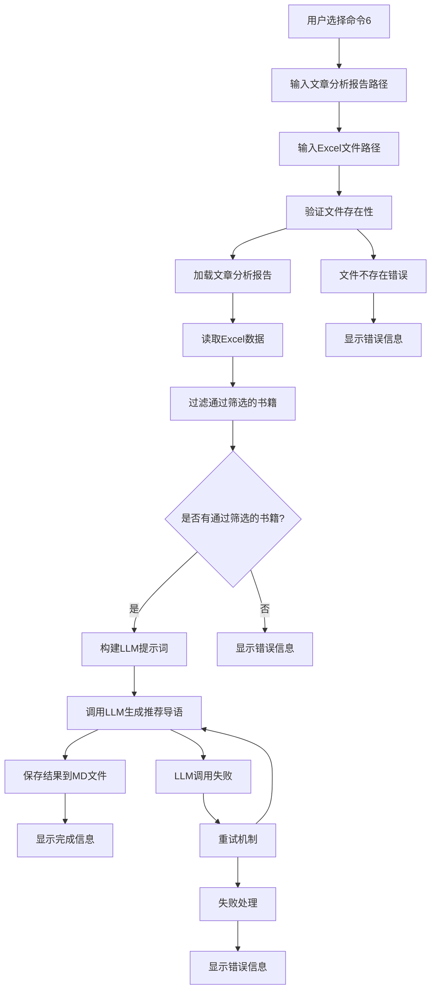

# 大模型推荐导语功能设计文档
- **Status**: Proposal
- **Date**: 2025-12-15

## 1. 目标与背景

### 1.1 目标
开发一个"大模型推荐导语"功能，对通过主题筛选的候选书目列表撰写总的推荐导语，将零散的"文章痛点"与厚重的"书籍智慧"编织成完整的认知地图。

### 1.2 背景
在现有的图书检索和大模型主题筛选流程基础上，用户需要获得专业的书目推荐导语，以增强阅读体验和书籍推荐的深度。该功能将在图书检索以及调用大模型主题筛选后执行，为筛选通过的候选书目生成专业的推荐导语。

### 1.3 解决的问题
- 为筛选后的书目提供专业的推荐导语，增强用户体验
- 将文章主题分析与书籍内容有机结合，构建完整的认知地图
- 提供结构化的推荐内容，包括标题、策展人手记、阅读谱系和结语

## 2. 详细设计

### 2.1 模块结构

遵循项目结构规范，设计方案如下：

- `src/core/book_vectorization/recommendation_writer.py`: 核心推荐导语生成器
  - 职责：负责根据文章分析报告和书籍列表生成推荐导语
  - 依赖：UnifiedLLMClient、ExcelEnhancer

- `src/core/book_vectorization/excel_reader.py`: Excel数据读取器（新增工具类）
  - 职责：专门处理Excel文件中书籍数据的读取和过滤
  - 依赖：pandas、Path

- `tests/test_book_vectorization/test_recommendation_writer.py`: 推荐导语生成器测试
  - 职责：测试推荐导语生成器的各项功能
  - 测试范围：正常路径、边界条件、异常路径

### 2.2 核心逻辑/接口

#### 2.2.1 RecommendationWriter类设计

```python
class RecommendationWriter:
    """推荐导语生成器，负责根据文章分析报告和书籍列表生成推荐导语"""
    
    def __init__(self, llm_client: UnifiedLLMClient, config: Dict):
        """
        初始化推荐导语生成器
        
        Args:
            llm_client: 统一LLM客户端实例
            config: 推荐导语生成配置字典
        """
        
    def generate_recommendation(self, article_report_path: str, excel_path: str) -> str:
        """
        生成推荐导语
        
        Args:
            article_report_path: 文章分析报告MD文件路径
            excel_path: 书籍元数据Excel文件路径
            
        Returns:
            生成的推荐导语MD文件路径
            
        Raises:
            FileNotFoundError: 输入文件不存在
            ValueError: 没有通过筛选的书籍
            LLMCallError: LLM调用失败
        """
        
    def _load_article_report(self, file_path: str) -> str:
        """
        加载文章分析报告
        
        Args:
            file_path: 文章分析报告文件路径
            
        Returns:
            文章分析报告内容
            
        Raises:
            FileNotFoundError: 文件不存在
            UnicodeDecodeError: 文件编码错误
        """
        
    def _load_selected_books(self, excel_path: str) -> List[Dict]:
        """
        加载通过主题筛选的书籍数据
        
        Args:
            excel_path: Excel文件路径
            
        Returns:
            通过筛选的书籍数据列表
            
        Raises:
            FileNotFoundError: Excel文件不存在
            ValueError: 没有通过筛选的书籍
        """
        
    def _build_user_prompt(self, article_report: str, books_data: List[Dict]) -> str:
        """
        构建用户提示词
        
        Args:
            article_report: 文章分析报告内容
            books_data: 书籍数据列表
            
        Returns:
            格式化的用户提示词
        """
        
    def _save_recommendation(self, content: str, excel_path: str) -> str:
        """
        保存推荐导语到Excel同路径
        
        Args:
            content: 推荐导语内容
            excel_path: Excel文件路径
            
        Returns:
            保存的MD文件路径
        """
```

#### 2.2.2 ExcelReader类设计

```python
class ExcelReader:
    """Excel数据读取器，专门处理书籍元数据读取"""
    
    def __init__(self):
        """初始化Excel读取器"""
        
    def load_books_data(self, excel_path: str) -> List[Dict]:
        """
        加载Excel中的书籍数据
        
        Args:
            excel_path: Excel文件路径
            
        Returns:
            书籍数据列表
            
        Raises:
            FileNotFoundError: 文件不存在
            ValueError: 文件格式错误或缺少必需列
        """
        
    def filter_selected_books(self, books_data: List[Dict]) -> List[Dict]:
        """
        过滤通过主题筛选的书籍
        
        Args:
            books_data: 完整的书籍数据列表
            
        Returns:
            通过筛选的书籍数据列表
        """
```

#### 2.2.3 数据结构设计

**输入数据结构**：
- 文章分析报告：MD格式文本
- 书籍数据：Excel表格，包含书目条码、豆瓣书名、豆瓣副标题、豆瓣作者、豆瓣丛书、豆瓣内容简介、豆瓣作者简介、豆瓣目录、初评理由等字段

**输出数据结构**：
- 推荐导语：MD格式文档，包含标题、策展人手记、阅读谱系、结语四个部分

### 2.3 可视化图表



### 2.4 配置扩展

需要在`config/llm.yaml`中添加推荐导语任务配置：

```yaml
tasks:
  recommendation_writer:
    provider_type: text
    temperature: 0.4
    prompt:
      type: langfuse
      langfuse_name: "推荐导语"
    retry:
      max_retries: 3
      base_delay: 1.0
      max_delay: 10
      enable_provider_switch: true
    langfuse:
      enabled: true
      name: "推荐导语生成"
      tags: ["book-echoes", "推荐导语"]
      metadata:
        module: "图书向量化"
```

### 2.5 交互式界面扩展

在`scripts/retrieve_books.py`的交互式模式中添加命令6：

```python
elif mode_choice == 5:  # 大模型推荐导语
    print("\n✍️ 大模型推荐导语模式")
    
    article_report_path = get_user_input("请输入文章分析报告文件路径", required=True)
    if not Path(article_report_path).exists():
        print(f"❌ 文件不存在: {article_report_path}")
        return None
        
    excel_path = get_user_input("请输入图书元数据Excel文件路径", required=True)
    if not Path(excel_path).exists():
        print(f"❌ 文件不存在: {excel_path}")
        return None
    
    # 执行推荐导语生成
    try:
        print("\n🔄 开始生成推荐导语...")
        
        # 初始化推荐导语生成器
        llm_client = UnifiedLLMClient()
        recommendation_writer = RecommendationWriter(llm_client, {})
        
        # 生成推荐导语
        recommendation_path = recommendation_writer.generate_recommendation(
            article_report_path, excel_path
        )
        
        print(f"✅ 推荐导语生成完成: {recommendation_path}")
        
        return None
        
    except Exception as e:
        print(f"❌ 推荐导语生成失败: {e}")
        logger.error(f"推荐导语生成失败: {e}")
        return None
```

## 3. 测试策略

### 3.1 单元测试范围

#### 3.1.1 RecommendationWriter测试
- **正常路径测试**：
  - 测试完整的推荐导语生成流程
  - 测试不同数量的书籍输入
  - 测试不同长度的文章分析报告

- **边界条件测试**：
  - 测试只有1本书籍的情况
  - 测试大量书籍（如50本）的情况
  - 测试超长文章分析报告的处理

- **异常路径测试**：
  - 测试文件不存在的情况
  - 测试Excel文件格式错误
  - 测试没有通过筛选的书籍
  - 测试LLM调用失败的重试机制

#### 3.1.2 ExcelReader测试
- **正常路径测试**：
  - 测试标准Excel文件的读取
  - 测试书籍数据的正确过滤

- **边界条件测试**：
  - 测试空Excel文件
  - 测试只有表头的Excel文件

- **异常路径测试**：
  - 测试非Excel文件
  - 测试缺少必需列的Excel文件

### 3.2 集成测试
- 测试与现有LLM框架的集成
- 测试与ExcelEnhancer的协作
- 测试交互式界面的完整流程

### 3.3 性能测试
- 测试大量书籍的处理性能
- 测试LLM调用的响应时间
- 测试内存使用情况

## 4. 实现注意事项

### 4.1 错误处理策略
- 文件不存在时提供清晰的错误信息
- LLM调用失败时使用现有的重试机制
- 没有通过筛选的书籍时提供友好的提示

### 4.2 性能优化
- 对于大量书籍，考虑分批处理
- 使用流式处理减少内存占用
- 缓存常用的配置和提示词

### 4.3 代码规范
- 遵循项目的编码规范，使用中文注释
- 所有公共方法必须有完整的docstring
- 使用结构化日志记录关键操作

### 4.4 扩展性考虑
- 设计时考虑未来可能的需求变化
- 预留配置接口支持不同的推荐风格
- 支持自定义输出格式