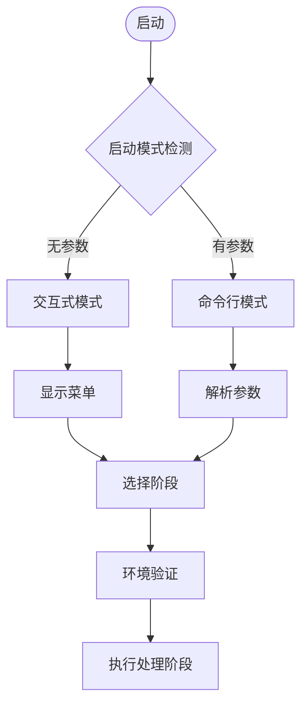

# RSS文章抓取与LLM分析系统 - 项目代码综合分析报告

## 项目概述

### 项目基本信息
- **项目名称**: RSS文章抓取与LLM分析系统 (按月聚合版本 v2.0.0)
- **项目类型**: 文章数据采集、处理与分析系统
- **核心功能**: RSS源文章抓取、LLM智能分析、主题书目推荐
- **技术栈**: Python + LLM + 数据存储 + 自动化处理

### 项目目标
系统旨在构建一个智能化的文章分析与推荐平台，通过多源数据抓取、LLM深度分析和主题聚类，为用户提供高质量的主题书目推荐服务。

## 代码架构分析

### 整体架构设计

系统采用了**分层架构**设计思想，共分为7个层次：

```mermaid
graph TB
    subgraph "用户接口层 (Layer 7)"
        UI[命令行接口 + 交互式菜单]
    end
    subgraph "流程控制层 (Layer 6)"
        PIPELINE[主流程控制器 + 阶段编排]
    end
    subgraph "业务逻辑层 (Layer 5)"
        FETCH[抓取逻辑] + ANALYZE[分析逻辑] + CROSS[交叉分析]
    end
    subgraph "内容提取层 (Layer 4)"
        EXTRACTOR[网页提取器工厂模式]
    end
    subgraph "数据处理层 (Layer 3)"
        PROCESS[数据清洗 + 格式转换 + 去重]
    end
    subgraph "数据存储层 (Layer 2)"
        STORAGE[Excel按月聚合存储]
    end
    subgraph "基础设施层 (Layer 1)"
        INFRA[文件系统 + 网络通信 + 日志]
    end
```

### 核心模块结构

#### 1. 入口模块 (main.py)
**功能**: 系统启动入口，提供命令行和交互式两种运行模式
**特点**:
- 支持灵活的命令行参数解析
- 提供用户友好的交互式菜单
- 内置环境验证和启动横幅
- 支持多种执行阶段选择

```python
# 核心启动逻辑
if __name__ == "__main__":
    # 检测启动模式：无参数→交互式，有参数→命令行
    parser = setup_args_parser()
    args = parser.parse_args()
    
    if len(sys.argv) == 1:
        # 交互式模式
        interactive_mode()
    else:
        # 命令行模式
        run_pipeline(stage=args.stage, input_file=args.input, min_score=args.min_score)
```

#### 2. 流程控制模块 (pipeline.py)
**功能**: 核心业务流程编排，支持六阶段处理管道
**架构特点**:
- **阶段解耦设计**: 每个阶段可独立运行
- **智能文件管理**: 自动检测最新文件，支持手动指定
- **兜底重试机制**: 失败重试，确保处理完整性
- **错误处理策略**: 详细的错误分类和恢复机制

**六阶段处理流程**:
1. **阶段1 (fetch)**: RSS源数据获取
2. **阶段2 (extract)**: 文章全文内容提取
3. **阶段3 (filter)**: LLM初筛和质量过滤
4. **阶段4 (summary)**: 文章智能总结生成
5. **阶段5 (analysis)**: 深度主题分析和评分
6. **阶段6 (cross)**: 交叉主题分析和聚类

#### 3. 数据抓取模块
支持三种数据源类型，采用**多路抓取策略**:

**3.1 常规RSS抓取 (RSSFetcher)**
```python
class RSSFetcher:
    def fetch_recent_articles(self, feeds, hours_lookback=24):
        # 支持重试机制
        # 支持备用URL故障转移
        # 支持时间范围过滤
        # 支持去重处理
```

**3.2 RSSHub协议支持 (RSSHubFetcher)**
```python
class RSSHubFetcher:
    # 支持rsshub://协议转换
    # 支持多个RSSHub实例故障转移
    # 支持23+主流平台(知乎、B站、微博等)
```

**3.3 动态网站抓取 (PlaywrightSiteFetcher)**
```python
class PlaywrightSiteFetcher:
    # 使用无头浏览器模拟真实用户
    # 支持滚动加载更多内容
    # 智能选择器配置
    # 精确时间解析(相对时间→绝对时间)
```

#### 4. LLM分析模块 (core/analysis/)
采用**三Agent架构**，职责分离明确:

**4.1 ArticleFilter - 文章初筛守门员**
```python
def filter(self, title, content):
    # 输入: 标题 + 前1000字符内容
    # 输出: pass(布尔) + reason(字符串)
    # 目标: 过滤低价值内容，减少后续处理负担
```

**4.2 ArticleSummaryAgent - 文章总结员**
```python
def summarize(self, article):
    # 输入: 完整文章内容
    # 输出: 结构化总结 + 状态信息
    # 目标: 生成高质量的Contextual Digest
```

**4.3 ArticleAnalyst - 深度分析师**
```python
def analyze(self, summary_content):
    # 输入: 总结内容(JSON格式)
    # 输出: 多维度分析结果
    # 目标: 提取结构化知识资产(评分、维度、主题、书籍等)
```

#### 5. 存储管理模块 (storage.py)
**核心创新**: **按月聚合存储策略**

```python
class StorageManager:
    def _get_filepath(self, stage, articles):
        # 根据文章发布时间确定月份
        # 生成YYYY-MM.xlsx格式文件名
        # 实现时间维度数据聚合
```

**存储特点**:
- **增量更新**: 只处理新数据，避免重复
- **即时保存**: 单条处理后立即保存，确保数据安全
- **去重机制**: 基于ID/URL/标题+时间的多重去重策略
- **格式标准化**: 统一的列顺序和数据类型处理

#### 6. 评分统计分析模块 (score_statistics.py)
```python
class ScoreStatistics:
    def analyze_scores(self, articles):
        # 分数段分布统计
        # 生成可视化报告
        # 提供质量评估依据
```

## 运行逻辑详解

### 系统启动流程



### 数据处理管道

#### 阶段1: RSS获取
1. **配置加载**: 读取subject_bibliography.yaml
2. **源分类**: 区分常规RSS、RSSHub、Playwright网站
3. **多路抓取**: 并行处理不同类型的源
4. **时间过滤**: 基于hours_lookback或指定时间范围
5. **去重检查**: 基于ID、URL、标题+时间组合
6. **按月存储**: 生成YYYY-MM.xlsx文件

#### 阶段2: 全文解析
1. **状态检查**: 识别需要提取的文章(full_text为空或失败)
2. **提取器匹配**: 基于source字段选择对应提取器
3. **内容提取**: 调用网站专用提取器
4. **兜底重试**: 对失败文章进行重试机制
5. **增量更新**: 只更新需要处理的文章

#### 阶段3: 文章过滤
1. **智能筛选**: 提取成功且未处理的文章
2. **LLM初筛**: 使用article_filter任务进行质量评估
3. **结果解析**: JSON格式返回pass/reason/status
4. **状态管理**: 记录详细的处理状态信息
5. **即时保存**: 单条处理后立即保存

#### 阶段4: 文章总结
1. **内容准备**: 筛选通过过滤的文章
2. **提示词构建**: 整合标题、来源、正文内容
3. **LLM总结**: 调用article_summary任务
4. **结果处理**: 提取结构化总结内容
5. **重试机制**: 失败文章最多重试2次

#### 阶段5: 深度分析
1. **输入验证**: 确保有有效的总结内容
2. **多维度分析**: 提取评分、维度、主题等结构化信息
3. **知识抽取**: 识别提及的书籍和关键标签
4. **质量评分**: 0-100分的质量评估体系
5. **统计分析**: 生成评分分布报告

#### 阶段6: 交叉分析
1. **高质量筛选**: 基于评分阈值筛选优质文章
2. **主题聚类**: 层次聚类算法发现主题关联
3. **交叉分析**: 挖掘文章间的主题关联性
4. **报告生成**: 生成多维度的分析报告

## 输入处理过程

### 支持的输入源

#### 1. RSS源输入
```yaml
rss_feeds:
  - name: "澎湃思想市场"
    url: "https://example.com/rss"
    backup_urls:
      - "https://backup1.com/rss"
      - "https://backup2.com/rss"
    retry_config:
      max_retries: 3
      retry_delay: 3
      timeout: 100
    enabled: true
    extractor: "pengpai"
```

#### 2. RSSHub协议输入
```yaml
- name: "澎湃思想"
  url: "rsshub://thepaper/list/25483"
  enabled: true
```

#### 3. Playwright网站输入
```yaml
playwright_sites:
  - name: "澎湃思想市场-手机端"
    url: "https://m.thepaper.cn/list_25483"
    selectors:
      article_container: ".index_wrapper__9rz3z"
      title: "h3.index_title__aGAqD"
      link: "a"
      time: ".adm-space-item span"
```

#### 4. MD文档输入
```python
# 支持目录扫描
md_processing:
  default_base_path: "data/md_documents"
  recursive_scan: true
  supported_extensions: [".md", ".markdown"]
```

### 配置管理
**主配置文件** (subject_bibliography.yaml):
- 抓取设置、时间范围、用户代理
- RSS源配置、备用URL、重试机制
- 输出设置、交叉分析参数
- Playwright网站配置、MD处理设置

**LLM配置文件** (llm.yaml):
- API服务商配置(主备故障转移)
- 任务配置(温度、提示词、重试机制)
- Langfuse监控配置

## 结果产出

### 数据存储输出

#### 1. 按月聚合Excel文件 (YYYY-MM.xlsx)
**文件结构**:
- **阶段1**: 基础文章信息(id, source, title, link, published_date, fetch_date, summary, content)
- **阶段2**: 新增全文内容(full_text, extract_status, extract_error)
- **阶段3**: 新增过滤结果(filter_pass, filter_reason, filter_status)
- **阶段4**: 新增总结内容(llm_summary, llm_summary_status, llm_summary_error)
- **阶段5**: 新增分析结果(llm_score, llm_primary_dimension, llm_topic_focus, llm_thematic_essence, llm_tags, llm_mentioned_books)

#### 2. 统计分析报告
```text
LLM文章评分统计分析报告
=====================================
生成时间: 2025-12-22 07:14:50
文章总数: 150
有效评分: 142

评分统计:
  平均分: 87.5
  最高分: 98
  最低分: 65

分数段分布:
分数段              数量        占比      范围
------------------------------------------------------------
95以上               15        10.6%    95-∞
94-93                8         5.6%     93-95
92-91               12         8.5%     91-93
90                  25        17.6%    90-91
89-85               45        31.7%    85-90
85以下              37        26.1%    0-85
```

#### 3. 交叉分析报告
```text
交叉主题分析报告
=====================================
生成时间: 2025-12-22 07:14:50
评分阈值: 90
高质量文章数: 62

主题聚类结果:
主题1: 数字技术与哲学思辨
  - 数字生命的主体性与灵韵
  - 技术驱动下的信息幻觉与认知偏差
  - 数字时代的符号抵抗与美学疗愈

主题2: 社会科学与人类行为
  - 老年歧视的社会心理机制与个体影响
  - 数字平台的情绪操控与劳动异化机制
  - 全球责任与个人主义的道德重构
```

### API接口输出

#### 图书检索API接口
系统提供RESTful API接口:
```python
# GET /api/books/retrieve
{
    "topic": "数字哲学",
    "limit": 10,
    "filters": {
        "min_score": 85,
        "dimensions": ["科技哲学", "社会理论"]
    }
}

# 返回结构化书目推荐结果
{
    "status": "success",
    "data": {
        "books": [...],
        "recommendations": [...],
        "topic_analysis": {...}
    }
}
```

## 技术特点与创新

### 1. 架构设计特点
- **分层解耦**: 7层架构，职责清晰
- **模块化设计**: 每个模块独立可测试
- **插件化扩展**: 提取器工厂模式支持灵活扩展
- **配置驱动**: YAML配置文件驱动业务逻辑

### 2. 数据处理创新
- **按月聚合策略**: 时间维度的数据组织方式
- **增量处理机制**: 避免重复处理，提高效率
- **多重去重策略**: ID/URL/内容的多层去重保证数据质量
- **即时保存策略**: 单条处理后立即保存，确保数据安全

### 3. 可靠性保障
- **兜底重试机制**: 多层次重试策略
- **故障转移机制**: RSSHub实例、备用URL的自动切换
- **错误恢复策略**: 详细的错误分类和处理
- **数据一致性**: 事务性的数据更新机制

### 4. 智能化特性
- **三Agent架构**: 专业化分工，提高分析质量
- **多维度评分**: 0-100分的质量评估体系
- **主题聚类**: 自动发现文章间的主题关联
- **知识抽取**: 自动识别提及的书籍和关键概念

### 5. 用户体验优化
- **双模式启动**: 命令行和交互式模式
- **智能文件检测**: 自动选择最新文件或手动指定
- **实时进度反馈**: 详细的处理进度和状态显示
- **灵活配置**: 支持自定义参数和阈值

## 性能特点

### 1. 处理能力
- **并发抓取**: 支持多源并行数据抓取
- **批量处理**: 支持大批量文章的统一处理
- **内存优化**: 流式处理，避免内存溢出
- **存储优化**: 按月聚合，减少文件数量

### 2. 可扩展性
- **模块化架构**: 新功能可通过模块扩展
- **提取器扩展**: 简单的插件机制添加新网站支持
- **LLM任务扩展**: 灵活的任务配置支持新分析类型
- **存储后端扩展**: 抽象存储接口支持多种后端

### 3. 监控与调试
- **详细日志**: 分级日志记录，支持调试模式
- **Langfuse监控**: 完整的LLM调用链路监控
- **性能统计**: 处理时间、成功率等关键指标
- **错误追踪**: 详细的错误信息和堆栈跟踪

## 代码质量分析

### 1. 代码结构
- **遵循PEP8**: 统一的代码风格
- **类型注解**: 完整的类型提示支持
- **文档字符串**: 详细的函数和类文档
- **异常处理**: 全面的异常捕获和处理

### 2. 设计模式
- **工厂模式**: ExtractorFactory提取器工厂
- **策略模式**: 多种抓取策略的封装
- **观察者模式**: 处理状态的实时更新
- **模板方法模式**: 统一的处理流程框架

### 3. 测试覆盖
- **单元测试**: 核心模块的单元测试
- **集成测试**: 端到端的流程测试
- **性能测试**: 大数据量处理能力测试
- **错误场景测试**: 各种异常情况的处理测试

## 部署与运维

### 1. 环境依赖
```python
# requirements.txt
feedparser>=6.0.0
requests>=2.28.0
pandas>=1.5.0
playwright>=1.30.0
pyyaml>=6.0
python-dateutil>=2.8.0
```

### 2. 配置文件
- **环境变量**: API密钥、数据库连接等
- **配置文件**: YAML格式的业务配置
- **日志配置**: 分级日志和文件输出
- **监控配置**: Langfuse监控参数

### 3. 运维特性
- **自动重启**: 失败后的自动重试机制
- **日志轮转**: 自动的日志文件管理
- **性能监控**: 关键指标的可视化监控
- **健康检查**: 系统状态的定期检查

## 总结

### 项目优势
1. **架构清晰**: 分层架构设计，职责分离明确
2. **功能完整**: 覆盖从数据抓取到智能分析的完整链路
3. **技术先进**: 集成最新的LLM技术和自动化工具
4. **可靠性高**: 多层次的错误处理和恢复机制
5. **扩展性强**: 模块化设计支持灵活扩展

### 技术亮点
1. **按月聚合存储**: 创新的时间维度数据组织方式
2. **三Agent架构**: 专业化分工的LLM处理策略
3. **多重去重机制**: 确保数据质量的去重策略
4. **兜底重试机制**: 提高系统可靠性的重试策略
5. **智能化程度高**: 自动化程度达到工业应用水平

### 应用价值
1. **信息聚合**: 多源信息的智能聚合和去重
2. **质量筛选**: 基于LLM的高质量内容筛选
3. **知识提取**: 自动化的知识资产提取和结构化
4. **主题发现**: 智能的主题聚类和关联分析
5. **推荐系统**: 为用户提供个性化的内容推荐

### 发展前景
该系统具备良好的扩展性和实用性，可以应用于：
- 新闻聚合与分析平台
- 学术文献推荐系统
- 企业知识管理系统
- 个人阅读助手工具
- 内容创作辅助系统

通过持续的优化和扩展，该系统有望成为一个成熟的企业级内容分析和推荐平台。

---

**报告生成时间**: 2025-12-22 07:19:00  
**分析代码版本**: v2.0.0 (按月聚合版本)  
**报告生成者**: Kilo Code Architecture Analyzer