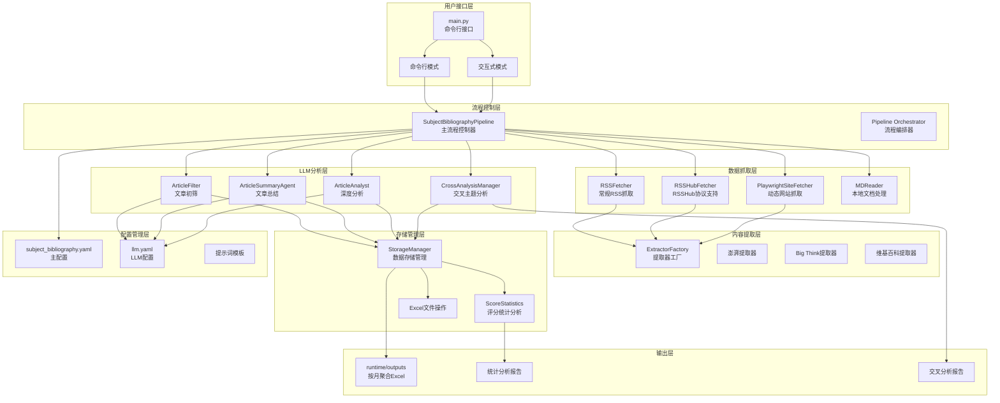
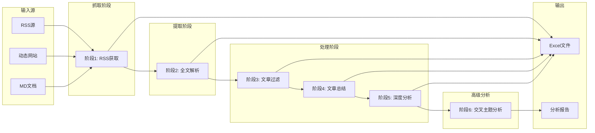
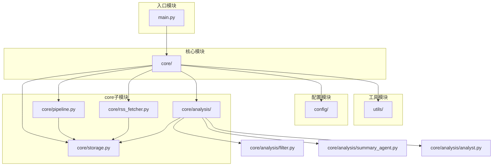
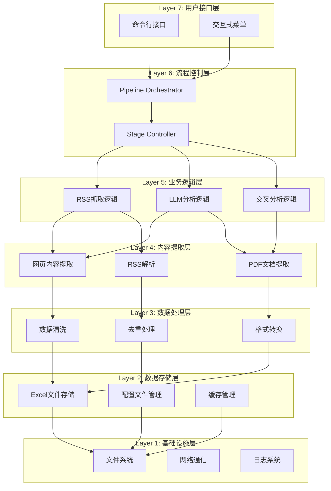
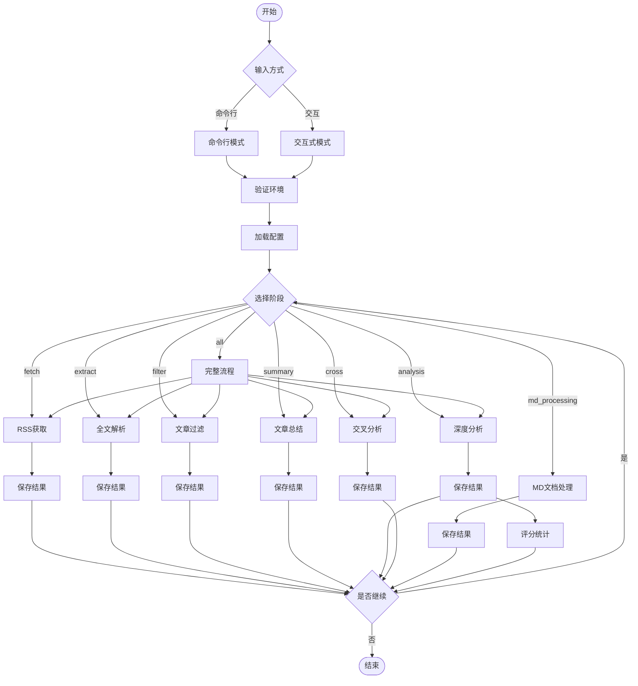

# RSS文章抓取与LLM分析系统 - 项目架构可视化

## 项目整体架构图

```mermaid
graph TB
    subgraph "用户接口层"
        UI[main.py<br/>命令行接口]
        INTERACTIVE[交互式模式]
        CMD[命令行模式]
    end

    subgraph "流程控制层"
        PIPELINE[SubjectBibliographyPipeline<br/>主流程控制器]
        RUNNER[Pipeline Orchestrator<br/>流程编排器]
    end

    subgraph "数据抓取层"
        RSS[RSSFetcher<br/>常规RSS抓取]
        RSSHUB[RSSHubFetcher<br/>RSSHub协议支持]
        PLAYWRIGHT[PlaywrightSiteFetcher<br/>动态网站抓取]
        MD[MDReader<br/>本地文档处理]
    end

    subgraph "内容提取层"
        EXTRACTOR[ExtractorFactory<br/>提取器工厂]
        PENGPAI[澎湃提取器]
        BIGTHINK[Big Think提取器]
        WIKI[维基百科提取器]
    end

    subgraph "LLM分析层"
        FILTER[ArticleFilter<br/>文章初筛]
        SUMMARY[ArticleSummaryAgent<br/>文章总结]
        ANALYST[ArticleAnalyst<br/>深度分析]
        CROSS[CrossAnalysisManager<br/>交叉主题分析]
    end

    subgraph "存储管理层"
        STORAGE[StorageManager<br/>数据存储管理]
        SCORE[ScoreStatistics<br/>评分统计分析]
        EXCEL[Excel文件操作]
    end

    subgraph "配置管理层"
        CONFIG[subject_bibliography.yaml<br/>主配置]
        LLM_CONFIG[llm.yaml<br/>LLM配置]
        PROMPTS[提示词模板]
    end

    subgraph "输出层"
        OUTPUT[runtime/outputs<br/>按月聚合Excel]
        REPORT[统计分析报告]
        ANALYSIS[交叉分析报告]
    end

    %% 连接关系
    UI --> INTERACTIVE
    UI --> CMD
    CMD --> PIPELINE
    INTERACTIVE --> PIPELINE

    PIPELINE --> RSS
    PIPELINE --> RSSHUB
    PIPELINE --> PLAYWRIGHT
    PIPELINE --> MD

    RSS --> EXTRACTOR
    RSSHUB --> EXTRACTOR
    PLAYWRIGHT --> EXTRACTOR

    PIPELINE --> FILTER
    PIPELINE --> SUMMARY
    PIPELINE --> ANALYST
    PIPELINE --> CROSS

    FILTER --> STORAGE
    SUMMARY --> STORAGE
    ANALYST --> STORAGE
    CROSS --> STORAGE

    STORAGE --> SCORE
    STORAGE --> EXCEL

    PIPELINE --> CONFIG
    FILTER --> LLM_CONFIG
    SUMMARY --> LLM_CONFIG
    ANALYST --> LLM_CONFIG

    STORAGE --> OUTPUT
    SCORE --> REPORT
    CROSS --> ANALYSIS
```

## 数据流架构图

```mermaid
graph LR
    subgraph "输入源"
        RSS_SOURCE[RSS源]
        WEBSITE[动态网站]
        MD_DOC[MD文档]
    end

    subgraph "抓取阶段"
        FETCH[阶段1: RSS获取]
    end

    subgraph "提取阶段"
        EXTRACT[阶段2: 全文解析]
    end

    subgraph "处理阶段"
        FILTER[阶段3: 文章过滤]
        SUMMARY[阶段4: 文章总结]
        ANALYSIS[阶段5: 深度分析]
    end

    subgraph "高级分析"
        CROSS[阶段6: 交叉主题分析]
    end

    subgraph "输出"
        EXCEL_OUT[Excel文件]
        REPORTS[分析报告]
    end

    RSS_SOURCE --> FETCH
    WEBSITE --> FETCH
    MD_DOC --> FETCH

    FETCH --> EXTRACT
    EXTRACT --> FILTER
    FILTER --> SUMMARY
    SUMMARY --> ANALYSIS
    ANALYSIS --> CROSS

    FETCH --> EXCEL_OUT
    EXTRACT --> EXCEL_OUT
    FILTER --> EXCEL_OUT
    SUMMARY --> EXCEL_OUT
    ANALYSIS --> EXCEL_OUT

    CROSS --> REPORTS
```

## 模块依赖关系图

```mermaid
graph TD
    subgraph "入口模块"
        MAIN[main.py]
    end

    subgraph "核心模块"
        CORE[core/]
    end

    subgraph "工具模块"
        UTILS[utils/]
    end

    subgraph "配置模块"
        CONFIG[config/]
    end

    MAIN --> CORE
    CORE --> UTILS
    CORE --> CONFIG

    subgraph "core子模块"
        PIPELINE[core/pipeline.py]
        FETCHER[core/rss_fetcher.py]
        STORAGE[core/storage.py]
        ANALYSIS[core/analysis/]
    end

    CORE --> PIPELINE
    CORE --> FETCHER
    CORE --> STORAGE
    CORE --> ANALYSIS

    ANALYSIS --> FILTERS[core/analysis/filter.py]
    ANALYSIS --> SUMMARY[core/analysis/summary_agent.py]
    ANALYSIS --> ANALYST[core/analysis/analyst.py]

    PIPELINE --> STORAGE
    FETCHER --> STORAGE
    ANALYSIS --> STORAGE
```

## 系统层次架构图

```mermaid
graph TB
    subgraph "Layer 7: 用户接口层"
        UI1[命令行接口]
        UI2[交互式菜单]
    end

    subgraph "Layer 6: 流程控制层"
        CTRL1[Pipeline Orchestrator]
        CTRL2[Stage Controller]
    end

    subgraph "Layer 5: 业务逻辑层"
        BIZ1[RSS抓取逻辑]
        BIZ2[LLM分析逻辑]
        BIZ3[交叉分析逻辑]
    end

    subgraph "Layer 4: 内容提取层"
        EXT1[网页内容提取]
        EXT2[PDF文档提取]
        EXT3[RSS解析]
    end

    subgraph "Layer 3: 数据处理层"
        DATA1[数据清洗]
        DATA2[格式转换]
        DATA3[去重处理]
    end

    subgraph "Layer 2: 数据存储层"
        STORE1[Excel文件存储]
        STORE2[配置文件管理]
        STORE3[缓存管理]
    end

    subgraph "Layer 1: 基础设施层"
        INFRA1[文件系统]
        INFRA2[网络通信]
        INFRA3[日志系统]
    end

    UI1 --> CTRL1
    UI2 --> CTRL1
    CTRL1 --> CTRL2
    CTRL2 --> BIZ1
    CTRL2 --> BIZ2
    CTRL2 --> BIZ3

    BIZ1 --> EXT1
    BIZ1 --> EXT3
    BIZ2 --> EXT1
    BIZ2 --> EXT2
    BIZ3 --> EXT2

    EXT1 --> DATA1
    EXT2 --> DATA2
    EXT3 --> DATA3

    DATA1 --> STORE1
    DATA2 --> STORE1
    DATA3 --> STORE2

    STORE1 --> INFRA1
    STORE2 --> INFRA1
    STORE3 --> INFRA1
```

## 核心处理流程图

```mermaid
flowchart TD
    START([开始]) --> INPUT{输入方式}
    
    INPUT -->|命令行| CLI[命令行模式]
    INPUT -->|交互| INTERACTIVE[交互式模式]
    
    CLI --> VALIDATE[验证环境]
    INTERACTIVE --> VALIDATE
    
    VALIDATE --> CONFIG_LOAD[加载配置]
    CONFIG_LOAD --> STAGE_SELECT{选择阶段}
    
    STAGE_SELECT -->|fetch| FETCH[RSS获取]
    STAGE_SELECT -->|extract| EXTRACT[全文解析]
    STAGE_SELECT -->|filter| FILTER[文章过滤]
    STAGE_SELECT -->|summary| SUMMARY[文章总结]
    STAGE_SELECT -->|analysis| ANALYSIS[深度分析]
    STAGE_SELECT -->|cross| CROSS[交叉分析]
    STAGE_SELECT -->|md_processing| MD_PROC[MD文档处理]
    STAGE_SELECT -->|all| ALL_STAGES[完整流程]
    
    FETCH --> SAVE_FETCH[保存结果]
    EXTRACT --> SAVE_EXTRACT[保存结果]
    FILTER --> SAVE_FILTER[保存结果]
    SUMMARY --> SAVE_SUMMARY[保存结果]
    ANALYSIS --> SAVE_ANALYSIS[保存结果]
    CROSS --> SAVE_CROSS[保存结果]
    MD_PROC --> SAVE_MD[保存结果]
    
    ALL_STAGES --> FETCH
    ALL_STAGES --> EXTRACT
    ALL_STAGES --> FILTER
    ALL_STAGES --> SUMMARY
    ALL_STAGES --> ANALYSIS
    ALL_STAGES --> CROSS
    
    SAVE_FETCH --> CHECK{是否继续}
    SAVE_EXTRACT --> CHECK
    SAVE_FILTER --> CHECK
    SAVE_SUMMARY --> CHECK
    SAVE_ANALYSIS --> CHECK
    SAVE_CROSS --> CHECK
    SAVE_MD --> CHECK
    
    CHECK -->|是| STAGE_SELECT
    CHECK -->|否| END([结束])
    
    SAVE_ANALYSIS --> SCORE_STAT[评分统计]
    SCORE_STAT --> CHECK
```

这个架构图展示了系统的层次结构、模块依赖关系以及核心处理流程。系统采用了分层架构，确保了代码的可维护性和可扩展性。