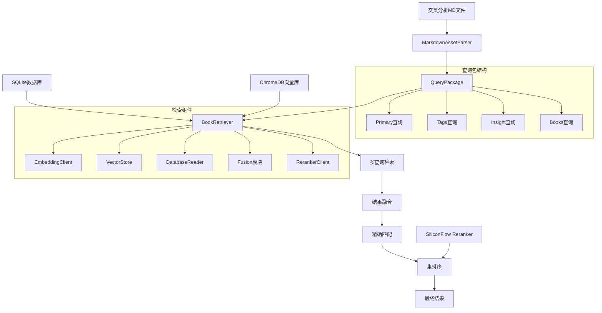

## 概述

本文档详细说明了图书检索系统中重排序功能的完整架构，包括查询生成、多查询检索、结果融合、重排序和精确匹配的完整流程。

## 系统架构图



## 核心组件详解

### 1. 查询资产提取 (Query Assets)

#### 1.1 MarkdownAssetParser
**文件**: [`src/core/book_vectorization/query_assets.py`](src/core/book_vectorization/query_assets.py:81)

**功能**: 从交叉分析Markdown报告中提取多维度查询

**提取流程**:
```python
def parse(self) -> QueryPackage:
    content = self.md_path.read_text(encoding="utf-8")
    primary = self._extract_primary_queries(content)    # 主要查询
    tags = self._extract_tags(content)                    # 标签查询  
    insight = self._extract_insights(content)             # 洞察查询
    books = self._extract_books(content)                   # 书籍查询
    return QueryPackage(primary=primary, tags=tags, insight=insight, books=books)
```

**具体提取规则**:
- **Primary查询**: 从"共同母题"部分提取名称、摘要、关键词
- **Tags查询**: 从表格中提取标签列表
- **Insight查询**: 从"深度洞察"部分提取要点
- **Books查询**: 从"提及书籍"表格中提取书名

#### 1.2 实际案例解析
以文件 [`runtime/outputs/cross_analysis/20251211_091218_数字平台的情绪操控与劳动异化_g7.md`](runtime/outputs/cross_analysis/20251211_091218_数字平台的情绪操控与劳动异化_g7.md) 为例:

```python
# 提取结果示例
QueryPackage(
    primary=[
        "该母题揭示数字平台如何系统性地利用情绪操控...",  # 摘要
        "数字平台的情绪操控与劳动异化",                    # 名称
        "愤怒诱饵", "平台资本主义", "AI伦理", "劳动劣化", "算法批判"  # 关键词
    ],
    tags=['算法批判', '数字劳动', '情绪政治', '平台资本主义', 'AI伦理'],
    insight=[
        "文章将情绪操控与劳动异化并置，暗示二者同源...",
        "'逆向半人马'与'愤怒诱饵'构成数字时代人机关系的两面...",
        "作者拒绝技术决定论，强调AI威胁并非来自智能觉醒..."
    ],
    books=['Enshittification', "The Reverse Centaur's Guide to Life After AI"]
)
```

#### 1.3 长文本向量检索详解

**核心问题**: 系统如何处理长文本（如完整摘要）进行向量检索？

**答案**: 系统直接使用完整的长文本进行向量检索，这是现代语义检索系统的核心优势。

**技术原理**:
1. **完整文本提取**: 从MD文件中提取完整的摘要段落，不进行截断或简化
2. **直接向量化**: 将整个长文本传递给embedding模型处理
3. **语义理解**: 现代embedding模型能够理解长文本的完整语义和上下文关系

**具体示例**:
以"数字平台的情绪操控与劳动异化"为例，系统会提取完整摘要：
```
原始文本: "该母题揭示数字平台如何系统性地利用情绪操控（如'愤怒诱饵'）获取注意力，并通过AI技术将人类劳动降级为可替换的'血肉义肢'，形成新型异化。其核心在于资本逻辑驱动下的技术滥用，而非技术本身进步，批判焦点集中于平台权力、算法操控与劳动者处境的结构性恶化。"
```

这个完整文本（约150字）会被直接转换为向量，然后在向量数据库中寻找语义相似的书籍。

**长文本vs短文本检索对比**:

| 检索方式 | 示例 | 优势 | 适用场景 |
|---------|------|------|---------|
| **长文本检索** | 完整摘要(150字) | 语义完整、上下文丰富、精确匹配复杂概念 | 理解复杂理论、把握概念关系 |
| **短文本检索** | "愤怒诱饵"(4字) | 聚焦核心、泛化能力强、快速匹配 | 快速定位特定主题、广泛搜索 |

**Embedding模型的长文本处理能力**:
- **Token容量**: 支持处理512-1024个token（约300-800个中文字）
- **注意力机制**: 能够捕捉文本中远距离的语义依赖关系
- **上下文保持**: 保持概念之间的逻辑关系和细微差别

**代码实现**:
```python
# 在query_assets.py中直接提取完整摘要
def _extract_primary_queries(self, content: str) -> List[str]:
    section = self._extract_section(content, "共同母题")
    summary = self._search_line(SUMMARY_PATTERN, section)
    if summary:
        candidates.append(summary)  # 完整摘要，不截断
    
# 在retriever.py中直接向量化长文本
def search_by_text(self, query_text: str, top_k: int = 10) -> List[Dict]:
    query_embedding = self.embedding_client.get_embedding(query_text)  # 直接传入长文本
```

**多查询策略的优势**:
系统同时使用长文本和短文本进行检索，实现优势互补：
- **长文本查询**: 提供深度语义理解，找到概念上相关的书籍
- **短文本查询**: 提供广泛覆盖，确保不遗漏相关主题
- **结果融合**: 结合两种查询的优势，提高检索的全面性和准确性

### 2. 多查询检索 (Multi-Query Retrieval)

#### 2.1 BookRetriever
**文件**: [`src/core/book_vectorization/retriever.py`](src/core/book_vectorization/retriever.py:22)

**核心方法**: [`search_multi_query()`](src/core/book_vectorization/retriever.py:134)

**检索流程**:
```python
def search_multi_query(self, query_package: QueryPackage, ...) -> List[Dict]:
    # 1. 按优先级执行各类型查询
    for bucket in priorities:  # ['primary', 'tags', 'insight', 'books']
        queries = package_dict.get(bucket, [])
        for query_text in queries:
            results = self.search_by_text(query_text=query_text, ...)
            query_results.append((bucket, results))
    
    # 2. 融合多查询结果
    fused_results = fuse_query_results(query_results, active_fusion_config)
    
    # 3. 精确匹配（可选）
    if exact_enabled:
        exact_results = self._search_exact_matches(query_package, ...)
    
    # 4. 重排序（可选）
    if rerank:
        anchor_query = self._select_anchor_query(package_dict, priorities)
        fused_results = self._apply_rerank(anchor_query, fused_results)
    
    return final_results
```

#### 2.2 锚查询选择机制
**关键问题**: 不同查询如何统一重排序？

**解决方案**: 锚查询机制
```python
@staticmethod
def _select_anchor_query(package_dict: Dict[str, List[str]], priorities: Sequence[str]) -> str:
    for bucket in list(priorities) + ['primary', 'tags', 'insight', 'books']:
        values = package_dict.get(bucket, [])
        if values:
            return values[0]  # 选择第一个非空桶的第一个查询作为锚查询
    return ''
```

**设计优势**:
- 确保重排序的一致性基准
- 避免不同查询间的评分标准冲突
- 降低计算复杂度

### 3. 结果融合 (Result Fusion)

#### 3.1 Fusion模块
**文件**: [`src/core/book_vectorization/fusion.py`](src/core/book_vectorization/fusion.py:50)

**核心算法**: [`fuse_query_results()`](src/core/book_vectorization/fusion.py:50)

**融合策略**:
```python
# 融合权重配置
weights = FusionWeights(
    max_similarity=0.6,    # 最高相似度权重
    avg_similarity=0.2,    # 平均相似度权重  
    match_count=0.2        # 匹配次数权重
)

# 融合分数计算
fused_score = (
    weights.max_similarity * max_score +
    weights.avg_similarity * avg_score +
    weights.match_count * entry["match_count"]
)
```

**融合逻辑**:
1. **去重聚合**: 按`book_id`聚合相同书籍的多条检索结果
2. **分数计算**: 结合最高分、平均分和匹配频次
3. **排序截断**: 按融合分数排序，保留前N个结果

### 4. 精确匹配 (Exact Matching)

#### 4.1 精确匹配实现
**方法**: [`_search_exact_matches()`](src/core/book_vectorization/retriever.py:244)

**匹配策略**:
```python
# 提取匹配关键词
raw_terms = []
raw_terms.extend((book, "books") for book in query_package.books)      # 书名匹配
raw_terms.extend((tag, "tags") for tag in query_package.tags)          # 标签匹配
raw_terms.extend((short_term, "primary") for short_term in primary_candidates)  # 主要关键词

# SQL模糊查询
sql = f"""
    SELECT id, douban_title, douban_author, douban_rating, douban_summary, call_no
    FROM {self.table}
    WHERE ({' OR '.join(where_clauses)})  # 多个LIKE条件
    ORDER BY douban_rating DESC
    LIMIT ?
"""
```

**权重分配**:
- 标题匹配: 1.0
- 作者匹配: 0.9  
- 关键词匹配: 0.8

### 5. 重排序 (Reranking)

#### 5.1 RerankerClient
**文件**: [`src/core/book_vectorization/reranker.py`](src/core/book_vectorization/reranker.py:26)

**核心方法**: [`rerank()`](src/core/book_vectorization/reranker.py:38)

**重排序流程**:
```python
def _apply_rerank(self, anchor_query: str, candidates: List[Dict]) -> List[Dict]:
    # 1. 构建候选文档文本
    documents = [self._compose_candidate_text(item) for item in candidates]
    
    # 2. 调用Reranker API
    rerank_results = self.reranker.rerank(anchor_query, documents)
    
    # 3. 分数融合
    for idx, candidate in enumerate(candidates):
        rr_score = score_map.get(idx)
        base_score = candidate.get('fused_score', candidate.get('similarity_score', 0.0))
        if rr_score is not None:
            candidate['reranker_score'] = rr_score
            candidate['final_score'] = 0.7 * base_score + 0.3 * rr_score  # 加权融合
        else:
            candidate['final_score'] = base_score
    
    # 4. 重新排序
    candidates.sort(key=lambda item: item.get('final_score', 0.0), reverse=True)
    return candidates
```

**分数融合策略**:
- 基础分数权重: 0.7 (向量检索+融合分数)
- 重排序分数权重: 0.3 (Reranker相关性评分)

## 配置管理

### 核心配置文件
**文件**: [`config/book_vectorization.yaml`](config/book_vectorization.yaml)

**关键配置节**:

```yaml
# 多子查询检索配置
multi_query:
  enabled: false
  top_k_per_query: 20
  priorities: ['primary', 'tags', 'insight', 'books']
  max_queries_per_type:
    tags: 8
    insight: 4
    books: 5

# 结果融合规则  
fusion:
  weights:
    max_similarity: 0.6
    avg_similarity: 0.2
    match_count: 0.2
  final_top_k: 15

# Reranker配置
reranker:
  enabled: true
  model: "Qwen/Qwen3-Reranker-8B"
  api_key: "env:SiliconFlow_API_KEY"
  top_n: 20
  timeout: 15

# 精确匹配配置
exact_match:
  enabled: true
  top_k: 10
  match_fields: ['douban_title', 'douban_summary']
  title_weight: 1.0
  keyword_weight: 0.8
  final_weight: 1.1
```

## 使用示例

### 命令行调用
```bash
# 多查询检索 + 重排序
python scripts/retrieve_books.py --query-mode multi \
    --from-md runtime/outputs/cross_analysis/20251211_091218_数字平台的情绪操控与劳动异化_g7.md \
    --per-query-top-k 20 --final-top-k 15 --enable-rerank --min-rating 8
```

### 代码调用
```python
from src.core.book_vectorization.query_assets import build_query_package_from_md
from src.core.book_vectorization.retriever import BookRetriever

# 1. 构建查询包
query_package = build_query_package_from_md('analysis.md')

# 2. 执行多查询检索
retriever = BookRetriever('config/book_vectorization.yaml')
results = retriever.search_multi_query(
    query_package=query_package,
    min_rating=8.0,
    per_query_top_k=20,
    rerank=True,
    final_top_k=15
)
```

## 性能优化

### 1. 批量处理
- **向量化**: [`EmbeddingClient.get_embeddings_batch()`](src/core/book_vectorization/embedding_client.py:83)
- **数据库查询**: 复用连接，减少连接开销
- **向量检索**: ChromaDB批量操作

### 2. 缓存机制
- **数据库连接**: [`DatabaseReader._get_connection()`](src/core/book_vectorization/database_reader.py:31)
- **API会话**: [`RerankerClient.session`](src/core/book_vectorization/reranker.py:36)

### 3. 查询限制
- **每类查询数量**: [`max_queries_per_type`](config/book_vectorization.yaml:103)
- **单查询结果数**: [`top_k_per_query`](config/book_vectorization.yaml:94)
- **最终结果数**: [`final_top_k`](config/book_vectorization.yaml:114)

## 错误处理与容错

### 1. LLM兜底机制
当Markdown解析失败时，自动调用LLM生成查询:
```python
def recover_with_llm(self, llm_client, task_name: str) -> Optional[QueryPackage]:
    # 使用LLM从原始文本生成查询
    response = llm_client.generate_json(task_name=task_name, messages=prompt_messages)
    return QueryPackage(...)
```

### 2. API重试机制
- **Embedding API**: [`max_retries=3`](config/book_vectorization.yaml:25)
- **Reranker API**: [`timeout=15`](config/book_vectorization.yaml:124)

### 3. 状态管理
- **向量化状态**: [`embedding_status`](src/core/book_vectorization/database_reader.py:86)
- **失败重试**: [`final_retry`](config/book_vectorization.yaml:76)

## 扩展性设计

### 1. 插件化架构
- **查询提取器**: 可扩展新的Markdown解析规则
- **融合策略**: 可自定义融合算法
- **重排序器**: 可集成不同的Reranker服务

### 2. 配置驱动
- 所有算法参数通过配置文件控制
- 支持运行时参数覆盖
- 模块化配置结构

### 3. 接口标准化
- 统一的检索接口
- 标准化的结果格式
- 可插拔的组件设计

## 长文本向量检索的实际效果

**检索示例分析**:
以"数字平台的情绪操控与劳动异化"主题为例，系统的多查询检索过程：

1. **长文本查询执行**:
   ```
   查询: "该母题揭示数字平台如何系统性地利用情绪操控（如'愤怒诱饵'）获取注意力..."
   结果: 找到讨论平台资本主义、算法批判等深层理论的书籍
   ```

2. **短文本查询执行**:
   ```
   查询: "愤怒诱饵"
   结果: 找到专门讨论社交媒体情绪操控的书籍
   
   查询: "AI伦理"
   结果: 找到人工智能伦理相关的广泛书籍
   ```

3. **融合效果**:
   - 长文本确保了概念的深度理解和理论相关性
   - 短文本确保了主题的广泛覆盖和多样性
   - 融合算法平衡了深度和广度，提供最优的检索结果

**技术优势总结**:

| 技术特性 | 传统关键词检索 | 长文本向量检索 |
|---------|---------------|---------------|
| **语义理解** | 仅匹配字面关键词 | 理解完整语义和概念关系 |
| **上下文处理** | 无法处理上下文 | 保持完整的上下文信息 |
| **概念匹配** | 需要精确词汇匹配 | 可匹配同义词和相关概念 |
| **复杂概念** | 难以处理复杂理论 | 能够理解复杂理论描述 |
| **检索质量** | 表面匹配，质量有限 | 深度语义匹配，质量更高 |

## 总结

图书检索重排序系统通过以下关键技术实现了高质量的检索结果:

1. **多维度查询**: 从Primary、Tags、Insight、Books四个角度提取查询
2. **长文本向量检索**: 直接使用完整摘要进行深度语义检索，这是系统的核心创新
3. **长短文本互补**: 结合长文本的深度理解和短文本的广泛覆盖
4. **锚查询机制**: 解决多查询重排序的一致性问题
5. **智能融合**: 结合相似度、频次等多维度信息
6. **精确匹配**: 补充向量检索的不足
7. **重排序增强**: 利用专业Reranker提升相关性
8. **容错设计**: LLM兜底、重试机制、状态管理

**核心创新价值**:
长文本向量检索技术使得系统能够理解复杂理论的完整语义，而不是仅仅依赖关键词匹配。这就像让一个专业的图书管理员理解你的完整需求，而不是只在书名中搜索关键词。对于学术研究和深度阅读需求，这种技术提供了前所未有的检索精度和相关性。

这种架构设计既保证了检索的全面性，又确保了结果的一致性和准确性，为用户提供了高质量的图书推荐服务。